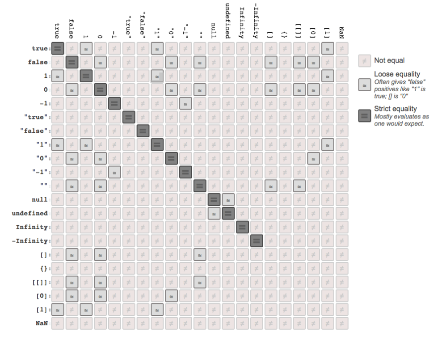

#你不知道的JavaScript － 类型和语法

##序

有人说JavaScript是唯一一门程序员先使用后学习的语言。

每次听到这样的话我都会心一笑，因为我自己就是这样，我想其他许多程序员也是如此。JavaScript，也许还有CSS和HTML，在互联网早期的大学计算机课程中并非主流的教学语言。初学者大多通过搜索引擎和“查看源代码”的方式来自学这些Web基础语言。

我仍然记得高中时代的第一个网站项目。当时的任务是搭建一个网上商店，无论什么样的都行，因为我是007的粉丝，所以我决定搭建一个“黄金眼”商店。它包罗万象，背景音乐是“黄金眼”主题曲，有一个用JavaScript实现的瞄准器跟随鼠标移动，每次点击鼠标时会发出一声枪响。Q（007中的一个角色）应该会为这个杰作感到骄傲吧。

之所以讲到这个故事，是因为我当时使用的开发方式直到现在仍然有许多程序员在使用，那就是“拷贝＋粘贴”。在项目中我“拷贝＋粘贴”了大量JavaScript代码，但根本没有真正理解它们。现在流行的JavaScript工具库，如：jQuery，也在以各自的方式潜移默化地影响着程序员，使得他们不去深入了解JavaScript的核心知识。

我并不反对使用JavaScript工具库，事实上我还是MooTools JavaScript团队的成员之一。然而这些工具库之所以强大，恰恰是因为它们的开发者理解这门语言的本质和缺陷，并且将其运用到了极致。学会使用这些工具库非常有帮助，同时掌握这门语言的基础知识仍然是十分重要的。现在有了Kyle Simpson的《你不知道的JS》系列丛书，我们再也没有理由不好好学习了。

《类型和语法》是该系列的第三本书，它介绍了JavaScript核心基础知识，这些知识你永远不可能从“拷贝＋粘贴”和JavaScript工具库中学到。强制类型转换（coercion）及其隐患、原生构造方法(natives as constructors，JJ-??)、以及JavaScript的全部基础知识都在本书中做了详细的介绍，并配以示例代码。同本系列的其他作品一样，Kyle的行文切中要点，没有多余的套话和修辞，是我喜欢的技术写作风格。

希望大家喜欢《类型和语法》这本书，并能够常读常新。

-David Walsh ([http://davidwalsh.name](http://davidwalsh.name)),
Senior Web Developer at Mozilla

------

##前言

你应该注意到本书使用了“JS”，这样称呼并无恶意，虽然吐槽编程语言是咱们这些程序员的典型特征。

从互联网最早期开始，JavaScript就一直是实现交互体验的基础技术。虽然起初是用来实现诸如鼠标移动轨迹闪烁效果，以及烦人的弹出消息框这些东西。大约20年之后，JavaScript技术和功能得到了数量级的提升，没有人再质疑它在互联网这个世界上最广为使用的软件平台中的重要地位。

但是作为一门编程语言它一直为人所诟病，包括它的历史沿革，更多的则是它的设计理念。因为它的名字，Brendan Eich曾戏称它为“傻弟弟”（相对于它更加成熟的兄长Java而言）。实际上这个名字完全是政治和市场考量下的产物。两个语言之间千差万别，“JavaScript”和“Java”之间如同“Carnival”（嘉年华）和“Car”（汽车）之间一样，没有半点关系。

JavaScript在概念和句法风格上借鉴了其他一些编程语言，包括壮观的C语言风格的程序根，和相对隐晦的Scheme/Lisp语言风格的函数根，这使得它能为许多不同背景的开发人员所接受，包括那些没有多少编程经验的人。用JavaScript编写一个“Hello World”程序非常简单。

JavaScript可能是最容易上手的编程语言之一，但其中的一些奇异之处使得它不像其他语言那样容易全面掌握。用C或者C++开发一个完整的应用程序要求开发者对这门语言有相当深入的了解。然而对于JavaScript而言，即使你用它开发了一个完整的系统，也不见得就能深入理解它。

这门语言中有些复杂的概念隐藏得很深，但往往以一种看似简单的方式呈现出来，例如：将函数作为回调函数参数传递，JavaScript程序员往往满足于使用这些现成方便的机制，而不愿意去探究其中的原理。

JavaScript是一门简单易用的语言，应用广泛，同时又有着复杂和声名狼藉的语言机制，如果不用心掌握，即使经验丰富的JavaScript程序员也会出现理解上的偏差。

JavaScript让人纠结之处就在于此，它的阿基里斯之踵正是我们要在本书中解决的问题。因为我们不需要深入理解就能用它编程，所以常常放任自流。

###使命

每当我们遇到JavaScript中那些让人诧异和抓狂的情况时，如果对其置之不理或者不求甚解，很快你会发现自己根本没有办法充分发挥这门语言的威力。

这部分被称为JavaScript的“精粹（The Good Parts）”，但我宁愿读者朋友们把它视作“容易的部分”，“安全的部分”，或者“不完整的部分”。

《你不知道的JS》系列介绍的是JavaScript的另一面，让你深入掌握JavaScript的所有知识，特别是那些难点。

JS程序员常常满足于一知半解，不愿意更深入地去了解这门语言，本书要解决的正是这个问题。而且我们会直面那些疑难问题，不会避而不谈。

我个人不会满足于仅仅让代码运行起来然而不明就里，你也应该这样。在本书中，我会逐步向你介绍JavaScript中那些不太为人知的地方，最终让你对这门语言有一个全面的了解。一旦掌握了这些知识，无论什么技巧、框架、和时髦术语都不在话下。

本系列丛书全面深入地介绍了JavaScript中最被误解和忽视的关键知识点。你在读完之后，无论从理论还是实践，应该能自信对它们有了充分的理解。

目前为止你对JavaScript的了解可能都来自于那些一知半解的“专家”。你所知道的仅仅是管中窥豹。读完本系列后你将会真正了解这门语言。现在就让我们愉快地开始吧。

###回顾

JavaScript是一门优秀的语言。部分学习起来很容易，但是要整体掌握则很难。程序员们遇到困惑时往往归咎于语言本身，而不是反省他们自身对语言的理解有多匮乏。本系列丛书旨在解决这个问题，使你能够发自内心地喜欢上这门语言。

<table>
    <tr style="border: none;">
        <td style="border: none; width: 150px;"></td>
        <td style="border: none;">本书中的许多示例需要新版本的JavaScript引擎，比如：ES6。有些代码可能无法在老版本的引擎（ES6之前）中运行。</td>
    </tr>
</table>


###书写约定

本书使用以下书写约定：

*斜体字*
表示新术语，URL，电子邮件，文件名，和文件扩展名。

`等宽字`
用于程序代码，以及在段落中引用的程序代码内容，如：变量名，函数名，数据库，数据类型，环境变量，声明语句，和关键词等。

####`粗体等宽字`
需要用户输入的命令和其他文本。

*`斜体等宽字`*
需要用户提供替换值的文本，或者根据上下文计算的值。

<table>
    <tr style="border: none;">
        <td style="border: none; width: 150px;"></td>
        <td style="border: none;">提示和建议</td>
    </tr>
</table>

<table>
    <tr style="border: none;">
        <td style="border: none; width: 150px;"></td>
        <td style="border: none;">注解</td>
    </tr>
</table>

<table>
    <tr style="border: none;">
        <td style="border: none; width: 150px;"></td>
        <td style="border: none;">警告和提醒</td>
    </tr>
</table>

###示例代码

本书的附带资料（如：示例代码，练习等）可以从[http://bit.ly/ydkjs-types-code](http://bit.ly/ydkjs-types-code)下载。

本书旨在帮助你解决实际问题。你可以在你的程序和文档中使用本书中的示例代码。除非大量使用，否则你不需要经过我们许可。例如，你不必征得我们的同意既可在程序中使用本书中的一些示例代码。如果你欲将O'Reilly出版物中的示例代码制作为光盘出售则需要经过我们许可。如果你在回答别人的问题时引用了本书中的内容和示例代码，也不需要征得我们许可。如果你在产品文档中引用了大量本书中的示例代码，则需要征得我们许可。

如果你能够在使用到本书内容的地方注明出处，我们会非常感激，不过这不是强制性的。注明出处通常包括书名，作者，出版方，和ISBN。例如：《你不知道的JS》，Kyle Simpson著，O'Reilly出版。Copyright 2015 Getify Solutions, Inc.,978-1-491-90419-0。

如果你的情况不属于上述种种，请通过[permissions@oreilly.com](permissions@oreilly.com)和我们联系。

###Safari Books Online

<table>
    <tr style="border: none;">
        <td style="border: none; width: 150px;"></td>
        <td style="border: none;"><a href='http://safaribooksonline.com'>Safari Books Online</a>是一个即时点播数字图书馆，为您提供来自世界顶尖科技和商业作者的专业书籍和视频<a href='https://www.safaribooksonline.com/explore/'>内容</a>。</td>
    </tr>
</table>

科技工作者、软件开发人员、Web设计师、和商业创新从业者都将Safari Books Online作为他们研究、攻关、学习和认证培训的一个主要资源。

Safari Books Onine为[企业](https://www.safaribooksonline.com/enterprise/)、[政府](https://www.safaribooksonline.com/government/)、[教育](https://www.safaribooksonline.com/academic-public-library/)和个人提供不同的[计划和收费](https://www.safaribooksonline.com/pricing/)。

Safari Books Online的会员可以通过一个可检索数据库来访问数千本图书,教学视频，和正式出版前的稿件，它们来自[上百家出版方](https://www.safaribooksonline.com/our-library)，如：O'Reilly Media，Prentice Hall Professional, Addison- Wesley Professional, Microsoft Press, Sams, Que, Peachpit Press, Focal Press, Cisco Press, John Wiley & Sons, Syngress, Morgan Kaufmann, IBM Redbooks, Packt, Adobe Press, FT Press, Apress, Manning, New Riders, McGraw-Hill, Jones & Bartlett, Course Tech‐ nology等。有关Safari Books Online更多的信息请访问我们的网站。

------

###联系我们

如果你有任何关本书的看法和问题，可以通过以下方式和出版方联系：

O’Reilly Media, Inc.
1005 Gravenstein Highway North
Sebastopol, CA 95472
800-998-9938 (in the United States or Canada) 707-829-0515 (international or local) 707-829-0104 (fax)

我们为本书搭建了一个网页，上面有勘误，示例，和其他信息。可以通过这个链接访问[http://bit.ly/ydkjs_types-and-grammar](http://bit.ly/ydkjs_types-and-grammar)。

有关本书的评论和技术问题，可以发送邮件到[bookquestions@oreilly.com](bookquestions@oreilly.com)。

有关其他图书的信息，课程，论坛，和新闻，请访问我们的网站[http://www.oreilly.com](http://www.oreilly.com)。

我们的Facebook页面：[http://facebook.com/oreilly](http://facebook.com/oreilly)

我们的Twitter：[http://twitter.com/oreillymedia](http://twitter.com/oreillymedia)

我们的Youtube频道：[http://www.youtube.com/oreillymedia](http://www.youtube.com/oreillymedia)

------

##第一章 类型

很多程序员认为JavaScript这样的动态语言是没有类型的。让我们看看ES5.1规范（[http://www.ecma-international.org/ecma-262/5.1/](http:// www.ecma-international.org/ecma-262/5.1/)）对此怎样解释：

```
本规范中的算法所操作的值均有相应的类型。本节中定义了所有可能的值类型。类型是对ECMAScript的语言类型和规范类型的进一步细分。
我们在ECMAScript语言中直接操纵的值均有一个ECMAScript语言类型与之对应。ECMAScript语言中的类型包括：Undefined，Null，Boolean，String，Number，和Object。
```

如果你喜欢强类型（又称为静态类型）语言，你或许不认同我们在这里使用“类型”一词。在强类型语言中，“类型”一词的含义比在JavaScript中广得多。

也有人认为JavaScript中的“类型”应该叫“标签（tags）”或者“子类型（subtypes）”更为恰当。

在本书中我们对类型做如下粗略的定义（与规范相同）：*类型*是值的一组内部特征，它定义了该值的行为特征，使其能够区别于其他值，该定义对于语言引擎和程序员均适用。

换句话说，如果语言引擎和程序员处理`42`（数字）和`"42"`（字符串）的方式不同，说明它们具有不同的类型，一个是数字，一个是字符串。我们通常会对数字`42`执行数学运算，而对字符串`"42"`执行字符串操作，如显示到网页等。所以它们的类型是不同的。

这样的定义并不完美，不过对于本书而言已经足矣，并且这也与JavaScript语言对自身的描述方式一致。

###类型的另一面

除了学术定义的考虑之外，我们为什么要纠结于JavaScript有没有类型这个问题？

要合理准确地对值进行类型转换（见`第四章`），我们必须正确理解每个类型及其内部行为特征。几乎所有的JS程序都涉及到各种形式的强制类型转换，你在处理这些情况时需要有充分的把握和信心。

如果你要将数字`42`当作字符串来处理，比如获得其中第二个字符`"2"`，你就需要先将其从数字转换（强制类型转换）为字符串。

这看似简单明了，但是强制类型转换的方式可以有很多种。有些是显式的，比较好理解，也不容易出错。但是如果你稍不注意，强制类型转换可能会产生意想不到的结果。

强制类型转换是让JavaScript程序员最头疼的地方之一。它经常被指摘说太危险，以至于被认为是语言设计上的缺陷，要避免使用。

在全面了解了JavaScript类型之后，我们将向你解释为什么强制类型转换的坏处被过分夸大了，这也许能够彻底转变你对它的看法，让你认识到它的强大和用处。不过首先我们需要更进一步了解值（values）和类型（types）。

###内置类型

JavaScript有七种内置类型：

- null
- undefined
- boolean
- number
- string
- object
- symbol（ES6中新加入）

<table>
    <tr style="border: none;">
        <td style="border: none; width: 150px;"></td>
        <td style="border: none;">除<i>object</i>之外，其他统称为基本类型。</td>
    </tr>
</table>

我们使用`typeof`操作符来检测值的类型，它返回上述类型的字符串值。奇怪的是，以上七种类型和它们的字符串值并不一一对应：

```
    typeof undefined    === "undefined";    // true
    typeof true         === "boolean";      // true
    typeof 42           === "number";       // true
    typeof "42"         === "string";       // true
    typeof { life: 42 } === "object";       // true
    
    // added in ES6!
    typeof Symbol()     === "symbol";       // true
```

以上六种类型均有同名的字符串值与之对应。`Symbol`是ES6中新加入的类型，我们将在`第三章`中介绍。

你可能注意到类型`null`不在此列。它比较特殊，`typeof`针对它的返回结果有些问题：

```
    typeof null === "object"; // true
```

正确的返回结果应该是`"null"`，这是JavaScrtip中一个由来已久的bug，已经存在了将近20年，可能永远也不会被修复，因为太多的Web系统在“使用”它，修复它将会产生更多的bug，从而导致大量的Web系统无法正常工作。

你需要使用复合条件来检测`null`值的类型，：

```
    var a = null;

    (!a && typeof a === "object"); // true
```

`null`是所有基本类型中唯一一个假值（falsy，也称作false-like，见`第四章`）类型，`typeof`对其仍然返回`"object"`。

那么`typeof`的第七个返回值字符串值是什么呢？


```
    typeof function a(){ /* .. */ } === "function"; // true
```

上面`typeof`的返回值容易让我们得出这样一个结论，就是`函数`（function）也是JavaScript的一个内置类型。然而如果你查阅规范就会知道，它实际上是`object`的一个“子类型”（subtype）。具体来说，函数被称为“可调用对象”（callable object），即该对象内部有一个`\[\[Call\]\]`属性使得它能够被执行。

函数是对象这一事实对我们很有用，更为重要的是，函数还可以拥有属性。例如：


```
    function a(b,c) {
        /* .. */
    }
```

函数对象的`length`属性值是它正式声明的参数数目：


```
    a.length; // 2
```

因为该函数声明了两个命名参数（named parameters，即`b`和`c`），所以函数的`length`属性值为`2`。

那么数组的情况又如何呢？JavaScript本身支持数组，那它是不是也是一个特殊类型？

```
    typeof [1,2,3] === "object"; // true
```

非也，数组也是`object`类型。确切地说是`object`的一个子类型（见`第三章`），其中一个特征是数组中的元素按照数字顺序进行索引（而非普通对象那样是字符串键值），并且`length`属性会根据元素数量自动更新。

###值的类型

在JavaScript中变量是没有类型的，只有值才有。变量随时可以持有任意类型的值。

我们换一种方式来理解JavaScript的类型，JavaScript不“强制指定类型”，也就是说语言引擎不要求变量总是持有与其初始值同样类型的值。变量可以现在被赋值为字符串类型值，稍后又被赋值为数字类型值。

值`42`的类型为`数字（number）`，并无法更改。值`"42"`的类型为`字符串（string）`，数字`42`可以通过*强制类型转换*（coercion，见`第四章`）成为字符串`"42"`。

在对变量执行`typeof`操作时，得到的并非是该变量的类型，因为JavaScript中变量是没有类型的。我们得到的是变量所持有的值的类型。

```
    var a = 42;
    typeof a; // "number"

    a = true;
    typeof a; // "boolean"
```

`typeof`操作符总是返回一个字符串：

```
    typeof typeof 42; // "string"
```

`typeof 42`首先返回字符串`"number"`，然后`typeof "number"`返回`"string"`。

###undefined和“undeclared”

变量在未持有任何值的时候，其值为`undefined`。此时`typeof`返回`"undefined"`：

```
    var a;

    typeof a; // "undefined"

    var b = 42;
    var c;

    // later 
    b = c;

    typeof b; // "undefined"
    typeof c; // "undefined"
```

很多程序员容易将“undefined”等同为“undeclared”。然而它们在JS中有很大差别。

对于已经在作用域中声明过但是还未持有任何值的变量，它们的值为“undefined”。对于还没有在作用域中声明过的变量，它们的值为“undeclared”。

例如：

```
    var a;

    a; // undefined
    b; // ReferenceError: b is not defined
```

浏览器在处理这类情况的时候产生的错误信息很让人抓狂。上面的例子中，“b is not defined”容易让人理解为“b is undefined”。所以我们必须再次说明，“undefined”和“is not defined”完全不同。如果浏览器能够产生诸如“b is not found”或者“b is not declared”这样的错误信息，就能避免许多不必要的误会。

在处理undeclared变量时，`typeof`的一个特殊行为又导致了更多的误会。例如：

```
    var a;

    typeof a; // "undefined"

    typeof b; // "undefined"
```

对于“undeclared”（或者“not defined”）变量，`typeof`也返回`"undefined"`。请注意`typeof b`执行时没有产生错误，即使b是一个undeclared变量。这是`typeof`的一个特殊的安全防范措施。

同样地，如果`typeof`对undeclared变量返回“undeclared”而非“undefined”，情况会好很多。

###typeof Undeclared

话说回来，这样的安全防范措施对于在浏览器中运行的JavaScript来说是很有用的，因为不同的script文件能够将变量加载到共享的全局命名空间中。

<table>
    <tr style="border: none;">
        <td style="border: none; width: 150px; "></td>
        <td style="border: none;">很多程序员认为全局命名空间中不应该有变量，所有的东西应该被封装到模块和私有命名空间中。理论上这样没错，虽然在实际操作中基本不可行，但仍不失为一个值得努力的方向。好消息是ES6中加入了对模块的优先支持，最终会让其更具可操作性。
        </td>
    </tr>
</table>

举个简单的例子，在你的程序中通过一个全局变量`DEBUG`作为“调试模式”的开关。在执行诸如将信息写入控制台这样的调试任务前，你会检查`DEBUG`变量是否已经被声明过。最顶层的全局变量声明`var DEBUG = true`只包含在“debug.js”文件中，该文件只在开发和测试时才在浏览器中加载，在生产环境中不加载。

然而在程序的其他地方，你需要特别注意检查全局变量`DEBUG`的方式，以免出现`ReferenceError`错误。这时安全防范措施就很有用：

```
    // 这样做会产生错误
    if (DEBUG) {
        console.log( "Debugging is starting" );
    }

    // 这样做则是安全的，不会产生错误
    if (typeof DEBUG !== "undefined") {
        console.log( "Debugging is starting" );
    }

```

即使对非用户定义的变量来说，这样的检查也是很有用的。如果你要为内置的API做功能检查，它也可以让你避免产生错误：

```
    if (typeof atob === "undefined") {
        atob = function() { /*..*/ };
    }
```


<table>
    <tr style="border: none;">
        <td style="border: none; width: 150px;"></td>
        <td style="border: none;">如果要为某个缺失的功能制作“polyfill”（衬垫代码或者补充代码，用来补充当前运行环境中缺失的功能），你也许不会使用<b>var atob</b>来声明变量atob。如果在<b>if</b>语句中使用<b>var atob</b>，该声明会被提升（hoisted，参见本系列的Scope &amp; Closures一书）到作用域（当前脚本或函数的作用域）的最顶层，即使<b>if</b>条件未通过也是如此（因为atob全局变量已经存在）。在一些浏览器中，对于一些特殊的内置全局变量（通常被称为“host objects”），这样重复声明会产生错误。去掉<b>var</b>可以防止声明被提升。
        </td>
    </tr>
</table>

另外有一种方法可以不使用`typeof`中的安全防范来检查全局变量是否已经存在，即检查全局变量是否也是全局对象中的属性，在浏览器中这个全局变量是`window`。所以前面的例子可以这样来实现：

```
    if (window.DEBUG) {
        // ..
    }
    
    if (!window.atob) {
        // ..
    }
```

和undeclared变量不同的是，访问不存在的对象属性时并不会产生`ReferenceError`错误。

然而许多程序员会尽量避免使用`window`来访问全局变量，特别是当代码需要在多个JS环境中运行时（不仅仅是浏览器，还有服务器端node.js等），因为此时的全局变量并不一定是`window`。

从技术角度来说，`typeof`中的安全防范对于非全局变量仍然是有用的，虽然这种情况不太常见，所以一些程序员不大愿意使用。如果想让别人在他们的程序中拷贝粘贴你的工具函数，你需要在函数中做一些检查来确定某些变量是否已经在宿主程序中定义过：

```
    function doSomethingCool() {
        var helper =
            (typeof FeatureXYZ !== "undefined") ?
            FeatureXYZ :
            function() { /*.. default feature ..*/ };

        var val = helper();
        // .. 
    }
```

`doSomethingCool()`检查变量`FeatureXYZ`是否存在，如果是就使用之，否则使用自己定义的版本。如果这段代码在其他的模块和程序中使用，它会安全地检查变量`FeatureXYZ`是否已在宿主程序中定义：

```
    // an IIFE (see the "Immediately Invoked Function Expressions"
    // discussion in the Scope & Closures title in this series)
    (function(){
        function FeatureXYZ() { /*.. my XYZ feature ..*/ }

        // include `doSomethingCool(..)`
        function doSomethingCool() {
            var helper =
                (typeof FeatureXYZ !== "undefined") ?
                FeatureXYZ :
                function() { /*.. default feature ..*/ };

            var val = helper();
            // .. 
        }
        
        doSomethingCool();
    })();
```

这里`FeatureXYZ`不是一个全局变量，但我们还是使用`typeof`的安全防范来做检查。重要的是我们没有使用任何全局对象（如前面提到的`windows.___`），因此`typeof`在这里非常管用。

有些程序员倾向使用一种方式叫“依赖注入”（dependency injection），即将需要的对象作为参数显式地传递进来，而不是通过函数`doSomethingCool()`来检查变量`FeatureXYZ`是否已经定义过，如：

```
    function doSomethingCool(FeatureXYZ) {
        var helper = FeatureXYZ ||
            function() { /*.. default feature ..*/ };
        var val = helper();
        // ..
    }
```

实现此类检查的方法有很多。它们之间没有“错”与“对”之分，各有利弊。`typeof`为我们提供了多一个选择，这总归是极好的。

###回顾

JavaScript有七种内置类型：`null`，`undefined`，`boolean`，`number`，`string`，`object`，和`symbol`。可以使用`typeof`操作符来标识。

变量没有类型，但是它们持有的值有类型。类型定义了值的内在行为特征。

很多程序员认为“undefined“和“undeclared”基本上是相同的，但是在JavaScript中它们有很大区别。`undefined`是变量可以持有的一种值。“Undeclared”表示变量还没有被声明过。

糟糕的是JavaScript将它们合二为一，在错误信息中是这样（“ReferenceError:a is not defined”），`typeof`的返回值"undefined"也是如此。

无论如何，在一些特定情况下使用`typeof`的安全防范（避免抛出错误）来检查undeclared变量是非常有用的。

------

##第二章 值

`数组`（array），`字符串`（string），和`数字`（number）是计算机程序最基本的组成部分，然而在JavaScript中，它们的某些特性可以说是“让我欢喜让我忧”。

###数组

相比强类型语言，JavaScript中的`数组`可以容纳任何类型的值，可以是`字符串`，`数字`，`对象`，甚至其他`数组`（多维数组就是以此方式来实现的）：

```
    var a = [ 1, "2", [3] ];

    a.length;       // 3
    a[0] === 1;     // true
    a[2][0] === 3;  // true
```

你不需要预先设定数组的大小（参考`第44页的Array(..)`），你只需要对其进行声明，然后既可向其中加入适当的值：

```
    var a = [ ];

    a.length;   // 0
    
    a[0] = 1;
    a[1] = "2";
    a[2] = [ 3 ];

    a.length;   // 3
```

<table>
    <tr style="border: none;">
        <td style="border: none; width: 150px;"></td>
        <td style="border: none;">对<b>数组</b>中的值执行<b>delete</b>操作可将其移除，需要注意的是，即使值被移除后，数组的<b>length</b>属性并不会相应变化。我们会在<b>第五章</b>详细介绍<b>delete</b>操作。
        </td>
    </tr>
</table>

创建“稀疏”`数组`（数组中有一些空白／空缺的单元）时需要特别注意：

```
    var a = [ ];

    a[0] = 1;
    // no `a[1]` slot set here
    a[2] = [ 3 ];
    
    a[1];       // undefined
    
    a.length;   // 3
```

上面的代码虽然可以正常运行，但是其中的“空白单元”会产生一些令人困惑的结果。`a[1]`当前的值为`undefined`，但这和我们显示将其赋值为`undefined`（`a[1] = undefined`）还是有区别。详情参见`第44页的“Array(..)”`。

`数组`使用数字索引，因为数组也是`对象`类型，所以可以包含字符串键值和属性（这些并不计算在数组长度`length`内）：

```
    var a = [ ];

    a[0] = 1;
    a["foobar"] = 2;
    
    a.length;       // 1
    a["foobar"];    // 2
    a.foobar;       // 2
```

然而有一个容易出错的地方需要我们注意，如果作为键值的`字符串`可以被强制类型转换为10进制`数字`，则系统则视其为`数字`索引而非`字符串`键值！

```
    var a = [ ];

    a["13"] = 42;
    
    a.length; // 14
```

通常来说，在`数组`中使用`字符串`作为键值/属性并不是一个好办法。建议用`对象`来存放通过键值/属性访问的值，用`数组`来存放通过数字索引的值。

###类数组

有时候我们需要将类似`数组`的值（一组使用数字索引的值）转换为真正的`数组`，通常可以使用`数组`工具函数来实现（如：`indexOf(..)`，`concat(..)`，`forEach(..)`等等）。

例如，一些DOM查询操作返回DOM元素列表，它们并非真正意义上的`数组`，但却十分类似。另一个常见的例子，是一些函数通过`arguments`对象（类数组）以列表的方式来访问函数参数（ES6已经废止了）。

我们常用工具函数`slice(..)`来实现这类转换：

```
    function foo() {
        var arr = Array.prototype.slice.call( arguments );
        arr.push( "bam" );
        console.log( arr );
    }

    foo( "bar", "baz" ); // ["bar","baz","bam"]
```

如上例所示，如果`slice()`不带其他参数，它会返回当前的数组参数（本例中是一个类`数组`）的一个复本。

在ES6有一个内置工具函数`Array.from(..)`也有相同的功能：

```
    ...
    var arr = Array.from( arguments );
    ...
```

<table>
    <tr style="border: none;">
        <td style="border: none; width: 150px;"></td>
        <td style="border: none;"><b>Array.from(..)</b>有一些功能很强大，我们将在本系列的<i>《ES6规范及更多》</i>一书中详细介绍。
</td>
    </tr>
</table>

###字符串

`字符串`通常被认为是由字符组成的`数组`。然其内部实现有没有使用`数组`并不一定，对我们来说重要的是认识到JavaScript中的`字符串`和字符`数组`并不一样。它们仅仅是表面上看起来相似罢了。

例如下面两个值：

```
    var a = "foo";
    var b = ["f","o","o"];
```

如上例所示，`字符串`和`数组`确实有相似之处，都是类`数组`。比如，它们都有`length`属性，`indexOf(..)`方法（从ES5开始`数组`支持此方法），和`concat(..)`方法：

```
    [source,js]

    a.length;                           // 3
    b.length;                           // 3

    a.indexOf( "o" );                   // 1
    b.indexOf( "o" );                   // 1

    var c = a.concat( "bar" );          // "foobar"
    var d = b.concat( ["b","a","r"] );  // ["f","o","o","b","a","r"]

    a === c;                            // false
    b === d;                            // false

    a;                                  // "foo" 
    b;                                  // ["f","o","o"]
```

那是不是因此就可以说它们都是“由字符组成的数组”？答案是否定的，见下例：

```
    a[1] = "O";
    b[1] = "O";

    a; // "foo"
    b; // ["f","O","o"]
```

JavaScript中的`字符串`是不可变的，而`数组`是可变的。并且`a[1]`这样的方式在JavaScript中并非总是合法的。老版本的IE就不允许这样（现在可以了）。*正确*的方式应该是`a.charAt(1)`。

`字符串`不可变的意思是`字符串`的成员函数都不会改动`字符串`的原始值，而是创建并返回一个新的`字符串`。而`数组`的成员函数都是在其原始值上进行操作。

```
    c = a.toUpperCase();
    a === c;    // false
    a;          // "foo"
    c;          // "FOO"

    b.push( "!" );
    b;          // ["f","O","o","!"]
```

此外，很多`数组`函数在处理`字符串`时非常有用，`字符串`中没有这些函数，但我们可以“借用”`数组`的这些非变更方法（nonmutation）来处理`字符串`：

```
    a.join;         // undefined
    a.map;          // undefined

    var c = Array.prototype.join.call( a, "-" );
    var d = Array.prototype.map.call( a, function(v){
        return v.toUpperCase() + ".";
    } ).join( "" );
    
    c;              // "f-o-o"
    d;              // "F.O.O."
```

我们再来看看另外一个例子：`字符串`反转（经常在JavaScript面试中遇到的问题！）。`数组`有一个可变更成员函数`reverse()`，而`字符串`没有：

```
    a.reverse;      // undefined

    b.reverse();    // ["!","o","O","f"]
    b;              // ["f","O","o","!"]
```

遗憾的是，此类“借用”对于`数组`的可变更成员函数不适用，因为`字符串`是不可变的，其内容无法更改：

```
    Array.prototype.reverse.call( a );
    // 返回值仍然是"foo"的一个字符串封装对象（见第三章）:(
```

一个变通（破解）的办法是将`字符串`转换为`数组`再执行需要的操作，然后再将结果转换回`字符串`：

```
    var c = a
        // split `a` into an array of characters
        .split( "" )
        // reverse the array of characters
        .reverse()
        // join the array of characters back to a string
        .join( "" );
    
    c; // "oof"
```

虽然看起来很丑陋，但对于简单的`字符串`来说是可以的，这类简单粗暴的方法有时往往很奏效。

<table>
    <tr style="border: none;">
        <td style="border: none; width: 150px;"></td>
        <td style="border: none;">请注意！上述方法对于包含复杂字符（unicode，如：星号，多子节字符等等）的<b>字符串</b>来说并不适用。这时你需要功能更加完备，能够处理unicode的工具库。可以参考Mathias Bynen的<a href='https://github.com/mathiasbynens/esrever'>Esrever</a>。</td>
    </tr>
</table>

还有一种方法，如果需要经常用`字符数组`的方式来处理`字符串`，不如直接使用`数组`。这样就不用在`字符串`和`数组`之间折腾了。可以在需要时对`字符数组`执行`join("")`来将其转换为`字符串`。

###数值

JavaScript只有一种数字类型，即：`数字`。它包括“整数”和带小数的十进制数。“整数“加引号是因为和其他语言不同，JavaScript中没有真正意义上的整数，这也是它一直以来为人诟病的地方。这个情况在将来或许会有所改观，不过就目前而言所有数值均为`数字`类型。

JavaScript中的“整数”只是没有小数位的十进制数。所以`42.0`即等同于“整数”`42`。

和大多数现代编程语言一样，包括所有的脚本语言，JavaScript的`数字`类型是基于“IEEE 754”标准来实现的，我们通常称之为“浮点数”。JavaScript具体使用的是“双精度”（即“64位二进制”）标准。

网上有很多优秀的文章详细介绍了二进制浮点数在内存中的存储方式，以及不同实现的各自的考量。正确使用JS的`数字`类型并不一定要求我们掌握内存中数位的存储方式，所以本书对此不多做介绍，有兴趣的读者可以参考IEEE 754的相关细节。

###数字的句法

JavaScript中，数字常量一般用十进制表示。例如：

```
    var a = 42;
    var b = 42.3;
```

数字前半部分为0的话可以省略：

```
    var a = 0.42;
    var b = .42;
```

同样地，数字后半部分（小数）为0的话也可以省略：

```
    var a = 42.0;
    var b = 42.;
```

<table>
    <tr style="border: none;">
        <td style="border: none; width: 150px;"></td>
        <td style="border: none;"><b>42.</b>这种写法不太常见，虽然是合法的，但考虑到代码的可读性我们通常不建议使用。</td>
    </tr>
</table>

缺省情况下大部分`数字`都以十进制显示，小数部分最后面的0省略。如：

```
    var a = 42.300;
    var b = 42.0;

    a; // 42.3
    b; // 42
```

那些特别大和特别小的`数字`会默认用指数格式显示，与`toExponential()`函数的输出结果相同，例如：

```
    var a = 5E10;
    a;                  // 50000000000
    a.toExponential();  // "5e+10"

    var b = a * a;
    b;                  // 2.5e+21
    
    var c = 1 / a;
    c;                  // 2e-11
```

由于`数字`类型的值可以使用`Number`对象来进行封装（boxed，见`第三章`），因此`数字`类型的值可以使用`Number.prototype`中的方法（见`第三章`）。例如`toFixed(..)`方法能够让你指定小数部分显示的位数：

```
    var a = 42.59;

    a.toFixed( 0 ); // "43"
    a.toFixed( 1 ); // "42.6"
    a.toFixed( 2 ); // "42.59"
    a.toFixed( 3 ); // "42.590"
    a.toFixed( 4 ); // "42.5900"
```

请注意上例的输出结果实际上是该`数字`的`字符串`，如果小数部分显示的位数多于实际的位数则用`0`补齐。

类似地，`toPrecision(..)`方法能够让你指定`有效数字`显示的位数：

```
    var a = 42.59;

    a.toPrecision( 1 ); // "4e+1"
    a.toPrecision( 2 ); // "43"
    a.toPrecision( 3 ); // "42.6"
    a.toPrecision( 4 ); // "42.59"
    a.toPrecision( 5 ); // "42.590"
    a.toPrecision( 6 ); // "42.5900"
```

这些方法不仅适用于`数字`变量，也适用于`数字`常量。不过在使用`.`操作符时需要特别注意，因为它是一个合法的数字字符，它会被尽可能优先识别为`数字`常量的一部分，然后才是对象属性访问操作符。

```
    // invalid syntax:
    42.toFixed( 3 );    // SyntaxError

    // these are all valid:
    (42).toFixed( 3 );  // "42.000"
    0.42.toFixed( 3 );  // "0.420"
    42..toFixed( 3 );   // "42.000"
```

`42.toFixed(3)`是非法语法，因为`.`被视为常量`42.`的一部分（如前所述），因此上例中并没有`.`访问操作符来调用`toFixed`方法。

`42..toFixed(3)`没有问题，因为第一个`.`被视为`42.`的一部分，第二个`.`是访问操作符。只是这样看起来有点奇怪，在现实中也很少见。事实上这种基本类型值直接调用方法的形式并不常见，不过不常见并不代表`不好`和`不对`。

<table>
    <tr style="border: none;">
        <td style="border: none; width: 150px;"></td>
        <td style="border: none;">有一些代码库扩展了<b>Number.prototype</b>的内置方法（见<b>第三章</b>b），提供了更多数值操纵功能，比如使用<b>10..makeItRain()</b>实现下十分钟金钱雨的动画等。</td>
    </tr>
</table>

下面的语法也是合法的（请注意空格）：

```
    42 .toFixed(3); // "42.000"
```

然而对于`数字`常量而言这样的语法很容易造成误导，我们不建议使用。

`数字`还可以用指数格式表示，常用于较大的数字，如：

```
    var onethousand = 1E3;                      // means 1 * 10^3
    var onemilliononehundredthousand = 1.1E6;   // means 1.1 * 10^6
```

`数字`常量还可以用其他格式来表示，如：二进制，八进制，和十六进制。

这些格式当前版本的JavaScript都支持：

```
    0xf3; // hexadecimal for: 243
    0Xf3; // 同上

    0363; // octal for: 243
```

<table>
    <tr style="border: none;">
        <td style="border: none; width: 150px;"></td>
        <td style="border: none;">从ES6开始，<b>严格模式</b>不再支持0363八进制格式（新格式见下）。0363格式在<b>非严格模式</b>中仍然支持，但是考虑到将来的兼容性最好不要再使用（目前你使用的应该是<b>严格模式</b>）。</td>
    </tr>
</table>

ES6支持以下新格式：

```
    0o363;      // octal for: 243
    0O363;      // 同上

    0b11110011; // binary for: 243
    0B11110011; // 同上
```

考虑到代码的易读性，我们不推荐使用`0O363`格式，因为`0`和大写`O`在一起容易混淆。建议尽量使用小写`0x`，`0b`，和`0o`。

###较小的数值

使用二进制浮点数最大的问题（不仅仅JavaScript，所有遵循IEEE 754规范的语言都是如此），是会出现下面的情况：

```
    0.1 + 0.2 === 0.3; // false
```

从数学角度来说上面的条件判断应该为`true`，但为什么是`false`呢？

简单来说，二进制浮点数中的`0.1`和`0.2`并不特别精确，它们相加的结果并非刚刚好等于`0.3`，而是一个比较接近数字`0.30000000000000004`，所以上面的条件判断结果为`false`。

<table>
    <tr style="border: none;">
        <td style="border: none; width: 150px;"></td>
        <td style="border: none;">有人认为JavaScript应该采用可以精确表示数字的实现方式。一直以来也出现了很多替代方案，只是都没有获得认可，或许永远也不会。虽然这个问题看起来挺简单，，实际却并非如此，否则早就解决了。</td>
    </tr>
</table>

现在的问题是，如果有些`数字`无法做到完全精确，是否意味着我们完全不能使用`数字`类型了呢？答案当然是否定的。

有一些应用程序在处理数字，特别是带有小数的数字时需要特别精确。还有很大一部分（或许占绝大多数）应用程序仅需要处理整数，最大不超过百万或者万亿。JavaScript的数字操作对于这些应用程序来说是绝对可靠的。

如果我们了解了以上知识，再要比较两个`数字`，比如：`0.1 + 0.2`和`0.3`，时应该怎么做呢？

通常的方法是设置一个误差范围值。通常称为“机器小量（machine epsilon）”，对于JavaScript中的`数字`来说一般是`2^-52 (2.220446049250313e-16)`。

自ES6起，该误差范围值定义在`Number.EPSILON`中，你可以直接使用，或者可以通过polyfill来为ES6之前的版本定义该值：

```
    if (!Number.EPSILON) {
        Number.EPSILON = Math.pow(2,-52);
    }
```

现在我们可以使用`Number.EPSILON`来比较两个`数字`是否相等了（在指定的误差范围内）：

```
    function numbersCloseEnoughToEual(n1,n2) {
        return Math.abs( n1 - n2 ) < Number.EPSILON;
    }

    var a = 0.1 + 0.2;
    var b = 0.3;

    numbersCloseEnoughToEqual( a, b );                  // true
    numbersCloseEnoughToEqual( 0.0000001, 0.0000002 );  // false
```

能够呈现的最大浮点值为`1.798e+308`（这是一个相当大的数字），定义在`Number.MAX_VALUE`中。最小浮点值定义在`Number.MIN_VALUE`中，大约是`5e-324`，它不是负数，但无限接近于`0`！

###整数的安全范围

`数字`的呈现方式决定了“整数”有一个远远小于`Number.MAX_VALUE`的安全值范围。

能够被“安全”呈现的最大整数值（即能够确保该值被清晰无误地呈现）是`2^53 - 1`，即`9007199254740991`，在ES6中定义为`Number.MIN_SAFE_INTEGER`。

有时JS程序需要处理一些比较大的数字，常见的情况是数据库中的64位ID等。由于JavaScript的`数字`类型无法精确处理64位数值，所以必须将它们保存（转换）为`字符串`来处理。

庆幸的是大数值操作并不常见（除了比较操作，其可以通过`字符串`来处理）。不过如果我们确实需要对这类较大的数值进行数学运算，目前来说还是需要使用相关的工具库。在未来的JavaScript版本中也许会加入对大数值的支持。

###整数检测

如果要检测一个值是否是整数，可以使用ES6中的`Number.isInteger(..)`方法：

```
    Number.isInteger( 42 );     // true
    Number.isInteger( 42.000 ); // true
    Number.isInteger( 42.3 );   // false
```

我们可以为ES6之前的版本polyfill一个`Number.isInteger(..)`方法：

```
    if (!Number.isInteger) {
        Number.isInteger = function(num) {
            return typeof num == "number" && num % 1 == 0;
        };
    }
```

要检测一个值是否是`安全的整数`，可以使用ES6中的`Number.isSafeInteger(..)`方法：

```
    Number.isSafeInteger( Number.MAX_SAFE_INTEGER );    // true
    Number.isSafeInteger( Math.pow( 2, 53 ) );          // false
    Number.isSafeInteger( Math.pow( 2, 53 ) - 1 );      // true
```

我们可以为ES6之前的版本polyfill一个`Number.isSafeInteger(..)`方法：

```
    if (!Number.isSafeInteger) {
        Number.isSafeInteger = function(num) {
            return Number.isInteger( num ) &&
                Math.abs( num ) <= Number.MAX_SAFE_INTEGER;
        }; 
    }
```

###32位有符号整数

虽然整数最大能够达到53位，一些数字操作（如：数位操作）只适用于32位的`数字`，因此这些操作中的`数字`的安全范围就要小得多。

这种情况下的安全范围是从`Math.pow(-2,31)`（-2147483648，约-21亿）到`Math.pow(2,31)`（2147483647，约21亿）。

如果要将变量`a`中的数值转换为32位有符号整数，可以这样：`a | 0`。这个方法很管用，因为`|`数位操作符只适用于32位整数（即它只关心32位以内的值，忽略其他的数位）。因此与0进行`或`操作即可截取`a`中的32位数位。

<table>
    <tr style="border: none;">
        <td style="border: none; width: 150px;"></td>
        <td style="border: none;">有一些特殊的值并不是32位安全（32-bit safe）的，如：<b>NaN</b>和<b>Infinity</b>（我们将在下节介绍）。32位安全是指传递给数位操作符的值会执行一个虚拟操作<b>ToInt32</b>（见第四章），用来转换为符合数位操作符要求的<b>+0</b>值。</td>
    </tr>
</table>

###特殊的数值

JavaScript的类型涉及几个特殊的值，JS程序员需要对它们特别注意。

####不是值的值

`undefined`类型只有一个值，即：`undefined`。`null`也只有一个值类型，即：`null`。对于这两个类型，它们的名称既是类型也是值。

`undefined`和`null`经常被用来表示“空（empty）”值或“非值（non）”值。它们之间存在一些细微的差别。例如：

- `null`指空值。
- `undefined`指还未赋值。

或者：

- `undefined`指从未赋过值。
- `null`指曾被赋过值，但是目前没有值。

无论你如何定义和使用这两个值，`null`都是一个特殊关键字，而非标识符，因此你不能将其当作变量来赋值。然而`undefined`却是标识符。

####Undefined

在`非严格（non-strict）`模式下，我们可以为全局标识符`undefined`赋值（这个设计实在是脑残！）：

```
    function foo() {
        undefined = 2; // really bad idea!
    }
    
    foo();
    
    function foo() {
        "use strict";
        undefined = 2; // TypeError!
    }

    foo();
```

在`非严格`和`严格`模式下，你可以声明一个名为`undefined`的局部变量。再次强调我们不建议这样做。

```
   function foo() {
        "use strict";
        var undefined = 2;
        console.log( undefined ); // 2
    }

    foo();
```

永远不要重新定义`undefined`。

####void操作符

`undefined`是一个内置的标识符（除非被修改，见前面的介绍），其值为`undefined`，要得到该值还有另外一个方法，即通过`void`操作符。

表达式`void ___`不返回任何值，因此其返回结果永远是`undefined`。它并不更改其操作的值，只是让表达式不返回任何值：

```
    var a = 42;

    console.log( void a, a ); // undefined 42
```

按照惯例（大部分源自C语言），我们使用`void 0`来得到`undefined`（显然`void true`和其他`void`表达式也返回相同的结果）。`void 0`，`void 1`，和`undefined`之间并没有实质区别。

`void`操作符在其他一些情况下也非常有用，比如你需要确保表达式不返回任何结果时，即使它有副作用（side effects）。

例如：

```
    function doSomething() {
        // note: `APP.ready` is provided by our application
        if (!APP.ready) {
            // try again later
            return void setTimeout( doSomething,100 );
        }
    
        var result;
        
        // do some other stuff
        return result;
    }

    // were we able to do it right away?
    if (doSomething()) {
        // handle next tasks right away
    }
```

上例中，`setTimeout(..)`函数返回一个数值（计时器间隔的唯一标识，用来取消计时），但是为了让该函数的`if`语句不产生误报（false positive），我们就要`void`掉它。

很多程序员喜欢把它们分开，不用`void`但效果是一样的：

```
    if (!APP.ready) {
        // try again later
        setTimeout( doSomething,100 );
        return;
    }
```

一般来说，如果你想将代码中的某个值（由一些表达式产生）设为`undefined`，就使用`void`操作符。这种用法可能并不常见，不过在需要时还是很有用。

####特殊数值

`数字`类型包括几个特殊的值，我们将在这里详细介绍。

#####不是数字的数值

如果数学运算中的操作数不是`数字`类型（或者不能够被解析为常规的10进制或16进制`数字`），那么运算将无法返回一个合法的`数字`结果，这种情况下返回值为`NaN`。

`NaN`字面上意指“不是一个数字（not a number）”，这个名字不太好，容易引起误导，后面我们会讲到。把它解释为“无效数值”，“失效数值”，或者“坏的数值”可能更贴切一些。

例如：

```
    var a = 2 / "foo";      // NaN

    typeof a === "number";  // true
```

换句话说，“不是数字的数值”的类型仍然是`数字`。名字和意思一样的绕啊！

`NaN`是一个“标记符号”(sentinel value，具有特殊意义的正常值)，用来表示`数字`类型中的某种出错状况，就是“我试图执行一个数学运算但是没有成功，这是操作失败返回的`数字`结果”。

如果你要检查变量中的数值是否是`NaN`，也许会认为可以直接拿该数值和`NaN`来比较，就象比较`null`和`undefined`那样。答案是否定的。

```
    var a = 2 / "foo";
   
    a == NaN;   // false
    a === NaN;  // false
```

`NaN`这个值很特殊，它永远不会和其他的`NaN`值相等（即永远不等于它自己）。它是唯一一个非自反（reflexive，即`x === x`不成立）的值。因而`NaN != NaN`为`true`，很奇怪不是吗？

如果我们无法比较两个`NaN`（永远返回false），那应该怎样对它做判断呢？

```
    var a = 2 / "foo";
   
    isNaN( a ); // true
```

很简单，我们使用内建的全局工具函数`isNaN(..)`来判断一个值是否是`NaN`。搞定！

问题并没有这么简单。

`isNaN(..)`有一个严重缺陷。它是按照字面来解读`NaN`（“Not a Number”），即“判断传递进来的参数是`NaN`还是`数字`”。但是这样做结果并不十分准确：

```
    var a = 2 / "foo";
    var b = "foo";
    
    a; // NaN
    b; "foo"
    
    window.isNaN( a ); // true
    window.isNaN( b ); // true--ouch!
```

很明显"foo"不是一个`数值`，但是它也不是`NaN`。这个bug自JS问世以来一直存在（超过19年）。

从ES6开始，有一个替代工具函数`Number.isNaN(..)`。它是一个简单的polyfill，你可以在ES6之前的浏览器中安全地测试`NaN`值。

```
    if (!Number.isNaN) {
        Number.isNaN = function(n) {
            return (
                typeof n === "number" &&
                window.isNaN( n )
            ); 
        };
    }
    
    var a = 2 / "foo";
    var b = "foo";
    
    Number.isNaN( a ); // true
    Number.isNaN( b ); // false--phew!
```

实际上我们可以用更简单的方式来实现`Number.isNaN(..)`polyfill，利用`NaN`不等于自己这个奇怪的特性。`NaN`是JavaScript中*唯一*一个不等于自己的值，其他的值都等于自己。

因此我们可以这样做：

```
    if (!Number.isNaN) {
        Number.isNaN = function(n) {
            return n !== n;
        };
    }
```

虽然奇怪，但是有效。

`NaN`有意无意地反映了很多JS程序面临的一个现实问题。它使得我们尽量使用`Number.isNaN(..)`这样的可靠的测试方法，无论是系统内置还是polyfill都是如此。

如果你用到了`isNaN(..)`，很不幸你的代码会有bug，即便目前还未显露。

#####无穷数

熟悉传统编译型语言的程序员可能遇到过“除以0”这样的编译错误或者运行时错误，例如：

```
    var a = 1 / 0;
```

然而在JS中，上面代码的结果为`Infinity`（即`Number.POSITIVE_INFINITY`）。例如：

```
    var a = 1 / 0;  // Infinity
    var b = -1 / 0; // -Infinity
```

如果除法运算中有一个操作数为负，则结果为`-Infinity`（即`Number.NEGATIVE_INFINITY`）。

JS遵循有限数值规范（既之前讨论过的IEEE 754浮点数），所以和纯粹的数学运算不同，它的运算结果有可能溢出，此时运算结果既为`Infinity`或者`-Infinity`。

例如：

```
    var a = Number.MAX_VALUE;   // 1.7976931348623157e+308
    a + a;                      // Infinity
    a + Math.pow( 2, 970 );     // Infinity
    a + Math.pow( 2, 969 );     // 1.7976931348623157e+308
```

根据规范，如果加法运算的结果超出处理范围，则运算结果由IEEE 754规范中的“就近取整（round-to-nearest）”模式来决定。例如：相对于`Infinity`来说，`Number.MAX_VALUE + Math.pow(2, 969)`与`Number.MAX_VALUE`更为接近，因此它被“向下取整（round down）”，然而`Number.MAX_VALUE + Math.pow(2, 970）`与`Infinity`更为接近，所以它被“向上取整（round up）”。

这个问题想多了容易让人头疼，我们就此打住吧。

一旦计算结果溢出到`无穷数`就无法再产生任何有穷数结果。说得诗意一点就是，你可以从有穷走向无穷，但无法从无穷回到有穷。

如果你有哲学家式的思维可能会问：“那么无穷除以无穷会得到什么结果呢？”。我们的第一反应可能会是“1“或者”无穷“，可惜都不对。因为从数学运算和JavaScript语言的角度来说，`Infinity / Infinity`是一个未经定义的运算操作。JS中它的运算结果是`NaN`。

那么有穷数正数除以`Infinity`呢？很简单，结果是`0`。有穷负数除以`Infinity`呢？这里卖个关子，我们后面介绍。

#####零值

这部分内容对于有数学思维的读者可能会带来困惑，JavaScript中有一个正常的`0`（也叫做`+0`）和一个`-0`。在解释为什么会有`-0`之前，我们先来看看JS是如何处理它的，因为这很容易令人费解。

除了将`-0`作为常量，一些数学运算也返回负零。例如：

```
    var a = 0 / -3; // -0
    var b = 0 * -3; // -0
```

加法和减法运算不会得到负零的结果。

在开发调试控制台中，负零通常被显示为`-0`，不过一些老的浏览器会将其显示为`0`。

根据规范，负零转换为字符串结果是“`0`”：

```
    var a = 0 / -3;
    
    // (some browser) consoles at least get it right
    a;                          // -0
    
    // but the spec insists on lying to you!
    a.toString();               // "0"
    a + "";                     // "0"
    String( a );                // "0"

    // strangely, even JSON gets in on the deception
    JSON.stringify( a );   // "0"
```

有意思的是如果我们反过来将其从`字符串`转换为`数字`，得到的结果都是准确的：

```
    +"-0";              // -0
    Number( "-0" );     // -0
    JSON.parse( "-0" ); // -0
```

<table>
    <tr style="border: none;">
        <td style="border: none; width: 150px;"></td>
        <td style="border: none;"><b>JSON.stringify(-0)</b>返回<b>“0”</b>，而<b>JSON.parse("-0")</b>返回<b>-0</b>。</td>
    </tr>
</table>

负零转换为字符串的结果令人费解，它的比较操作也是如此：

```
    var a = 0;
    var b = 0 / -3;

    a == b;     // true
    -0 == 0;    // true

    a === b;    // true
    -0 === 0;   // true
    
    0 > -0;     // false 
    a > b;      // false
```

如果要在代码中区分`-0`和`0`，我们就需要处理得更巧妙些，不能依赖开发调试窗口的输出结果：

```
    function isNegZero(n) {
        n = Number( n );
        return (n === 0) && (1 / n === -Infinity);
    }

    isNegZero( -0 );        // true
    isNegZero( 0 / -3 );    // true
    isNegZero( 0 );         // false
```

除了那些理论上的考量外，我们为什么需要负零呢？

在某些特殊的应用程序中程序员需要使用级数形式来表示数据（如动画帧的移动速度），用`数字`的符号来表示其他一些信息（如移动的方向）。

在这种情况下，如果一个包含`0`值的变量丢失了它的符号，其代表的方向信息也就会丢失。所以保留`0`值的符号可以防止此类信息丢失。

#####特殊等式

如上所述，`NaN`和`-0`在进行相等比较时特别一些。`NaN`和自身不相等，因此你必须使用ES6中的`Number.isNaN(..)`（或者polyfill）来做判断。同样令人费解地是，`-0`等于`0`（甚至`===`也是如此，见`第四章`），因此你必须使用`isNegZero(..)`这样的工具函数来做判断。

从ES6开始有一个新的工具方法`Object.is(..)`来判断两个值是否严格相等，它可以处理上述所有的特殊情况：

```
    var a = 2 / "foo";
    var b = -3 * 0;

    Object.is( a, NaN );    // true
    Object.is( b, -0 );     // true

    Object.is( b, 0 );      // false
```

对于ES6之前的版本，`Object.is(..)`有一个简单的polyfill：

```
    if (!Object.is) {
        Object.is = function(v1, v2) {
            // test for `-0`
            if (v1 === 0 && v2 === 0) {
                return 1 / v1 === 1 / v2;
            }
            // test for `NaN`
            if (v1 !== v1) {
                return v2 !== v2;
            }
            // everything else
            return v1 === v2;
        };
    }
```

在能够安全使用`==`和`===`的情况下（见`第四章`），可以尽量不用`Object.is(..)`，因为前两者效率更高，也更符合习惯，更为通用。`Object.is(..)`主要是针对那些特殊情况。

###值和引用

在很多其他语言中，赋值和参数值传递可以通过值拷贝，也可以通过引用拷贝来完成，这取决于你用到的语法。

例如，在C++中，如果要向一个函数传递一个`数字`参数，在函数中参数值会被更改，你可以将该参数声明为`int& myNum`，当你向该函数传递变量`x`时，`myNum`即为指向`x`的引用。引用是指针的一种特别形式，让你得到一个指向该变量的指针（类似于*别名*）。如果你不将参数声明为引用，则参数值*总是*通过值拷贝的方式传递，即使对复杂的对象也是如此。

JavaScript中没有指针，引用的工作机制也不尽相同。JS中你不可能将一个引用从一个变量指向另一个变量。

JS中的引用指向的是值（共享值），如果你有10个不同的引用，则它们分别指向同一个共享值，*相互之间没有任何引用／指向关系*。

JavaScript在语法上对值和引用的赋值／传递不做区分，*仅仅*根据值的*类型*来决定采取哪种方式。

让我们来看一个例子：

```
    var a = 2;
    var b = a; // `b` is always a copy of the value in `a`
    b++;
    a; // 2
    b; // 3

    var c = [1,2,3];
    var d = c; // `d` is a reference to the shared `[1,2,3]` value
    d.push( 4 );
    c; // [1,2,3,4]
    d; // [1,2,3,4]
```

简单值（即标量基本类型值，scalar primitives）*总是*通过值拷贝的方式赋值／传递，包括：`null`，`undefined`，`string`，`number`，`boolean`，和ES6中的`symbol`。

复合值，既`object（对象）`（包括`数组`，所有的封装对象，见`第三章`）和`function（方法）`，*总是*通过引用拷贝的方式来赋值／传递。

在前面的示例代码中，由于`2`是一个标量基本类型值，则变量`a`持有的是该值的一个拷贝，`b`被赋值为该值的另一个拷贝。`b`中的值更改时`a`中的值保持不变。

然而`c`和`d`却是两个不同的引用，指向同一个复合值`[1,2,3]`。值得注意的是，`c`和`d`并不拥有值`[1,2,3]`，仅仅是同时指向它。所以通过它们之间的任何一个来更改值（如`.push(4)`）的时候，它们都将指向更改后的值`[1,2,3,4]`。

由于引用指向的是值本身而非变量，所以一个引用无法更改另一个引用的指向。

```
    var a = [1,2,3];
    var b = a;
    a; // [1,2,3]
    b; // [1,2,3]
    
    // later
    b = [4,5,6];
    a; // [1,2,3]
    b; // [4,5,6]
```

`b=[4,5,6]`给'b'赋新值时，并不影响`a`指向的值`[1,2,3]`。除非`b`不是指向`数组`的引用，而是指向'a'的指针。但是这种情况在JS中不存在！

此类困扰经常发生在函数参数上：

```
    function foo(x) {
        x.push( 4 );
        x; // [1,2,3,4]
    
        // later
        x = [4,5,6];
        x.push( 7 );
        x; // [4,5,6,7]
    }

    var a = [1,2,3];
    
    foo( a );

     a; // [1,2,3,4]  not  [4,5,6,7]
```

我们将`a`传递给函数的时候，实际是将`a`的一个复本赋值给`x`，而`a`仍然是指向`数组`对象`[1,2,3]`的一个单独的引用。在函数中我们可以通过引用`x`来更改该`数组`的值（`push(4)`）。赋值语句`x = [4,5,6]`并不影响`a`原来指向的值，`a`仍旧指向`[1,2,3,4]`。

我们不可能使用引用`x`来更改引用`a`的指向，只能更改`a`和`x`共同指向的值的内容。

如果要将`a`指向的值更改为`[4,5,6,7]`，你必须更改`x`指向的`数组`的值，而非为`x`创建并赋值一个新的`数组`。

```
    function foo(x) {
        x.push( 4 );
        x; // [1,2,3,4]

        // later
        x.length = 0; // empty existing array in-place
        x.push( 4, 5, 6, 7 );
        x; // [4,5,6,7]
    }
    
    var a = [1,2,3];

    foo( a );
    
    a; // [4,5,6,7] not [1,2,3,4]
```

如你所见，`x.length = 0`和`x.push(4,5,6,7)`没有创建一个新`数组`，而是对现有的`数组`进行更改。所以`a`指向的值变成了`[4,5,6,7]`。

请记住：你无法直接控制和重载值拷贝和引用，它们的语义由它们所指向的值的类型来决定。

如果要有效地通过值拷贝的方式传递复合值（如`数组`），你需要为其创建一个拷贝，使得传递到函数中的参数不再指向原始值。例如：

```
    foo( a.slice() );
```

`slice(..)`不带参数的话会返回一个当前`数组`的浅（shallow）拷贝。由于传递给函数的引用指向的是一个拷贝，所以`foo(..)`中的操作不会影响`a`指向的值。

反过来如果要象引用那样，将标量基本类型值传递到函数内并进行更改，就需要将该值封装到一个复合值（`对象`，`数组`，或其他）中，通过引用拷贝的方式传递。

```
    function foo(wrapper) {
        wrapper.a = 42;
    }

    var obj = { 
        a: 2
    };

    foo( obj );

    obj.a; // 42
```

这里`obj`是一个封装对象，其中包含了标量基本类型值`a`。`obj`引用的一个拷贝赋值给参数`wrapper`并传递到`foo(..)`中。这样我们就可以通过`wrapper`来访问共享对象并更改其属性。函数返回后`obj.a`的值将变为`42`。

有时我们需要传递指向标量基本类型值（如`2`）的引用，这时可以将该值封装到`Number`对象中（见`第三章`）。

虽然这里传递的是指向一个`Number`对象的引用拷贝，但并非如我们预想的那样，指向共享对象的引用并不能更改其中的基本类型值：

```
    function foo(x) {
        x = x + 1;
        x; // 3 
    }
    
    var a = 2;
    var b = new Number( a ); // or equivalently `Object(a)`
    
    foo( b );
    console.log( b ); // 2, not 3
```

原因是标量基本类型值是不可更改的（`String`和`Boolean`也是如此）。如果一个`Number`对象的标量基本类型值是`2`，那么该值就不可能被更改，除非创建一个新的包含不同值的`Number`对象。

当执行`x = x + 1;`时，`x`中的标量基本类型值`2`被从`Number`对象中提取出来，`x`神不知鬼不觉地从引用变成了`Number`对象，它的值为`2 + 1`等于`3`。然而函数外部的`b`仍然指向原来那个值为`2`的`Number`对象。

你可以往`Number`对象中添加属性（只要不更改其内部的基本类型值就行），从而间接地通过它们来交换信息。

不过这种方式不是很常见，多数人也并不认为这是一个好方法。

相对而言，我们在前面的示例代码中介绍过的使用`obj`作为封装对象的方法可能更好。这并不是说`Number`这样的封装对象没有什么用，只是大多数情况下标量基本类型值应该是首选。

引用的功能很强大，但是经常产生出人意料的结果。对于引用和值拷贝来说，值的类型决定了它们的行为方式，所以赋值／参数传递的行为取决于我们选择哪种值类型。

###回顾

JavaScript中的`数组`是通过数字索引的一组任意类型的值，`字符串`有点象`数组`，但是它们的行为特征不同，在将`字符串`作为`数组`处理时需要特别小心。JavaScript中的`数字`包括“整型”和“浮点型”。

基本类型中定义了几个特殊值。

`null`类型只有一个值`null`，同样`undefined`类型也只有一个值`undefined`。任何变量在赋值之前的默认值都是`undefined`。`void`操作符可以从任何值得到`undefined`。

`数字`中有几个特殊值，包括：`NaN`（意指“Not a Number”，更确切地说是“invalid number”），`+Infinity`，`-Infinity`，`-0`。

简单标量基本类型值（`字符串`，`数字`等）通过值拷贝来赋值／传递，但是复合值（`对象`等）通过引用拷贝来赋值／传递。这里的引用和其他语言中的引用／指针不同，它们不能指向其他引用／指针，只能指向值。

------

##第三章 原生函数

在`第一章`和`第二章`里，我们提到过一些JavaScript的内建函数，通常叫做“原生函数”，如：`字符串`和`数组`。本章我们将对它们做详细介绍。

以下是常用的原生函数：

- String() 
- Number() 
- Boolean()
- Array()
- Object()
- Function()
- RegExp()
- Date()
- Error()
- Symbol()－ES6中加入!

如你所见，它们实际上是内建函数。

如果你熟悉Java语言，会发现JavaScript中的`String()`看起来很象Java中字符串的构造函数`String(..)`。因此你可以象下面这样：

```
    var s = new String( "Hello World!" );

    console.log( s.toString() ); // "Hello World!"
```

这些原生函数可以作为构造函数来使用。但是它们构造出的对象可能和你预想的不同：

```
    var a = new String( "abc" );
    
    typeof a;                            // "object" ... not "String"
    
    a instanceof String;                 // true
    
    Object.prototype.toString.call( a ); // "[object String]"
```

`new String("abc")`构造出来的是一个封装基本值`"abc"`的对象。

重点是`typeof`显示这些对象的类型不是它们自己的类型，而是`对象`类型的子类型。

我们可以使用下面的代码来进一步查看这个封装对象：

```
    console.log( a );
```

上面代码的输出结果在不同的浏览器中有区别，取决于浏览器序列化对象的方式。

<table>
    <tr style="border: none;">
        <td style="border: none; width: 150px;"></td>
        <td style="border: none;">在本书写作的时候，Chrome的最新版本这样显示：String {0: "a", 1: "b", 2: "c", length: 3, [[PrimitiveValue]]: "abc"}。但是较老版本显示：String {0: "a", 1: "b", 2: "c"}。最新版本的Firefox显示：String ["a","b","c"]，但是之前版本显示："abc"，可以点击打开查看对象的内容。当然它们随着浏览器的迅速演进而变化，你看到的结果可能不同。</td>
    </tr>
</table>

`new String("abc")`创建了一个字符串`"abc"`的封装对象，而非基本类型值`"abc"`。

###内部类

类型（`typeof`）为`"object"`的值（如数组）包含一个附加的内部属性`[[Class]]`（可以把它看作一个内部的分类，而非传统意义上的类）。我们无法直接访问这个属性，但是通常可以通过`Object.prototype.toString(..)`来间接访问。例如：

```
    Object.prototype.toString.call( [1,2,3] );
    // "[object Array]"

    Object.prototype.toString.call( /regex-literal/i );
    // "[object RegExp]"
```

对于上例中的数组来说，内部`[[Class]]`为`"Array"`，对于正则表达式来说为`"RegExp"`。通常内部`[[Class]]`对应的是与值相关联的内建原生构建函数（见下），但情况并非总是如此。

那基本类型值呢？我们先来看看`null`和`undefined`：

```
    Object.prototype.toString.call( null );
    // "[object Null]"
    
    Object.prototype.toString.call( undefined );
    // "[object Undefined]"
```

你会注意到，虽然没有`Null()`和`Undefined()`这样的原生构建函数，内部`[[Class]]`仍然为`"Null"`和`"Undefined"`。

对于其他基本类型值来说，如：`string`，`number`和`boolean`，情况又不同，我们通常称之为“打包（boxing）”（参见`第42页的“打包封装”`）：

```
    Object.prototype.toString.call( "abc" );
    // "[object String]"
    
    Object.prototype.toString.call( 42 );
    // "[object Number]"
    
    Object.prototype.toString.call( true );
    // "[object Boolean]"
```

上面的示例代码中，基本类型值自动被打包为对应的封装对象，所以内部`[[Class]]`分别为`"String"`，`"Number"`和`"Boolean"`。

<table>
    <tr style="border: none;">
        <td style="border: none; width: 150px;"></td>
        <td style="border: none;">toString()和[[Class]]的行为在ES5和ES6中发生了一些变化，我们将会在本系列的《ES6 &amp; Beyond》一书中详细介绍。</td>
    </tr>
</table>

###打包封装

封装对象的用途很重要。基本类型值没有属性和方法，我们需要通过封装对象来访问`.length`和`.toString()`。好消息是，JS会在这个时候自动为基本类型值封装上对象：

```
    var a = "abc";
    
    a.length; // 3
    a.toUpperCase(); // "ABC"
```

如果你需要经常访问你的字符串中的属性和方法，比如在`for`循环中使用`i < a.length`，可能会觉得从一开始就创建一个该值的封装对象会比较好，这样JS引擎就不需要每次隐式地为你创建了。

但实际上这样做并不好。因为浏览器早就为`.length`这样的常见情况做了性能优化，如果你试图通过直接使用对象的方式（其并不在优化路径内）来“预先优化”你的代码，可能会让执行速度更慢。

通常我们不需要直接使用对象。最好是让JS引擎自己决定什么时候使用打包封装。换句话说就是应该优先考虑使用`"abc"`和`42`这样的基本类型，而不是`new String("abc")`，`new Number(42)`。

###封装对象释疑

使用封装对象时，有一些地方需要引起你的注意。

例如`Boolean`封装值：

```
    var a = new Boolean( false );
    
    if (!a) {
        console.log( "Oops" ); // never returns
    }
```

这里的问题是，你为`false`值创建了一个封装对象，但是对象本身总是返回`true`（“truthy”，见`第四章`），所以使用封装对象和使用`false`值返回的结果相反，这和我们预期的结果出入很大。

如果你想要自己对基本类型值进行封装，可以使用`Object(..)`函数（不带`new`）：

```
    var a = "abc";
    var b = new String( a );
    var c = Object( a );

    typeof a; // "string"
    typeof b; // "object"
    typeof c; // "object"
    
    b instanceof String; // true
    c instanceof String; // true

    Object.prototype.toString.call( b ); // "[object String]"
    Object.prototype.toString.call( c ); // "[object String]"
```

再次强调，我们不推荐自己使用封装对象，不过在一些特殊情况你可能需要这样做。

###拆封

如果你想要得到封装对象内的基本类型值，可以使用`valueOf()`函数：

```
    var a = new String( "abc" );
    var b = new Number( 42 );
    var c = new Boolean( true );

    a.valueOf(); // "abc"
    b.valueOf(); // 42
    c.valueOf(); // true
```

当封装对象遇到需要使用基本类型值的时候也会自动隐式地进行拆封。这个过程我们称为`强制（coercion）`，将在`第四章`详细介绍。

```
    var a = new String( "abc" );
    var b = a + ""; // `b` has the unboxed primitive value "abc"
    
    typeof a;       // "object"
    typeof b;       // "string"
```

###使用原生方法作为构造函数

对于`数组`，`对象`，`方法`和`正则表达式`这些值来说，我们总是倾向使用常量形式来产生值，其实常量形式和构造函数创建的对象是一样的（即都经过了封装）。

前面介绍过，应该尽量避免使用这些构造函数形式，除非你确实需要，因为它们通常会导致一些你不想碰到的疑难问题。

####Array(..)

```
    var a = new Array( 1, 2, 3 );
    a; // [1, 2, 3]

    var b = [1, 2, 3];
    b; // [1, 2, 3]
```

<table>
    <tr style="border: none;">
        <td style="border: none; width: 150px;"></td>
        <td style="border: none;">构造函数Array(..)前不需要带new关键字。你不指定的时候它也会当作你已经指定了。因此Array(1,2,3)和new Array(1,2,3)的结果是一样的。</td>
    </tr>
</table>

在只有一个参数时，`数组`构造函数有些特殊，这个参数会被当作数组预设的大小，而非数组中的内容。

这样处理实在不是一个好办法。首先你可能会不小心用错。

更重要的是，`数组`并没有预设大小这个概念。你创建的是一个空数组，只不过`length`属性被设置为指定的数值。

数组中的单元没有值，但是其`length`属性告诉我们那些单元是存在的，JS中这样的数据结构非常奇怪和让人困惑。这来自旧的，已经废弃的功能（象`arguments`这样的“类数组”）。

<table>
    <tr style="border: none;">
        <td style="border: none; width: 150px;"></td>
        <td style="border: none;">有至少一个空单元的数组我们称为“稀疏数组”。</td>
    </tr>
</table>

浏览器中的开发调试控制台对此也有不同的显示，给我们带来更多的困惑。

例如：

```
    var a = new Array( 3 );
    
    a.length; // 3
    a;
```

在Chrome中（到本书写成为止）`a`被序列化为`[ undefined x 3 ]`。很不幸，这表示数组中有三个值为`undefined`的单元，实际上并没有任何单元（“空单元（empty slots）也不是一个好的叫法”）。

我们来看看下面的代码，以便更好地理解不同情况的区别：

```
    var a = new Array( 3 );
    var b = [ undefined, undefined, undefined ];
    var c = [];
    c.length = 3;
    
    a; 
    b; 
    c;
```

<table>
    <tr style="border: none;">
        <td style="border: none; width: 150px;"></td>
        <td style="border: none;">如你所见，本例中的c中，创建数组能够产生空单元。将length改为超过实际定义的单元数将隐式地导致空单元的产生。实际上在本例中，你甚至可以调用delete b[1]在数组b的中产生一个空单元。(JJ-?? slot如何翻译更适当)</td>
    </tr>
</table>

`b`会被序列化为`[ undefined, undefined, undefined ]`（在Chrome的当前版本中），而非`a`和`c`的`[ undefined x 3 ]`。头晕了吗？大家都一样。

更不幸的是，到本书写成为止，`a`和`c`在Firefox中显示为`[ , , , ]`。你看到让人困惑的地方了吧？仔细看下。三个逗号代表了4个空单元，而非我们设想的3个。

为什么呢！？Firefox在序列化末尾额外加了一个`,`，因为在ES5中列表（数组、属性列表等）末尾允许加逗号（会被忽略和去掉）。所以如果你在代码或者调试控制台中输入`[ , , , ]`，实际得到的值是`[ , , ]`（有三个空单元的数组）。这样做虽然比较让人困惑，目的是让拷贝粘贴更为精确。

读到这里你可能会摇头转眼珠，大家都一样！只能无奈地耸耸肩。

<table>
    <tr style="border: none;">
        <td style="border: none; width: 150px;"></td>
        <td style="border: none;">Firefox即将输出改为[ <3 empty slots> ]这样的格式，相对于[ , , , ]来说是一个不小的改进。</td>
    </tr>
</table>

不幸的是还有更糟糕的事情。除了调试控制台显示上的困扰之外，示例代码中的`a`和`b`在有些情况下行为一致，有些情况下却不尽然：

```
    a.join( "-" ); // "--"
    b.join( "-" ); // "--"

    a.map(function(v,i){ return i; }); // [ undefined x 3 ]
    b.map(function(v,i){ return i; }); // [ 0, 1, 2 ]
```

额...。

调用`a.map(..)`方法会失败，因为数组中并没有单元，所以`map(..)`没有内容可以遍历。`join(..)`又不一样。我们可以将其想象为下面的实现代码：

```
    function fakeJoin(arr,connector) {
        var str = "";
        for (var i = 0; i < arr.length; i++) {
            if (i > 0) {
                str += connector;
            }
            if (arr[i] !== undefined) {
                str += arr[i];
            } 
        }
        return str; 
    }
    
    var a = new Array( 3 );
    fakeJoin( a, "-" ); // "--"
```

如你所见，`join(..)`假设数组中有单元，通过`length`值来循环。而`map(..)`内部的实现并不做这样的假设，所以其对“空单元”`数组`产生的结果无法预测，也容易导致各种问题。

所以如果想要创建一个数组，其中包含值为`undefined`的单元（而非“空单元”），我们该怎么做呢（除了手工编吗外）？

```
    var a = Array.apply( null, { length: 3 } );
    a; // [ undefined, undefined, undefined ]
```

有点难懂是吧？让我们看一看它是怎么回事。

`apply(..)`是一个工具函数，任何函数都可以调用，它用一种特别的方法来调用传递给它的函数。

第一个参数是对象本身的绑定（在本系列的《this & Object Prototypes》一书中有介绍），我们这里不用管，将它设置为`null`。第二个参数应该是一个`数组`（或者类似数组的值，即“类数组”对象）。该“数组”中的值作为调用函数的参数传递。

因此`Array.apply(..)`调用`Array(..)`方法，将`{ length: 3}`中的值作为参数。

在`apply(..)`中，我们设想那里有另外一个`for`循环（类似前面的`join(..)`），从`0`开始直到但不包括`length`（这里是`3`）。

它获取每个索引的值。如果在`apply(..)`中，数组对象参数为`arr`的话，就象这样来访问：`arr[0]`，`arr[1]`和`arr[2]`。当然在`{ length: 3 }`中没有这些值，所以返回的值为`undefined`。

换句话说，我们调用的是象这样的函数：`Array(undefined, undefined, undefined)`，这就是为什么我们最后得到的是一个单元值为`undefined`的数组，而非空单元。

虽然使用`Array.apply( null ,{ length: 3 } )`来创建单元值为`undefined`的数组显得比较奇怪和繁琐，但是远比使用`Array(3)`更好更可靠。

有一条底线必须要坚持：无论在什么情况下，永远、永远不要创建和使用空单元数组。不要这样做，空单元数组太糟糕了。

###Object(..), Function(..), and RegExp(..)

`Object(..)/Function(..)/RegExp(..)`构造函数通常也不是必须的（因此除非确实需要，否则我们应该尽量避免使用）：

```
    var c = new Object();
    c.foo = "bar";
    c; // { foo: "bar" }

    var d = { foo: "bar" };
    d; // { foo: "bar" }
    
    var e = new Function( "a", "return a * 2;" );
    var f = function(a) { return a * 2; }
    function g(a) { return a * 2; }
    
    var h = new RegExp( "^a*b+", "g" );
    var i = /^a*b+/g;
```

从实用性角度来说我们没有必要使用构造函数`new Object()`，并且它要求我们逐一定义属性，而不能使用常量形式一次性方便地定义。

构造函数`Function`在极少数情况下比较有用，比如你需要动态定义函数的参数和函数内容。不要将`Function(..)`当作`eval(..)`的替代品。你基本上不需要这样来定义函数。

我们强烈推荐使用常量形式（如：`/^a*b+/g`）来定义正则表达式，这样不仅语法简单，性能也更佳，因为JS引擎在执行代码之前会将其预编译并缓存。和前面介绍的构造函数不同，`RegExp(..)`在一些情况下比较有用，如动态定义正则表达式规则：

```
    var name = "Kyle";
    var namePattern = new RegExp( "\\b(?:" + name + ")+\\b", "ig" );

    var matches = someText.match( namePattern );
```

在JS中这样的情况不时出现，是合法的，因此你需要使用`new RegExp("pattern","flags")`。

###Date(..)和Error(..)

`Date(..)`和`Error(..)`这两个原生构造函数相比之下有用得多，因为没有常量形式来替代它们。

你必须使用`new Date()`来创建日期对象。`Date(..)`构造函数带参数时可以指定时间和日期，不带参数的话则使用当前日期。

使用该构造函数最主要是为了获得当前Unix系统时间（从1970年1月1日到现在的时间，以秒为单位）。你可以通过日期对象中的`getTime()`来获得该值。

从ES5开始，另一个更简单的方法是调用静态函数`Date.now()`。对ES5之前的版本我们可以如下polyfill：

```
    if (!Date.now) {
        Date.now = function(){
            return (new Date()).getTime();
        };
    }
```

<table>
    <tr style="border: none;">
        <td style="border: none; width: 150px;"></td>
        <td style="border: none;">如果在调用Date()时不带new，你将得到当前日期的字符串。在语言规范中没有指定具体的格式，但是浏览器倾向于使用类似这样的格式“Fri Jul 18 2014 00:31:02 GMT-0500 (CDT)”。</td>
    </tr>
</table>

构造函数`Error(..)`（和前面的`Array()`很类似）有没有`new`关键字效果是一样的。

创建错误对象的主要用途是获得当前运行堆栈的上下文信息（在大部分JS引擎中通过只读属性`.stack`来访问）。堆栈上下文信息包括函数调用堆栈和错误产生的代码行号，以方便我们调试。

一般我们将错误对象和`throw`操作符结合使用：

```
    function foo(x) {
        if (!x) {
            throw new Error( "x wasn't provided" );
        }
    // .. }
```

错误对象通常至少有一个`message`属性，有时候还有其他属性（当作只读属性处理），如：`type`。然而除了上述的`stack`属性，一般最好是直接调用方法`toString()`来获得格式化过的方便查看的错误信息（通过隐式或者显式强制，见`第四章`）。

<table>
    <tr style="border: none;">
        <td style="border: none; width: 150px;"></td>
        <td style="border: none;">从技术角度说，除了Error(..)之外，还有其他一些针对特定错误类型的原生方法：EvalError(..)，RangeError(..)，ReferenceError(..)，SyntaxError(..)，TypeError(..)，和URIError(..)。但是我们很少直接使用它们。如果程序产生异常时会自动调用这些方法（如：引用undeclared变量时产生ReferenceError错误）。</td>
    </tr>
</table>

###Symbol(..)

从ES6开始加入了一个新的基本数据类型“标识（Symbol）”。标识是一种特殊的唯一的（不绝对保证）值，可以用于对象属性而不用太担心产生冲突。引入该类型主要是为了ES6中的特殊构造，但是你也可以定义自己的标识。

标识可以被用作属性名，但是你无法在你的代码中看到和访问标识的实际值，在调试控制台中也不行。如果你试图在调试控制台中计算标识得值，你将看到诸如`Symbol(Symbol.create)`这样的内容。

在ES6中有几个与定义的标识，通过`Symbol`方法对象静态属性的方式访问，如：`Symbol.create`，`Symbol.iterator`等。它们的使用方法如下：

```
    obj[Symbol.iterator] = function(){ /*..*/ };
```

你可以使用`Symbol(..)`原生构造函数来定义自己的标识。它很独特，对其不能使用`new`，否则会产生错误：

```
    var mysym = Symbol( "my own symbol" );
    mysym;              // Symbol(my own symbol)
    mysym.toString();   // "Symbol(my own symbol)"
    typeof mysym;       // "symbol"
    
    var a = { };
    a[mysym] = "foobar";
    Object.getOwnPropertySymbols( a );
    // [ Symbol(my own symbol) ]
```

虽然标识实际上是非私有的（用`Object.getOwnPropertySymbols(..)`可以公开获得对象中的所有标识），但是我们主要还是将其用于私有和特殊属性的情况。大多数程序员将其用来替换属性名称中的下划线前缀，下划线前缀命名规范用来声明私有和特殊属性。

<table>
    <tr style="border: none;">
        <td style="border: none; width: 150px;"></td>
        <td style="border: none;">标识并非对象，它们是简单标量基本类型值。</td>
    </tr>
</table>

###原生Prototypes

原生构造函数都有自己的`.prototype`对象，诸如：`Array.prototype`，`String.prototype`等等。

这些对象包含各自字类型特有的行为特征。

例如，所有的字符串对象，通过封装的字符串基本类型值，都能够访问`String.prototype`对象中定义的方法。

<table>
    <tr style="border: none;">
        <td style="border: none; width: 150px;"></td>
        <td style="border: none;">根据文档规范，我们将String.prototype.XYZ简写为String#XYZ，对于其他.prototypes也如此。</td>
    </tr>
</table>

`String#indexOf(..)`
    在字符串中找到子字符串的位置

`String#charAt(..)`
    获得字符串中指定位置的字符

`String#substr(..)`，`String#substring(..)`，和` String#slice(..)`
    将字符串中的一部分提取出来形成新的字符串

`String#toUpperCase()`和`String#toLowerCase()`
    将字符串转换为大写和小写形式的新字符串

`String#trim()`
    去掉字符串前面和后面的空格，返回新的字符串

这些方法不更改字符串本身，是在字符串的基础上更改并创建一个新值。

由于prototype的代理的特点（参考本系列的《this & Object Prototypes》一书），任何字符串值都可以访问这些方法：

```
    var a = " abc ";
    
    a.indexOf( "c" ); // 3
    a.toUpperCase();  // " ABC "
    a.trim();         // "abc"
```

其他构造函数prototype包含它们各自类型的行为特征，比如：`Number#toFixed(..)`（将数值转换为包含制定整数位的字符串），和`Array#concat(..)`（合并数组）。所有的函数都可以访问由`Function.prototype`定义的`apply(..)`，`call(..)`，和`bind(..)`。

但是有些原生prototype并非单纯的对象：

```
    typeof Function.prototype;          // "function"
    Function.prototype();               // it's an empty function!
    
    RegExp.prototype.toString();        // "/(?:)/" -- empty regex
    "abc".match( RegExp.prototype );    // [""]
```

糟糕的是，你甚至可以更改这些原生prototypes（不仅仅是可能已经为你所熟悉的添加属性）：

```
    Array.isArray( Array.prototype );   // true
    Array.prototype.push( 1, 2, 3 );    // 3
    Array.prototype;                    // [1,2,3]

    // don't leave it that way, though, or expect weirdness!
    // reset the `Array.prototype` to empty
    Array.prototype.length = 0;
```

如你所见，`Function.prototype`是一个函数，`RegExp.prototype`是一个正则表达式，而`Array.prototype`是一个数组。很有意思吧？

###Prototypes作为默认值

`Function.prototype`是一个空函数，`RegExp.prototype`是一个“空”正则表达式（例如：找不到匹配），而`Array.prototype`是一个空数组，它们可以被用作很好的缺省值，来为那些还没有值的相应类型的变量赋值。

例如：

```
    function isThisCool(vals,fn,rx) {
        vals = vals || Array.prototype;
        fn = fn || Function.prototype;
        rx = rx || RegExp.prototype;
        return rx.test(
            vals.map( fn ).join( "" )
        ); 
    }

    isThisCool();       // true
    
    isThisCool(
        ["a","b","c"],
        function(v){ return v.toUpperCase(); },
        /D/
    );                  // false
```

<table>
    <tr style="border: none;">
        <td style="border: none; width: 150px;"></td>
        <td style="border: none;">到ES6为止，我们不再需要使用 vals = vals || .. 这样的缺省值语法（见第四章），因为我们可以通过函数声明中的原生语法来设置缺省值（见第五章）。</td>
    </tr>
</table>

该方法有一个小的好处就是`.prototypes`已经被创建好，并且只被创建一次。相比之下，使用`[]`，`function(){}`，和`/(?:)/`作为缺省值时（根据JS引擎的具体实现），每调用一次`isThisCool(..)`这些值都会被重复创建（稍后可能被垃圾回收）。这会造成内存和CPU资源的浪费。

还有需要注意的是，不要使用`Array.prototype`作为将来会被更改的缺省值。上例中，`vals`是作为只读变量来使用，但是如果你要更改vals的值，你实际上会更改`Array.prototype`本身，这会导致前面提到过的一些问题！

<table>
    <tr style="border: none;">
        <td style="border: none; width: 150px;"></td>
        <td style="border: none;">虽然我们介绍了这些原生prototypeshe它们的用途，在使用它们的时候还是需要特别小心，特别是要更改它们的时候。第167页中Appendix A的“Native Prototypes”部分有更详细的介绍。</td>
    </tr>
</table>

###回顾

JavaScript为基本数据类型值提供了封装对象，我们称为原生（`String`，`Number`，`Boolean`等）。这些封装对象为基本数据类型值提供了针对各自类型的方法和属性（`String#trim()`和`Array#concat(..)`）。

如果你有一个简单标基本值`"abc"`，你需要访问它的`length`属性或者`String.prototype`方法，JS引擎会自动封装该值（将其封装到相应类型的对象中）来实现对这些属性和方法的访问。

------

##第四章 强制类型转换

到目前为止我们对JavaScript的类型和值有了更全面的理解，现在让我们来讨论一个非常有争议的主题：强制（coercion）。

我们在`第一章`提到，有关强制是一个有用的特性还是一个设计缺陷的争论从JS诞生的第一天就开始了。在其他有关JS的流行书籍中你能看到有关强制的内容，大都是说它行为古怪，有害，令人困惑，完完全全是一个坏主意。

我们秉承本系列丛书的精神，不对强制特性退避三舍，虽然很多人这样做，并且不时还会碰到一些相关的怪异现象。对于不了解的事情，我认为你应该迎难而上，力争多了解一些。

这里我们旨在全面介绍强制特性的优点和缺点（确实有优点！），让你能够对何时使用到它做出恰当的决定。

###值转换

将值从一种类型转换为另一种通常称为“类型转换（type casting）”，这是指显式的情况，隐式的情况下，我们称作“强制类型转换（coercion）”（由值的使用方式相关规则来决定）。

<table>
    <tr style="border: none;">
        <td style="border: none; width: 150px;"></td>
        <td style="border: none;">虽然可能不是很明显，但是JavaScript中的强制总是返回标量基本类型值（见第二章），如：字符串，数字，和布尔值。强制不返回对象和函数。在第三章中我们介绍了“封装”，它在标量基本类型值外包装上一个相应类型的对象，但这并非严格意义上的强制。</td>
    </tr>
</table>

另一个区分这几个术语的方式是：“类型转换”在静态类型语言中是在编译时发生，而“强制类型转换”是发生于动态类型语言的运行时。

然而在JavaScript中，大多数人都将这一类的转换称为`强制类型转换`，我个人则倾向于使用“隐式类型转换”和“显式类型转换”来区分。

它们之间的区别显而易见：当你阅读代码时能够清楚地看出哪些地方发生了“显式类型转换”，而“隐式类型转换”则不那么明显，通常以一些操作的副作用的形式产生。

例如下面两个强制类型转换的例子：

```
    var a = 42;
    
    var b = a + "";         // implicit coercion
    
    var c = String( a );    // explicit coercion
```

对于变量`b`而言，强制类型转换隐式地发生，因为`+`操作符的其中一个操作数是字符串，因此这是一个字符串拼接操作，所以作为（隐式）副作用，值`42`被强制转换为其相应的字符串值：`"42"`。

不同的是，函数`String(..)`显式地将`a`强制转换为字符串。

两者均将数值`42`转换为字符串`"42"`。但是它们具体的实现方式则带来了很多对JavaScript强制转换的争论。

<table>
    <tr style="border: none;">
        <td style="border: none; width: 150px;"></td>
        <td style="border: none;">从技术角度来说，除了形式上的差别外，这里还有一些细微的行为上的差别。我们将在下一章第87页的“Implicitly: Strings &lt;--&gt; Numbers”详细介绍。</td>
    </tr>
</table>

这里使用的术语“显式”和“隐式”，“明显”和“隐式副作用”都是相对的。

如果你理解`a + ""`，并且有意使用它来实现字符串转换，你可能觉得这样的操作是“显式”的。反之，如果你从来没见过`String(..)`被用于`字符串`强制转换，你可能会觉得它是“隐式”的。

但是这里我们讨论的“显式”和“隐式”是一个普遍公认的标准，而非JS专家和程序员的标准。如果这与你的定义不符合，你可能需要根据我们的定义来调整。

请记住：我们写的代码大都会被其他人读到。即使你已经是一个JS的专家，你可需要考虑其他水平的同事能否读懂你的代码。他们对于“显式”和“隐式”的定义是否和你一样？

###抽象值操作

在介绍“显式”和“隐式”类型转换之前，我们需要掌握将值转换为`字符串`，`数字`，和`布尔型`的基本规则。ES5规范里第9节中定义了几个“抽象操作”（是针对“仅内部操作”的规范用语）及其转换规则。我们这里着重介绍`ToString`，`ToNumber`，和`ToBoolean`，附带介绍`ToPrimitive`。

####ToString

规范9.8节中定义的抽象操作`ToString`负责完成从非字符串值到`字符串`值的强制转换。

内建基本类型值有一些自然的字符串化规则：`null`转换为`"null"`，`undefined`转换为`"undefined"`，`true`转换为`"true"`。`数字`的字符串化规则一般如你所料，但是我们在`第二章`介绍过，那些非常小和非常大的`数字`是使用指数形式表示：

```
    // multiplying `1.07` by `1000`, seven times over
    var a = 1.07 * 1000 * 1000 * 1000 * 1000 * 1000 * 1000 * 1000;

    // seven times three digits => 21 digits
    a.toString(); // "1.07e21"
```

对于常规对象，除非你另有指定，否则缺省的`toString()`（在`Object.prototype.toString()`中）返回值为内部的`[[Class]]`（见第三章），例如：`"[object Object]"`。

但是之前介绍过，如果对象有自己的`toString()`方法，在将其转换为字符串时会调用该方法，得到的是该方法返回的`字符串`。

<table>
    <tr style="border: none;">
        <td style="border: none; width: 150px;"></td>
        <td style="border: none;">对象强制类型转换为字符串这一过程是通过ToPrimitive抽象操作来完成的（ES5规范，9.1节），我们稍后将在本章的ToNumber一节中详细介绍，我们在此略过。</td>
    </tr>
</table>

`数组`有一个被重载的缺省`toString()`方法，将所有单元值的字符串值通过`","`连接起来：

```
    var a = [1,2,3];

    a.toString(); // "1,2,3"
```

再次强调，`toString()`可以被显式调用，在`字符串`处理过程中遇到非字符串时也会被调用。

####JSON字符串化

另一个和`ToString`相关的可怕的情况是使用`JSON.stringify(..)`工具将JSON对象序列化为`字符串`。

值得注意的是这里的字符串转换并非严格意义上的强制类型转换。不过由于其和前面提到的`ToString`规则相关，我们在这里稍微岔开话题讨论下JSON字符串化。

对于大多数简单值来说，JSON字符串化基本上和`toString()`一样，除了序列化结果永远是一个字符串：

```
    JSON.stringify( 42 );   // "42"
    JSON.stringify( "42" ); // ""42"" (a string with a
                            // quoted string value in it)
    JSON.stringify( null ); // "null"
    JSON.stringify( true ); // "true"

```

JSON安全值能够使用`JSON.stringify(..)`来字符串化。但是什么叫做JSON安全值呢？就是能够使用JSON格式来呈现的值都叫做JSON安全值。

为了说明问题，我们来看看什么是非JSON安全值。诸如：`undefined`，`functions`，（ES6+）`symbols`和包含环型引用（即对象之间永无止尽地相互引用）的`objects`。这些值对于标准JSON结构来说都是非法值，主要是因为其他支持JSON值的语言来说无法处理这些值。

`JSON.stringify(..)`工具在遇到`undefined`，`function`和`symbol`这样的值时会自动忽略。如果数组中这样的值会被`null`替代（从而单元位置信息保持不变）。如果属性是对象则会被排除。

例如：

```
    JSON.stringify( undefined );        // undefined
    JSON.stringify( function(){} );     // undefined
 
    JSON.stringify(
       [1,undefined,function(){},4]
    );                                  // "[1,null,null,4]"
    JSON.stringify(
       { a:2, b:function(){} }
    );                                  // "{"a":2}"
```

当试图对包含环形引用的对象运行`JSON.stringify(..)`时会产生错误。

当某个对象包含`toJSON()`方法时，JSON的字符串化会有一些特殊，该方法会先被调用以获得用于序列化的返回值。

如果你试图JSON字符串化含有非法JSON值的对象，或者对象中的某些值无法被序列化的时候，你就需要为其定义`toJSON()`方法，使之返回一个JSON安全的值。

例如：

```
    var o = { };

    var a = { 
        b: 42,
        c: o,
        d: function(){}
    };

    // create a circular reference inside `a`
    o.e = a;
    
    // would throw an error on the circular reference
    // JSON.stringify( a );
    
    // define a custom JSON value serialization
    a.toJSON = function() {
        // only include the `b` property for serialization
        return { b: this.b };
    };
    
    JSON.stringify( a ); // "{"b":42}"
```

我们通常会误认为`toJSON()`必须返回一个JSON字符串化的结果。这样并不准确，除非你确实想让`字符串`的`.toJSON()`返回一个恰当的值（通常不会这样！），然后`JSON.stringify(..)`负责处理字符串化。

换句话说，`toJSON()`应该被理解为“转换为JSON安全的值使其更便于被字符串化”，而非很多程序员误解的“转换为JSON字符串”。

例如：

```
    var a = {
        val: [1,2,3],

        // probably correct!
        toJSON: function(){
            return this.val.slice( 1 );
        }
    };
    
    var b = {
        val: [1,2,3],
        // probably incorrect!
        toJSON: function(){
            return "[" +
                this.val.slice( 1 ).join() +
            "]"; 
        }
    };
    
    JSON.stringify( a ); // "[2,3]"
    
    JSON.stringify( b ); // ""[2,3]""
```

第二个函数调用字符串化的是返回的`字符串`而非`数组`本身，这可能并不是我们预期的结果。

借讨论`JSON.stringify(..)`的机会，我们在这里介绍几个不太为人所知但是仍然非常有用的功能。

我们可以向`JSON.stringify(..)`传递可选参数`replacer`作为其第二个参数。它可以是一个`数组`或者`函数`，通过一种过滤机制来指定应该包含和排除哪些属性，从而实现对象递归序列化的定制，类似于`toJSON()`。

如果`replacer`是一个`数组`，它必须是一个`字符串``数组`，其中每个元素是序列化需要包含的属性名称。`数组`之外的属性会被忽略。

如果`replacer`是一个`函数`，它会在`对象`本身被调用一次，然后对`对象`的每个属性被调用一次，每次调用传递两个参数，`key`和`value`。如果要在序列化中忽略某个`key`，则返回`undefined`。否则返回指定的`值`。

```
    var a = { b: 42,
        c: "42",
        d: [1,2,3] 
    };
    
    JSON.stringify( a, ["b","c"] ); // "{"b":42,"c":"42"}"
    
    JSON.stringify( a, function(k,v){
        if (k !== "c") return v;
    } );
    // "{"b":42,"d":[1,2,3]}"
```

<table>
    <tr style="border: none;">
        <td style="border: none; width: 150px;"></td>
        <td style="border: none;">在函数replacer这个例子中，key参数k在第一次调用时为undefined（就是传递对象本身的时候）。if语句将属性名"c"排除掉。字符串化是递归的，因此数组[1,2,3]中的每个元素都通过参数v传递给replacer，参数k则为索引值（0，1和2）。</td>
    </tr>
</table>

`JSON.string`还接受第三个可选参数，叫做*space*，它用来指定用户友好输出格式的缩进。*space*值为正数时指定每一级缩进的字符数。*space*值还可以是字符串，此时最前面的10个字符会被用来作为每一级缩进：

```
    var a = { 
        b: 42,
        c: "42",
        d: [1,2,3] 
    };
    
    JSON.stringify( a, null, 3 );
    // "{
   //      "b": 42,
    //      "c": "42",
    //      "d": [
    //          1, 
    //          2,
    //          3
    //      ]
    // }"

    JSON.stringify( a, null, "-----" );
    // "{
    // -----"b": 42,
    // -----"c": "42",
    // -----"d": [
    // ----------1,
    // ----------2,
    // ----------3
    // -----]
    // }"
```

请记住，`JSON.stringify(..)`并非强制类型转换的一种形式。我们在这里讨论它是因为它和`ToString`强制类型转换之间的关联，两个原因：

1. `string`，`nuber`，`boolean`和`null`等值为JSON进行的字符串化和它们通过抽象操作`ToString`被强制类型转换为`stirng`是一样的。

2. 如果你将一个`object`传递给`JSON.stringify(..)`，并且该`object`
中有`toJSON()`方法，`toJSON()`在字符串化之前会被自动调用，将值“强制类型转换”为JSON安全值。

####ToNumber

在有些情况下，非数字值需要被当作`数字`使用，如数学运算，ES5规范9.3节中定义了抽象操作`ToNumber`。

例如，`true`转换为`1`，`false`转换为`0`。`undefined`转换为`NaN`，而`null`则是`0`。

对于`string`值，`ToNumber`基本遵照数字常量相关规则／语法（见第三章）。失败时则返回`NaN`值（而非数字常量情况下的语法错误）。一个不同之处是以'0'作为前缀的十六进制数并不按十六进制处理（而是按十进制处理），即使十六进制是合法的`数字`常量（见第二章）。

<table>
    <tr style="border: none;">
        <td style="border: none; width: 150px;"></td>
        <td style="border: none;">数字常量与字符串通过ToNumber转换之间的区别是很微小的，因此这里不做进一步介绍。详细介绍请参考ES5规范的第9.3.1节。</td>
    </tr>
</table>

对象（还有数组）会首先被转换为它们对应的基本类型值，然后返回值（是基本类型但还不是`数字`）根据前面提到的规则被强制转换为数字。

转换为基本类型值时，抽象操作`ToPrimitive`（见ES5规范第9.1节）会先检查待转换的值是否有`valueOf()`方法（使用内部`DefaultValue`操作，见ES5规范第8.12.8节）。如果有`valueOf()`并且返回基本类型值，则使用该值进行强制类型转换。如果没有`valueOf()`方法，则使用`toString()`的返回值（如果有的话）来进行强制类型转换。如果
前两者均不返回基本类型值，则产生`TypeError`错误。

从ES5开始，你可以创建不能进行强制类型转换的对象，即没有`valueOf()`和`toString()`方法，如果对象通过`Object.create(null)`创建，`[[Prototype]]`为`null`。详细介绍请参考本系列中*《this & Object Prototypes》*一书`[[Prototype]]`相关部分。

<table>
    <tr style="border: none;">
        <td style="border: none; width: 150px;"></td>
        <td style="border: none;">我们稍后将详细介绍数字的强制类型转换，在下个代码示例中我们暂时假设函数Number(..)已经实现了数字的强制类型转换。</td>
    </tr>
</table>

例如：

```
    var a = {
        valueOf: function(){
            return "42";
        }
    };
    
    var b = {
        toString: function(){
            return "42";
        }
    };
    
    var c = [4,2];
    c.toString = function(){
        return this.join( "" ); // "42"
    };

    Number( a );            // 42
    Number( b );            // 42
    Number( c );            // 42
    Number( "" );           // 0
    Number( [] );           // 0
    Number( [ "abc" ] );    // NaN
```

####ToBoolean

下一步我们来介绍一下JS中的`boolean`类型。有关这个主题存在很多困惑和误解，所以请格外注意。

首先一点是，JS有两个关键词`true`和`false`，它们是`boolean`的两个仅有的合法值。一个常见的误区是数值`1`和`0`等同于`true`和`false`。在有些语言中可能如此，而在JS中`boolean`和`number`是不同的。你可以将`1`强制类型转换为`true`（反之亦然），将`0`强制类型转换为`false`（反之亦然）。但它们终究是不同的。

#####假值（Falsy values）

但是事情远没有这么简单。我们需要了解上面两个值之外的其他值是如何被强制转换为`boolean`值的。

JavaScript中所有的值可以被分为两类：

1. 在强制类型转换为`boolean`值时为`false`
2. 其他（在强制类型转换为`boolean`值时为`true`）

我可不是自己在这里分门别类。JS规范中定义了一组具体的为数不多的值，在强制类型转换为`boolean`值时为`false`。

那么是哪些值呢？ES5规范第9.2节定义了抽象操作`ToBoolean`，它明确定义了强制类型转换为`boolean`值时的所有可能的结果。

其中的这些值我们称为假值（“falsy” values）：

- `undefined`
- `null`
- `false`
- `+0`，`-0`和`NaN`
- `""`

上面的值在强制类型转换为`boolean`值时为`false`。

我们会顺理成章地认为，不在该列表中的值将会被转换为`true`，称之为真值（“truthy” values）。但是JS对此并没有明确定义。规范只给出了一些例子，诸如所有对象都是真值，其仅暗示了所有不在假值列表中的都是真值。

#####假对象（Falsy objects）

等一等，本节的标题似乎和前面的内容有点矛盾。我们不是说过规范中定义了所有对象都是真值吗？怎么还会有假对象这种情况。

这究竟是什么意思？

你可能会认为这是包装假值的封装对象（见`第三章`，如：`""`，`0`和`false`）。但是别被它的字面欺骗了。

<table>
    <tr style="border: none;">
        <td style="border: none; width: 150px;"></td>
        <td style="border: none;">有的人可能会领会到这是规范一个隐晦的小玩笑。</td>
    </tr>
</table>

例如：

```
    var a = new Boolean( false );
    var b = new Number( 0 );
    var c = new String( "" );
```

它们都是封装了假值的对象（见`第三章`）。在强制类型转换中它们是`true`还是`false`呢？这很容易回答：

```
    var d = Boolean( a && b && c );
    
    d; // true
```

它们都返回`true`，因而`d`的值是`true`。

<table>
    <tr style="border: none;">
        <td style="border: none; width: 150px;"></td>
        <td style="border: none;">请注意Boolean(..)封装a &amp;&amp; b &amp;&amp; c的方式，你可能会问为什么需要它。暂且记下，本章稍后会作说明。你可以不使用Boolean(..)，然后测试一下d = a &amp;&amp; b &amp;&amp; c的结果。</td>
    </tr>
</table>

如果`假对象`不单纯是封装假值的对象，那它究竟是什么？

奇怪的是它有可能在你的JS代码中出现，实际上却并不属于JavaScript语言。

什么！？

在一些情况下浏览器会在JS语法之外自己创建一些`外来`值，即“假对象”。

“假对象”看起来和普通对象一样（有属性等），但是当你将其强制类型转换为`boolean`值时，会得到`false`结果。

为什么？

最常见的例子是`document.all`，一个类似数组的对象，它包含了页面上的所有元素，由DOM提供给你的JS代码使用（而非JS引擎本身）。从前它是一个真正意义上的对象，而现在则是“假对象”。

`document.all`不是一个标准用法，因而很早就不再使用了。

“那浏览器能否将它彻底去掉？”，抱歉，想法是好的。希望如此。但是目前很多JS程序在使用它。

那为什么让它为假（`falsy`）呢？因为将`document.all`强制类型转换为`boolean`（如在if语句中）基本上是用来检测浏览器是否是老版本的非IE浏览器。IE很早以前就遵循了浏览器标准，相比其他浏览器在很多方面更好地推进了Web的发展。

但是那些`if(document.all) { /* it's IE */ }`代码仍然还在，并且可能一直会存在。这些代码仍然假设自己运行在老版本的IE中，对IE用户而言不是很好的体验。

虽然我们不能彻底去掉`document.all`，但是IE却不想继续支持`if (document.all) { .. }`，使用新版本的、复合标准的IE的用户也不想。

“我们应该怎么办？”

“我知道了！我们可以更改JS类型机制，不让`document.all`成为假值！“。

额。这不是一个好办法。大部分JS程序员对这个难点都不太理解。但是替代的办法（对此不作任何处理）更加糟糕。

这就是我们现在的境遇：令人抓狂的，非标准的”假值“被浏览器加入到JavaScript中。耶！

#####真值

让我们回到真值列表。真值究竟又是什么东西？记得吗：没有在假值列表中的都是真值。

例如：

```
    var a = "false";
    var b = "0";
    var c = "''";

    var d = Boolean( a && b && c );
    
    d;
```

你觉得`d`的值应该是什么？是`true`还是`false`。

答案是`true`。为什么呢？虽然这些`字符串`值看似`假值`，其实`字符串`值都是`真值`，因为`""`是唯一一个在`假值`列表中的`字符串`。

再如：

```
    var a = [];             // empty array--truthy or falsy?
    var b = {};             // empty object--truthy or falsy?
    var c = function(){};   // empty function--truthy or falsy?

    var d = Boolean( a && b && c );
    
    d;
```

你可能猜到了，`d`的值仍然是`true`。为什么呢？还是同样的原因。`[]`，`{}`，和`function(){}`都不在`假值`列表中，因此它们都是`真值`。

换句话说，`真值`列表可以无限长，从而无法对其做一个定义，所以我们只能定义`假值`列表并且以它为参照。

你可以花个五分钟的时间，将`假值`列表写出来贴在你的显示器上，或者用脑袋记住。这样你遇到真假值的时候可以轻易地做出判断。

真假值的重点在于理解值在被强制类型转换为`boolean`值时（显式和隐式）的行为。现在你对真假值有了一个理解，我们可以看看强制类型转换的示例。

####显式强制类型转换（Explicit Coercion）

显式类型转换是显式和明确的类型转换，很多类型转换都属于此类。

这里我们旨在让我们的代码能够清晰明确地呈现此类转换，以免留坑让其他人不小心掉进去。此类转换表达得越清晰，我们的代码就越易读。

显式强制类型转换的好处毋庸置疑，它与我们熟悉的静态类型语言中的类型转换基本一致。因此我们应该可以认为没人对显式强制类型转换有任何争议和不满。不过，我们稍后会回到这个话题。

#####字符串和数字之间的显式类型转换

我们从最常见的`字符串`和`数字`之间的转换开始。

我们使用内建的`String(..)`和`Number(..)`函数（我们称为“原生构造函数，见`第三章`”）在`字符串`和`数字`之间进行转换，值得注意的是，它们前面不带`new`关键字。因此并没有创建任何封装对象。

我们这里是显式地在两个类型之间做转换：

```
    var a = 42;
    var b = String( a );
    
    var c = "3.14";
    var d = Number( c );
    
    b; // "42"
    d; // 3.14
```

`String(..)`遵循前面提到的`ToString`操作规则，将值转换为`字符串`。`Number(..)`遵循前面提到的`ToNumber`操作规则，将值转换为`数字`。

将它们称为显式强制类型转换是因为，对大多数程序员来说这样的转换形式是很明显的，转换结果是指定的类型的值。

实际上，这样的用法和许多静态类型语言很相似。

例如，在C/C++中，你可以用`(int)x`或者`int(x)`将值`x`转换为整数。两种方式都可以，但是大多数人喜欢后者，因为它看起来象一个方法调用。在JavaScript中使用`Number(x)`与之及其类似。至于它在JS中是否真的是一个方法调用则没有太大关系。

除了`String(..)`和`Number(..)`，还有其他方法可以实现`字符串`和`数字`之间的转换：

```
    var a = 42;
    var b = a.toString();
    
    var c = "3.14";
    var d = +c;

    b; // "42"
    d; // 3.14
```

调用`a.toString()`表面上看起来非常显式（很明显“toString”表示“to a string”），不过它有一些隐蔽的隐式转换行为。`toString()`不能在象`42`这样的基本类型值上被调用。所以JS引擎会自动为`42`封装一个对象（见`第三章`），以便在该对象上调用`toString()`。即显式转换中的隐式转换。

上例中的`+c`是`+`操作符的`一元操作服符`形式（只有一个操作数和操作符）。`+`操作符显式地将操作数`c`转换为`数字`值，而不是进行数学加法（也不是字符串拼接，见下）。

那么`+c`是不是显式强制类型转换呢？这要看你自己的经验和理解。如果你知道一元运算符`+`代表显式强制类型转换`数字`值，那么它就是显式的。然而如果你不知道的话，它就会显得很让人困惑了，是隐式的强制类型转换，并有不为人知的副作用等。

<table>
    <tr style="border: none;">
        <td style="border: none; width: 150px;"></td>
        <td style="border: none;">根据JS开源社区中的普遍观点，一元运算+是显式强制类型转换。</td>
    </tr>
</table>

即使你很喜欢`+c`这样的形式，它在一些情况下会非常令人费解。例如：

```
    var c = "3.14";
    var d = 5+ +c;

    d; // 8.14
```

一元运算符`-`和`+`在强制类型转换时的行为一样，不过它同时也反转数字的符号。然而你不能使用两个`-`（--）来取消反转，因为`--`会被当作递减操作符来处理。所以你需要用`- -"3.14"`这样的形式，在其间加一个空格，结果既为`3.14`。

你可能能够想到所有这些可能的组合，下面是另一个抓狂的例子：

```
    1 + - + + + - + 1;  // 2
```

在和其他运算符相邻的时候，我们应该极力避免使用一元运算符`+`（和`-`）来做强制类型转换。虽然上面的例子没有问题，但是普遍认为并不是一个好的做法。甚至`d = +c`（和`d =+ c`）都很容易与`d += c`混淆起来，它们之间的区别大了去了。

<table>
    <tr style="border: none;">
        <td style="border: none; width: 150px;"></td>
        <td style="border: none;">另一个非常容易让人混淆的情况是一元运算符和++及--相邻。例如a +++b, a + ++b, and a + + +b。有关++请参见第125页“表达式的副作用”</td>
    </tr>
</table>

请记住，本书旨在解释清楚令人费解的地方，而非火上浇油。

#####日期转换为数字

一元运算符`+`的另一个常见用法是将`日期`对象强制类型转换为`数字`，因为结果值是Unix的时间戳格式（从1970年1月1日00:00:00 UTC起到现在的时间，以微秒为单位）：

```
    var d = new Date( "Mon, 18 Aug 2014 08:53:06 CDT" );

    +d; // 1408369986000
```

通常我们用这种方式来获得当前时间`now`的时间戳格式，例如：

```
    var timestamp = +new Date();
```

<table>
    <tr style="border: none;">
        <td style="border: none; width: 150px;"></td>
        <td style="border: none;">一些人注意到了JavaScript中的一个奇特的语法，即不带参数的时候，在构造函数上使用()（即使用new来调用构造函数）不是必须的。所以你可能会碰到 var timestamp = +new Date; 这样的写法。然而并非人人都觉得不带()会让代码更易读，因为只有 new fn() 这样的情况才适用，一般的 fn() 情况不适用。</td>
    </tr>
</table>

从`日期`对象得到时间戳并非只能使用强制类型转换。其他方法可能更好一些，因为更显式：

```
    var timestamp = new Date().getTime();
    // var timestamp = (new Date()).getTime();
    // var timestamp = (new Date).getTime();
```

不过最好的方式是使用`Date.now()`静态方法，从ES5中开始加入：

```
    var timestamp = Date.now();
```

如果你想要为老版本的恶浏览器polyfill`Date.now()`也很简单，如下：

```
    if (!Date.now) {
        Date.now = function() {
            return +new Date();
        };
    }
```

我建议对日期不要使用强制类型转换。使用`Date.now()`来获得当前时间戳，`new Date(..).getTime()`来获得指定时间的时间戳。

#####令人好奇的~

~这个操作符（也叫做“非”字位操作）常常被人们忽视，同时又非常令人费解，它也可以实现强制类型转换。甚至程序员即便了解它也会尽量避免使用它。但秉承本书的一贯宗旨，让我们来看看能否从中发现有用的内容。

在第23页“32位（带符号）整数”中，我们介绍过字位操作符只适用于32位操作数，这意味着它们将会强制操作数遵循32位值的表示方式。这是通过`ToInt32`抽象操作来实现的（ES5规范第9.5节）。

`ToInt32`首先进行`ToNumber`强制类型转换，如值`"123"`将会首先被转换为`123`，然后再执行`ToInt32`规则。

当字位操作符（如`|`和`~`）和某些特殊`数字`值一起使用时会导致强制类型转换从而产生不同的`数字`结果值。

让我们先来看看`|`（字位“或”）操作符在no-op(JJ-??)`0 | x`情况下（在`第二章`介绍过）仅仅执行`ToInt32`转换：

```
    0 | -0;         // 0
    0 | NaN;        // 0
    0 | Infinity;   // 0
    0 | -Infinity;  // 0
```

上面这些特殊数字不能够以32位方式呈现（因为它们来自于64位IEEE 754标准，见`第二章`），因此`ToInt32`对它们返回结果值`0`。

至于`0 | ___`是`显式`还是`隐式`的`ToInt32`转换则存在争议。从规范的角度来说毫无疑问是`显式`的，但是如果你对字位操作符没有足够的理解，它对你可能就是`隐式`的魔术。不过为了和本书其他地方保持一致，我们将其视为`显式`。

让我们回到`~`。它首先将值“强制类型转换”为`32位数字`，然后执行字位反转（反转每一个字位值parity(JJ-??)）。

<table>
    <tr style="border: none;">
        <td style="border: none; width: 150px;"></td>
        <td style="border: none;">这和!很相像，它不仅将值强制转换为boolean值，还反转值的parity(JJ-??)（见第83页“显式强制类型转换：*-->Boolean”）</td>
    </tr>
</table>

但是话说回来，为什么我们要关注字位反转？这些事情即专业又微妙。JS程序员很少需要考虑每个字位。

`~`的另一个定义来自于早先的计算机科学和离散数学：`~`得到2的余数。这样解释事情就清楚多了！

我们再来看看：`~x`大致和`-(x+1)`一样。这很奇怪，但是也很容易理解。于是：

```
    ~42;    // -(42+1) ==> -43
```

你可以仍然在疑惑`~`这个东西究竟是什么，为什么我们会将它和强制类型转换一起讨论。让我们直入主题。

以`-(x+1)`为例。唯一能得到结果`0`（或者严格来说是`-0`）的`x`是哪个值？是`-1`。换句话说，如果熟入为`-1`，`~`和一组`数字`一起能够得到一个假值`0`（能够被很简便地强制类型转换为`false`），否则则得到其他的真值`数字`。

这和我们的讨论有什么关系？

`-1`通常被称为“哨位值”，意指一个值在其同类型值（`数字`）中被赋予了任意的语法含义。在C语言中我们使用`-1`来作为函数执行失败的返回值，使用`>= 0`的值来作为函数执行成功的返回值。

JavaScript在定义`字符串`操作`indexOf(..)`时遵循了这个惯例，该操作在指定字符串中搜索一个子字符串，如果找到则返回它在字符串中的位置（从0开始计算的位置），否则返回`-1`。

通常我们不只用`indexOf(..)`来获得子字符串的位置，也用它来检查`字符串`是否包含子字符串，相当于判断一个`布尔`类型值。见下例：

```
    var a = "Hello World";
    
    if (a.indexOf( "lo" ) >= 0) {   // true
        // found it!
    }
    if (a.indexOf( "lo" ) != -1) {  // true
        // found it }
    if (a.indexOf( "ol" ) < 0) {    // true
        // not found!
    }
    if (a.indexOf( "ol" ) == -1) {  // true
        // not found!
    }
```

我觉得使用`>= 0`和`== -1`不是太优雅。这样有点“暴露式抽象”的意思，也就是在我们自己的代码中暴露了底层的具体实现，即使用`-1`作为失败时的返回值这个具体实现。所以我倾向于屏蔽这些实现细节。

现在我们明白`~`能起到什么作用了！对`indexOf()`使用`~`可以将结果“强制类型转换”（实际上是转换）为适当的`布尔`值：

```
    var a = "Hello World";
    
    ~a.indexOf( "lo" );         // -4 <-- truthy!
    
    if (~a.indexOf( "lo" )) {   // true
        // found it!
    }
    
    ~a.indexOf( "ol" );         // 0  <-- falsy!
    !~a.indexOf( "ol" );        // true
    
    if (!~a.indexOf( "ol" )) {  // true
        // not found!
    }
```

`~`将`indexOf(..)`的返回值转换为：失败情况的`-1`转换`为假值0`，其他情况则转换为`真值`。

<table>
    <tr style="border: none;">
        <td style="border: none; width: 150px;"></td>
        <td style="border: none;">-(x+1)对于~而言意味着~-1为-0，但是实际上是0，因为它是字位操作，而非数学运算。</td>
    </tr>
</table>

从技术角度，`if (~a.indexOf(..))`仍然是将`indexOf(..)`的返回结果进行隐式强制类型转换，`0`转为为`false`，其他情况则是`true`。但是总的来说，我感觉`~`更象显式强制类型转换，只要你了解它的实际原理。

我认为使用`~`比`>= 0`和`== -1`更简洁。

#####字位截除

你在JS代码中可能会时不时遇到`~`，一些程序员使用`~~`来截除`数字`值的小数部分（即转换为整数）。通常我们认为这和`Math.floor(..)`效果是一样的，实际上并不是。

`~~`的具体工作原理是，第一个`~`执行“强制类型转换”`ToInt32`并反转字位，然后第二个`~`在进行一次字位反转，将所有字位反转回原来的样子。所有的结果既是“强制类型转换”`ToInt32`（也叫做截除）。

<table>
    <tr style="border: none;">
        <td style="border: none; width: 150px;"></td>
        <td style="border: none;">~~和!!很相似，我们在第83页“显式强制转换：*-->Boolean”会介绍。</td>
    </tr>
</table>

不过我们需要对`~~`多加注意和说明。首先，它仅对32位数值可靠。更重要的是，和`Math.floor(..)`不同，它对负数无效。

```
    Math.floor( -49.6 );    // -50
    ~~-49.6;                // -49
```

抛开与`Math.floor(..)`的区别不谈，`~~x`能够将值截除为一个32位整数。同样地，`x | 0`也可以，并且显得（稍微）更便捷一些。

那么我们为什么倾向于使用`~~x`而不是`x | 0`呢？因为考虑到操作符优先级（详见第五章）：

```
    ~~1E20 / 10;        // 166199296
    1E20 | 0 / 10;      // 1661992960
    (1E20 | 0) / 10;    // 166199296
```

和这里介绍过的其他操作符号一样，我们的建议是，只有在确保完全理解的前提下，才推荐使用`~`和`~~`进行显式强制类型转换。

#####显式：解析数字字符串

要将`字符串`强制类型转换为`数字`，还可以通过解析字符串中的数字来实现。然而这个方法和我们之前介绍过的方法还是有明显的区别。

例如：

```
    var a = "42";
    var b = "42px";

    Number( a );    // 42
    parseInt( a );  // 42
    
    Number( b );    // NaN
    parseInt( b );  // 42
```

解析字符串中的数字可以允许字符串中含有非数字字符，按从左自右的顺序，如果遇到非数字字符则停止解析。然而强制类型转换不允许非数字字符，否则会失败并返回值`NaN`。

字符串解析并不能被视为强制类型转换的替代方法。它们虽然相似，但却有着不同的用途。如果你能够忽略字符串右边的非数字字符，则可以使用字符串解析。而将`字符串`强制类型转换为`数字`则要求字符串中所有的字符都是数字，"42px"这样的非数字字符串是不行的。

<table>
    <tr style="border: none;">
        <td style="border: none; width: 150px;"></td>
        <td style="border: none;">
            parseInt(..)还有一个同胞，parseFloat(..)，它的功能是从字符串中解析浮点数。
        </td>
    </tr>
</table>

请记住，`parseInt(..)`针对的是字符串值。向`parseInt(..)`传递数字和其他类型的参数是没有意义的，比如：`true`，`function(){...}`，和`[1,2,3]`。

如果传递的参数不是字符串，参数值将会首先被强制类型转换为字符串（见`第59页的“ToString”`），显而易见这是隐式强制类型转换。这样的代码风格不好，所以应该避免向parseInt(..)传递非字符串参数。

在ES5之前，`parseInt(..)`中有一个不太为人知的特性，成为很多JS程序bug的根源。如果你没有传递第二个参数来指定字符串转换为数字时的基数（也叫做radix），`parseInt(..)`将根据字符串的第一个字符来自己猜测决定。

如果第一个字符是`x`或者`X`，则该函数猜测你要将字符串转换为十六进制数字。如果第一个字符是`0`，则转换为八进制数字。

十六进制数字（以'x'或者'X'开头）并不是很容易被混淆起来。但是八进制数字则不然，它们非常常见。例如：

```
    var hour = parseInt( selectedHour.value );
    var minute = parseInt( selectedMinute.value );
    
    console.log(
       "The time you selected was: " + hour + ":" + minute
);
```

这段代码看起来没有问题。但是当小时数为`08`，分钟数为`09`时，结果将是`0:0`。原因是`8`和`9`不是有效的八进制数。

这个问题的解决方法很简单，同时也很容易被忽略：总是将第二个参数设置为10。这样就绝对安全了：

```
    var hour = parseInt( selectedHour.value, 10 );
    var minute = parseInt( selectedMiniute.value, 10 );
```

从ES5开始，`parseInt(..)`不再进行这样的猜测。或者说，函数默认转换为十进制数。这样好得多。如果你的代码要在ES5之前的环境下运行，仍然要注意将第二个参数设置为10。

#####解析非字符串

另一个有些臭名昭著的`parseInt(..)`特性，多年前曾经出现在一个讽刺笑话帖子中：

```
    parseInt( 1/0, 19 ); // 18
```

假设是这样（虽然完全不成立），“如果我传递一个`Infinity`参数，那么解析结果应该也是`Infinity`，而不是`18`”。JS返回这样的结果一定是疯了，对不对？

虽然这个例子纯属杜撰，让我们姑且放任之，来看一看JS是否真有那么疯狂。 

首先，这个例子中的第一个错误是传递了一个非字符串参数给`parseInt(..)`。千万不要这样做，否则你是在自找麻烦。如果你的确这样做了，JS也会礼貌地将参数强制类型转换为它能够处理的字符串。

有人可能会觉得这样做不合理，`parseInt(..)`应该拒绝非字符串参数。那么它是不是应该为此产生一个错误呢？坦白说这是Java的做法。我一想到JS代码中到处是抛出的错误，然后必须使用`try..catch`来处理错误，整个人都不好了。

那么它是不是应该为此返回`NaN`？也许吧，但是对于下面这样的情况：

```
    parseInt( new String( "42") );
```

函数是否应该运行失败？因为参数不是一个字符串。如果你希望该字符串封装对象被解封装（JJ-??）为`"42"`，那么数字`42`被首先转换为`"42"`，然后函数返回`42`不是很正常吗？

我认为这样办显式、半隐式的强制类型转换很多时候是非常有用的。例如：

```
    var a = {
        num: 21,
        toString: function() { return String( this.num * 2 ); }
    };

    parseInt( a ); // 42
```

`parseInt(..)`将参数强制类型转换为字符串然后解析之，这本身是合理的。如果你传递垃圾参数而得到垃圾结果，你无法抱怨垃圾箱本身，因为它只是在忠实地履行自己的职责。

因此，如果我们传递`Infinity`（`1/0`的计算结果）这样的值，应该将其强制转换为什么样的字符串最为合理呢？我只能想到两种选择：`"Infinity"`和`"∞"`。而我很高兴JS选择了`"Infinity"`。

我觉得JS中所有的值都有一个对应的字符串表示是一件好事，能够方便我们调试和推导。

现在我们来看看基数19是怎么回事？显然这是杜撰出来的。我们在实际的JS代码中不会用到基数19。这是很荒谬的，但是让我们由它去。对于基数19来说，有效的数字字符是`0-9`和`a-i`（区分大小写）。

让我们回到例子`parseInt(1/0, 19)`。它实际上是执行`parseInt("Infinity", 19)`。那么它如何解析呢？第一个字符是"I"，以19为基数时的值为`18`。第二个字符`"n"`不是有效的数字字符，因而解析到此停止，和遇到`"42px"`中的`"p"`一样。

那么结果是什么呢？结果是`18`，而非错误或者`Infinity`。这个结果很合乎情理，这就是JS的工作机制，很重要，不应该被轻易忽略。

另外一个看起来令人惊讶但也是合乎情理的有关`parseInt(..)`的例子是：

```
    parseInt( 0.000008 );       // 0   ("0" from "0.000008")
    parseInt( 0.0000008 );      // 8   ("8" from "8e-7")
    parseInt( false, 16 );      // 250 ("fa" from "false")
    parseInt( parseInt, 16 );   // 15  ("f" from "function..")
    
    parseInt( "0x10" );         // 16
    parseInt( "103", 2 );       // 2
```

`parseInt(..)`的行为实际上是前后一致并且可预测的。如果你使用方法正确，得到的结果就没问题。如果使用不当则会得到莫名其妙的结果，但这并不能归咎于JavaScript本身。

#####显式：*-->Boolean

现在让我们来看一看从非布尔值强制类型转换为布尔值。

和前面介绍过的`String(..)`和`Number(..)`一样，`Boolean(..)`（没有new关键字）是一种显示的`ToBoolean`强制类型转换：

```
    var a = "0";
    var b = [];
    var c = {};

    var d = "";
    var e = 0;
    var f = null;
    var g;
    
    Boolean( a ); // true
    Boolean( b ); // true
    Boolean( c ); // true
    
    Boolean( d ); // false
    Boolean( e ); // false
    Boolean( f ); // false
    Boolean( g ); // false
```

虽然`Boolean(..)`显而易见是显式的，但是却并不常用。

就象一元运算符`+`将值强制类型转换为数字（见前面的介绍），一元运算符`!`反操作显式地将值强制类型转换为`布尔值`。问题在于它同时还将正值反转为负值，或者反之。所以JS程序员经常使用`!!`操作符将值显式强制类型转换为布尔值，因为第二个`!`会将结果反转为原值：

```
    var a = "0";
    var b = [];
    var c = {};

    var d = "";
    var e = 0;
    var f = null;
    var g;

    !!a; // true
    !!b; // true
    !!c; // true

    !!d; // false
    !!e; // false
    !!f; // false
    !!g; // false
```

在布尔值上下文中，诸如`if(..)..`语句，如果不使用`Boolean(..)`和`!!`，以上的`ToBoolean`强制类型转换都是隐式地进行的。但是我们想要在这里显式地将值强制类型转换为`布尔值`，从而让代码更加清晰。

另一个相关的例子是在JSON序列化的时候将`true/false`强制类型转换为布尔值：

```
    var a = [ 1,
            function(){ /*..*/ },
            2,
            function(){ /*..*/ }
    ];

    JSON.stringify( a ); // "[1,null,2,null]"

    JSON.stringify( a, function(key,val){
        if (typeof val == "function") {
            // force `ToBoolean` coercion of the function
            return !!val;
        }
        else {
            return val;
    } } );
    // "[1,true,2,true]"
```

如果你有Java背景，可能对这样的用法比较熟悉：

```
    var a = 42;

    var b = a ? true : false;
```

`? :`三参数操作符判断条件是否为真，如果为真则将变量b赋值`true`，否则赋值`false`。

表面上这是一个显式的`ToBoolean`强制类型转换，因为结果不是`true`就是`false`。

然而其中包含了隐式强制类型转换，因为表达式首先必须被强制类型转换为`布尔值`以便进行判断。我将其称为“显式的隐式”。我建议你不要这样写JavaScript代码，因为它非但没有任何好处，有时还会造成造成误解。

使用`Boolean(a)`和`!!a`来进行显式强制类型转换则要好得多。

####隐式强制类型转换

隐式强制类型转换指的是那些隐藏的类型转换，其隐式产生的副作用也不是很明显。换句话说，所有对你来说不显而易见的类型转换都是隐式强制类型转换。

显式强制类型转换旨在让代码更加清晰易读，而隐式强制类型转换则恰恰相反，会让代码更加晦涩难懂。

从表面上看，这是强制类型转换最为人诟病的地方。程序员对“JavaScript 强制类型转换”的抱怨大都是针对隐式强制类型转换（无论他们是否意识到这一点）。

<table>
    <tr style="border: none;">
        <td style="border: none; width: 150px;"></td>
        <td style="border: none;">《JavaScript: The Good Parts》的作者Douglas Crockford在许多场合和文章当中都主张尽量避免使用JavaScript强制类型转换。看来在他的观点中，隐式强制类型转换是很糟糕的。然而如果你看看他写的代码，会发现许多隐式和显式强制类型转换。事实上他的困扰大都来自于==操作符，但在本章中你会发现，这仅仅是强制类型转换的一小部分。</td>
    </tr>
</table>

隐式强制类型转换真有这么糟糕吗？真的很危险吗？真的是JavaScript的一个设计缺陷吗？我们真的应该彻底避免使用它吗？

我猜想读者们也许会急迫地回答“是的！”。

其实不然，请听我细细道来。

让我们从另一个角度来看看隐式强制类型转换是怎么回事，能够如何使用，而非仅仅将其当作“显式强制类型转换的对立面”，因为这样理解太狭隘，忽略了它们之间一个重要的差别。

我们认为隐式强制类型转换的作用是减少代码冗余，让代码更加清晰易读。

#####简单化隐式

首先让我们来看看下面这个使用某种强类型语言的伪代码的例子：

```
    SomeType x = SomeType( AnotherType( y ) )
```

在上例中，变量`y`中是某个类型的值，我们要将其转换为类型`SomeType`。问题是该语言无法直接将`y`转换为类型`SomeType`。它需要一个中间步骤，首先将其转换为类型`AnotherType`，然后再从`AnotherType`转换为`SomeType`。

如果语言（或者你使用该语言进行自定义）允许你这样写：

```
    SomeType x = SomeType( y )
```

你不觉得这样做简化了中间步骤，让类型转换代码更简洁了吗？因为在这段代码中，变量y在转换为类型SomeType之前先转换为类型AnotherType这一步骤并不重要，所以可以被简化。

有人也许会说，没错，在某些情况下是这样的。但是我想对于很多其他情况来说，通过语言本身或者自定义的特性来剔除和隐藏一些不必要的细节，对于提高代码可读性来说是很有必要的。

毋庸置疑，这些中间步骤仍然会在幕后执行。但是如果这些细节在代码中被隐藏后，我们就可以只关注变量`y`转换到类型`SomeType`本身，而忽略其他不重要的细节。

虽然JS的隐式强制类型转换与此并非完全是一码事，在本章中的其余部分，我会坚持我的观点，即隐式强制类型转换同样能够让你的代码更加简洁。

但是这也不是绝对的有益无害，隐式强制类型转换绝对也会带来一些负面的影响，有时甚至更甚于它带来的好处。因此我们更应该学习如何避免这些负面的东西。

许多程序员认为如果某个机制能够带来好处*A*但是同时又会带来坏处*Z*，那么为了安全起见就必须彻底地将其弃用。

我的建议是不要有这样的想法。不要“因噎废食”。不要因为你觉得你看到的都是负面影响而想当然地认为隐式强制类型转换都是不好的。我认为其也有好的方面，我愿意帮助你们去发现并使用它们。

#####隐式：Strings <--> Numbers

在本章前面的部分，我们介绍了`字符串`和`数字`之间的显示强制类型转换。现在让我们来看看它们之间的隐式强制类型转换。首先让我们来看看一些导致隐式强制类型转换的操作的细节。

操作符`+`被重载以便同时支持`数字`的加法和`字符串`的拼接。那么JS如何知道我们要执行哪种操作呢？例如：

```
    var a = "42";
    var b = "0";

    var c = 42;
    var d = 0;
    
    a + b; // "420"
    c + d; // 42
```

是什么不同导致了`"420"`和`42`这两个不同的结果？常见的误解是因为某个或者两个操作数为`字符串`，因而`+`进行的是`字符串`拼接。这样的理解部分正确，实际情况比这个复杂得多。

例如：

```
    var a = [1,2];
    var b = [3,4];

    a + b; // "1,23,4"
```

两个操作数都不是`字符串`，但是它们均被强制转换为`字符串`然后进行拼接。这到底是怎么回事呢？

<table>
    <tr style="border: none;">
        <td style="border: none; width: 150px;"></td>
        <td style="border: none;">下面两个段落是规范中有关该问题的详细解释，如果你觉得太难理解可以跳过。</td>
    </tr>
</table>

根据ES5规范，第11.6.1节，如果运算符是`字符串`，或者其能够根据下面步骤产生`字符串`表示的话，`+`运算（操作数为某个`对象`值）将进行拼接操作。因此当`+`的其中一个操作数为`对象`（包括`数组`）的话，它首先对操作数的值调用`ToPrimitive`抽象操作（第9.1节），该抽象操作接着调用`[[DefaultValue]]`算法（第8.12.8节），上下文提示为`数字`(JJ-??)。

如果你多加留意，会发现该操作和`ToNumber`抽象操作处理`对象`的方式一样（`见第65页“ToNumber”`）。因为`数组`的`valueOf()`操作无法产生简单基本类型，所以它将转而调用`toString()`产生`字符串`表示。因此上例中的两个数组变成了`"1,2"`和`"3,4"`。`+`将这两个`字符串`拼接起来产生你要的结果：`"1,23,4"`。

让我们暂时撇开这些繁琐的细节，回到之前那个简单的描述：如果`+`操作数其中一个是`字符串`（或者通过以上步骤可以产生），则执行`字符串`拼接操作。否则执行`数字`加法。

<table>
    <tr style="border: none;">
        <td style="border: none; width: 150px;"></td>
        <td style="border: none;">强制类型转换一个比较常被提及的gotcha(JJ-??)是[] + {}和{} + []，它们产生的结果不同，分别是"[object Object]"和0。我们将在第134页的“块”一节详细介绍。</td>
    </tr>
</table>

这对于隐式强制类型转换意味着什么呢？

意味着你可以通过将`数字`和空字符串`""`相加来将其强制类型转换为字符串：

```
    var a = 42;
    var b = a + "";
    
    b; // "42"
```

<table>
    <tr style="border: none;">
        <td style="border: none; width: 150px;"></td>
        <td style="border: none;">数字加法操作符+是可以双向互换的，即2 + 3和3 + 2一样。使用+的字符串拼接操作显示不是这样，但是对于空字符串""而言，a + ""和"" + a结果是一样的。</td>
    </tr>
</table>

使用`a + ""`这样的方式隐式强制转换数字为字符串是非常常见的。有意思的事，许多诟病隐式强制类型转换的人也仍然这样写代码，而不是使用显示强制类型转换。

我想这是一个很好的例子，无论隐式强制类型转换如何被诟病，它仍然有适用的地方。

我们比较一下`a + ""`和之前介绍过的`String(a)`，两者之间有一个细微的区别需要注意。`a + ""`中，`ToPrimitive`抽象操作会对`a`调用`valueOf()`，返回值则通过`ToString`抽象操作转换为`字符串`。而`String(a)`则是直接调用`ToString()`。

两者最终都返回一个`字符串`，但是如果你使用的是`对象`而非`数字`基本类型，可能得到的结果会不一样！

例如：

```
    var a = {
        valueOf: function() { return 42; },
        toString: function() { return 4; }
    };
    
    a + ""; // "42"
    
    String( a );    // "4"
```

通常来说，如果你的代码中没有这些令人费解的数据结构和操作的话，是不会有机会碰到这个问题的，但是如果你对某些对象使用了自定义的`valueOf()`和`toString()`方法，就需要特别小心，因为这会影响到强制类型转换的结果。

那么反过来从`字符串`强制类型转换为`数字`又如何呢？

```
    var a = "3.14";
    var b = a - 0;
    
    b; // 3.14
```

操作符`-`只能用于数字减法，因此`a - 0`会将`a`强制类型转换为`数字`。更为少见的，`a * 1`和`a / 1`也能得到相同的结果，因为这两个操作符也只能用于数字。

那么针对`对象`执行`-`操作又如何？和前面的`+`类似：

```
    var a = [3];
    var b = [1];
    
    a - b; // 2
```

上面两个数组都必须被转换为`数字`，但它们首先被强制类型转换为`字符串`（使用`toString()`），然后被强制类型转换为`数字`，以便`-`减法操作符能够执行。

所以，隐式强制类型转换真如你耳闻那样的糟糕吗？我个人持不同意见。

让我们比较一下`b = String(a)`（显式）和`b = a + ""`（隐式）。我想两种方式都有用。`b = a + ""`更为常见，无论隐式强制类型转换如何备受争议，仍然有它的用武之地。

#####隐式：Booleans-->Numbers

我认为在某一种情况下，隐式强制类型转换会非常有帮助，就是将一些复杂的布尔逻辑转换为数字加法的时候。当然，这种方式并不常见，但是特殊情况需要特殊处理。

例如：

```
    function onlyOne(a,b,c) {
        return !!((a && !b && !c) ||
            (!a && b && !c) || (!a && !b && c));
    }
    
    var a = true;
    var b = false;
    
    onlyOne( a, b, b ); // true
    onlyOne( b, a, b ); // true
    
    onlyOne( a, b, a ); // false
```

如果只有一个参数为`true`（或者可以为真truthy(JJ--??)），函数`onlyOne(..)`应该返回`true`。它在做为真truthy测试时使用了隐式强制类型转换，其他地方使用的则是显式强制类型转换，包括最后的返回值。

如果我们想让这个函数用相同方式处理四个，五个，或者二十个参数呢？很难想象使用上面的代码来进行繁杂的比较操作。

这里我们则可以使用从`布尔值`到`数字（0或者1）`的强制类型转换：

```
    function onlyOne() {
        var sum = 0;
        for (var i=0; i < arguments.length; i++) {
            // skip falsy values. same as treating
            // them as 0's, but avoids NaN's.
            if (arguments[i]) {
        sum += arguments[i];
    }
    }
        return sum == 1;
    }
   
    var a = true;
    var b = false;
   
    onlyOne( b, a );                // true
    onlyOne( b, a, b, b, b );       // true
   
    onlyOne( b, b );                // false
    onlyOne( b, a, b, b, b, a );    // false
```

<table>
    <tr style="border: none;">
        <td style="border: none; width: 150px;"></td>
        <td style="border: none;">当然除了在onlyOne(..)使用loop循环，你也可以简单明了地使用ES5种的reduce(..)函数，上例只是为了说明问题。</td>
    </tr>
</table>

在这里我们通过累加真值（true/truthy）强制类型转换的结果`1`。`sum += arguments[i]`执行过程中使用了隐式强制类型转换。如果只有一个参数为`true`，数字累加结果为`1`，否则结果不为`1`，因此条件不成立。

我们也可以使用显式强制类型转换来实现：

```
    function onlyOne() {
        var sum = 0;
        for (var i=0; i < arguments.length; i++) {
            sum += Number( !!arguments[i] );
        }
        return sum === 1;
    }
```

首先我们用`!!arguments[i]`将值强制类型转换为`true`或`false`。因此你可以传递非布尔值，如：`onlyOne("42, 0)`，这样仍然有效（否则会返回拼接后的`字符串`，这样逻辑就不对了）。

一旦确定这是一个`布尔值`，我们使用`Number(..)`进行另一个显式强制类型转换以确保返回值为`0`或者`1`。

是不是在这里显示强制类型转换要更好些？如代码注释所说，它的确避免了`NaN`带来的问题。但是这一切最终取决于你自身的需要。我个人认为前者，即隐式强制类型转换，更为简洁（前提是你不会传递`undefined`和`NaN`这样的值），而显式强制类型转换有一些不必要的繁杂。

总之如同本书讨论的所有内容一样，一切都取决你自身的判断。

<table>
    <tr style="border: none;">
        <td style="border: none; width: 150px;"></td>
        <td style="border: none;">无论是隐式还是显式强制类型转换，你都能够很容易地修改onlyTwo(..)或者仅仅是Five(..)来处理更多的情况，只需要将最后的比较值从1分别改为2或者5。这比加入一大堆&amp;&amp;和||表达式要简洁的多。所以强制类型转换在这里是很有用的。</td>
    </tr>
</table>

#####隐式:**-->Boolean

现在让我们来看看到`布尔值`的隐式强制类型转换，到目前为止，这类情况最为常见，也最容易出错。

请记住，这类转换涉及的是隐式强制类型转换。对于`数字`和`字符串`操作来说，强制类型转换的过程很清楚。

那么，到布尔值的隐式强制类型转换涉及哪些表达式和操作呢？

- `if (..)`语句中条件判断表达式
- `for ( .. ; .. ; .. )`语句中的条件判断表达式（第二个）
- `while (..)`和`do..while(..)`循环中的条件判断表达式
- `? :`中的条件判断表达式
- 逻辑操作符`||`（逻辑或）和`&&`（逻辑与）左边的操作数（作为条件判断表达式）。

以上情况下的值，如果本身不是`布尔值`的话，会被隐式强制类型转换为`布尔值`，遵循本章之前介绍过的`ToBoolean`抽象操作的规则。

例如：

```
    var a = 42;
    var b = "abc";
    var c;
    var d = null;
    
    if (a) {
        console.log( "yep" );   // yep
    }

    while (c) {
        console.log( "nope, never runs" );
    }

    c = d ? a : b; 
    c;                          // "abc"
    
    if ((a && d) || c) {
        console.log( "yep" );   // yep
    }
```

在以各种情况下，非布尔值会被隐式强制类型转换为布尔值，以便进行条件判断。

#####||和&&操作符

你很有可能已经在其他语言中见到过`||`（逻辑或）和`&&`（逻辑与）操作符。所以应该很自然地认为它们在JavaScript中的功能也和他语言一样。

然而有一个细微的差别不太为人所知，但是却十分重要。

实际上我不太赞成将它们称为“逻辑操作符”，因为这个叫法并不能完全体现它们的功能。如果可以用一个更精确（也更冗长）的词的话，我会使用“选择器操作符”，或者“操作数选择器操作符”。

原因是在JavaScript中，它们返回的结果值并非是`布尔值`，这与其他语言不同。

那么它们返回什么样的结果值呢？它们返回其两个操作数中的一个（且仅一个）的值。换句话说，它们选择操作数中的某一个，然后返回其值。

这里我们引述ES5规范中的第11.11节：

*&&和||操作符的返回值并不一定是布尔值。它们的返回值总是两个操作数其中的一个的值*

让我们举个例子：

```
    var a = 42;
    var b = "abc";
    var c = null;

    a || b;     // 42 
    a && b;     // "abc"
    
    c || b;     // "abc" 
    c && b;     // null
```

等等，什么？仔细想一下。在C和PHP这样的语言中，这些表达式返回`true`或者`false`，然而JS（以及Python和Ruby）则返回操作数的值。

`||`和`&&`操作符首先会对第一个操作数（`a`和`c`）进行布尔值条件判断。如果该操作数不是布尔值（如本例）则执行`ToBoolean`强制类型转换，以便执行条件判断。

对于`||`操作数，如果条件判断结果为`true`，`||`表达式返回第一个操作数（`a`和`c`）的值。如果条件判断结果为`false`则返回第二个操作数（`b`）的值。

相反地，对于`&&`操作数，如果条件判断结果为`true`，`&&`表达式返回第二个操作数（`b`）的值。如果条件判断结果为`false`则返回第一个操作数（`a`和`c`）的值。

`||`和`&&`操作符的返回值总是其某一个操作数的值，而非条件判断的结果值（也许涉及强制类型转换）。如`c && b`, `c`为`null`，因而是个假值。然而`&&`表达式返回的结果值为`null`（`c`的值），而非其在条件判断中经过强制类型转换后的`false`。

现在你理解为什么这些操作符被称为“操作数选择器”了吧？

从另一个角度来理解：

```
    a || b;
    // roughly equivalent to:
    a ? a : b;

    a && b;
    // roughly equivalent to:
    a ? b : a;
```

<table>
    <tr style="border: none;">
        <td style="border: none; width: 150px;"></td>
        <td style="border: none;">之所以说a || b大致等价于a ? a : b，是因为它们的返回值相同，但是它们之间仍然有一个细微的差别。在a ? a : b中，如果a是一个更为复杂的表达式（比如一个有返回值的函数调用等等），则a表达式有可能被执行两次（如果第一次结果为真）。相反，对于a || b，表达式只会执行一次，其结果值会被用于条件判断以及返回值（如果适用）。这个差别也存在于a &amp;&amp; b和a ? b : a中。</td>
    </tr>
</table>

这种用法在一种情况下非常有用，你可能以前已经用到过，只不过当时并没有完全理解：

```
    function foo(a,b) {
        a = a || "hello";
        b = b || "world";
     
        console.log( a + " " + b );
    }

    foo();                  // "hello world"
    foo( "yeah", "yeah!" ); // "yeah yeah!"
```

`a = a || "hello"`这样的方式(有时也称为C#语言中的“null合并操作符”的JavaScript版本)用来测试变量`a`，如果它没有值（或者任何不需要的假值），则为其提供一个缺省值（"hello"）。

但是对此要多加注意！

```
    foo( "That's it!", "" ); // "That's it! world" <-- Oops!
```

你能看到问题所在吗？第二个参数""是一个假值（见`第67页“ToBoolean”`），因此`b = b || "world"`条件判断结果为假，返回缺省值`"world"`，虽然你可能本意是想传递空字符串`""`给`b`。

`||`这样的用法非常常见，也很有用，但是你需要确保在使用中避免传递`假值`。否则你就需要在条件判断中更加清晰地说明条件，也可以换而实用`? :`三元表达式。

用这样的方式来指定`缺省值`很常见，也很实用。那些公开诟病JavaScript强制类型转换的程序员也在他们的代码中使用它。

那么`&&`的情况又如何呢？

有一种方式程序员不太常用，但是广泛被JS代码压缩工具使用。如果第一个（且仅第一个）操作数为真值，`&&`操作符选择第二个操作数的值返回，这种方式有时被称为“守护操作符”（见`第五章`的`第140页“短路”`），第一个条件测试表达式“守护”第二个表达式：

```
    function foo() {
        console.log( a );
    }
    
    var a = 42;
    
    a && foo(); // 42
```

只有在`a`条件测试通过的时候`foo()`才被调用。如果条件测试不通过，`a && foo()`语句就会默默地终止（有时我们称之为“短路”），`foo()`不会被调用。

再次说明，对于程序员来说这样的用法不太常见。通常他们会使用`if (a) { foo(); }`。但是JS代码压缩工具会使用`a && foo()`，因为它更精简。现在如果遇到这样的代码，你就知道为什么了。

只要你理解和愿意在代码中使用隐式强制类型转换，`||`和`&&`还是很有用的。

<table>
    <tr style="border: none;">
        <td style="border: none; width: 150px;"></td>
        <td style="border: none;">a = b || "something"和a &amp;&amp; b()中使用到了“短路”机制，我们将在第五章的第140页“短路”中详细介绍。</td>
    </tr>
</table>

你现在可能对它们不返回`true`或者`false`有些挠头。也可能在想代码中的那些含有类似`a && (b || c)`这样的`if`和`for`语句一直以来也运行得没什么问题呀。

没关系！不用太担心。你的代码没问题（可能）。问题只是你一直以来都不知道，复杂的条件表达式执行之后还有一个布尔值的隐式强制类型转换。

例如：

```
    var a = 42;
    var b = null;
    var c = "foo";
    
    if (a && (b || c)) {
        console.log( "yep" );
    }
```

上面的代码仍然可以正常工作，除了一个细微的地方。`a && (b || c)`表达式的返回值实际上是`"foo"`，而不是`true`。`if`表达式将`foo`强制类型转换为`布尔值`，结果为`true`。

现在明白了吧？没有必要担心。你的代码可能仍然是安全的。只是现在你对它更加了解了。

你现在也知道这些代码中使用了`隐式`强制类型转换。如果你仍然倾向避免使用（隐式）强制类型转换，那么你的代码就得这样写：

```
    if (!!a && (!!b || !!c)) {
        console.log( "yep" );
    }
```

祝你好运吧！别介意，开个玩笑。

#####Symbol强制类型转换

到目前为止，我们介绍的显式和隐式强制类型转换的返回结果没有明显的区别，唯一不同的是代码可读性不同。

ES6中的symbols引入了一个gotcha（JJ--??），这里我们需要简单介绍一下。处于某些超出本书讨论范围的原因，`symbol`到`字符串`的显式强制类型转换是允许的，然而对应的隐式强制类型转换却不行，会产生`错误`。

例如：

```
    var s1 = Symbol( "cool" );
    String( s1 );     // "Symbol(cool)"
   
    var s2 = Symbol( "not cool" );
    s2 + "";      // TypeError
```

`Symbol`的值不能被强制类型转换为`数字`（也会产生错误），但是可以被强制类型转换为`布尔值`（`显式`和`隐式`，结果总是`true`），这很奇怪。

一致性总是让我们学习起来更容易，但是预期的结果却不容易，我们只是需要对ES6 `symbol`值的强制类型转换多加小心。

好消息是鉴于它们的用途（见`第三章`）,你可能极少需要将`symbol`值进行强制类型转换。

####宽松相等和严格相等

宽松相等操作符是`==`，严格相等操作符是`===`。两者均用于判断两个值是否“相等”，但是宽松相等和严格相等在判断”相等“时有一个很重要的区别。

一个最为常见的误解是：“`==`检查值是否相等，`===`检查值和类型是否相等”。虽然听起来很有道理，但却不尽准确。许多广为人知的JavaScript书籍中也是这样介绍的，但不幸的是他们都错了。

正确的解释是：“`==`允许强制类型转换，而`===`不允许”。

#####相等判断操作的性能

让我们来思考一下第一个解释（不准确）和第二个解释（准确）之间的区别。

第一个解释中，`===`似乎比`==`工作量更大，因为它还需要检查值的类型。第二个解释中，`==`的工作量更大，因为如果值类型不同时它还需要执行强制类型转换。

不要觉得这里有任何的性能问题，很多人认为似乎`==`会比`===`执行得更慢。最然强制类型转换确实需要花费多点时间，但只是在微秒级（100万分之一秒）。

如果你比较的是相同类型的两个值，`==`和`===`使用的是相同的算法，所以除了JS引擎实现方面的区别外，它们没有什么不同。

如果你比较的是不同类型的两个值，性能并非是一个值得考虑的因素。你需要搞清楚的问题是是否需要强制类型转换？

如果你需要强制类型转换，则使用`==`宽松相等操作符，如果不需要则使用`===`严格相等操作符。

<table>
    <tr style="border: none;">
        <td style="border: none; width: 150px;"></td>
        <td style="border: none;">==和===均检查操作数的类型。区别在于当操作数类型不同时，它们各自的处理方式不同。</td>
    </tr>
</table>

#####抽象相等

操作符`==`的工作机制在ES5规范中第11.9.3节“抽象相等比较算法”中定义。其中包括一个全面而简单的算法，针对所有可能出现的类型组合，以及每个组合如何执行（如果需要）强制类型转换。

<table>
    <tr style="border: none;">
        <td style="border: none; width: 150px;"></td>
        <td style="border: none;">隐式强制类型转换之所以被认为太过复杂和容易粗错，以至于无法被很好地运用，正是因为这些“抽象相等”规则。人们觉得它们太复杂晦涩，很难掌握和使用，因此产生的bug带来的坏处甚于其对代码可读性的提高。我不同意这样的观点，因为我的读者都是优秀的程序员，整天和算法、代码打交道。“抽象相等”这样的概念是小菜一碟。不过我还是希望你能够看一看ES5规范的11.9.3节，你会发现它的内容是十分合情理的。</td>
    </tr>
</table>

大体上来说，其中第一段（11.9.3.1）规定如果比较的两个值类型相同，则只比较它们的值是否相等。例如，`42`等于`42`，`"abc"`等于`"abc"`。

这里有一些小小的例外需要我们注意：

- `NaN`不等于`NaN`（见`第二章`）。
- `+0`等于`-0`（见`第二章`）。 

段落11.9.3.1的最后规定了针对`对象`（包括`函数`和`数组`）的宽松相等`==`。仅当两个对象指向同一值时才相等。这里不涉及强制类型转换。

<table>
    <tr style="border: none;">
        <td style="border: none; width: 150px;"></td>
        <td style="border: none;">严格相等===的定义和11.9.3.1一样，包括两个对象值的相等。很少有人知道，在对比两个对象的时候，==和===的工作原理是一样的。</td>
    </tr>
</table>

11.9.3中的其余部分规定，如果使用`==`来比较两个不同类型的值，其中一个或者两个值将会执行隐式强制类型转换。这是为了最终让两个值成为相同的类型，然后再进行值的相等比较。

<table>
    <tr style="border: none;">
        <td style="border: none; width: 150px;"></td>
        <td style="border: none;">!=宽松不相等操作的定义和我们期待的一样，就是==结果的相反值。!==也一样。</td>
    </tr>
</table>

#####比较：字符串到数字

为了阐明==的强制类型转换，让我们先来看看本章之前介绍过的`字符串`和`数字`的例子：

```
    var a = 42;
    var b = "42";

    a === b;    // false
    a == b;     // true
```

不出意外，`a === b`为假，因为其不允许强制类型转换，`42`和`"42"`是两个不同类型的值。

然而`a == b`是一个宽松相等操作，即如果两个值的类型不同，则对其中一个或两个值进行强制类型转换。

那么这里进行的是什么样的强制类型转换呢？是`a`由数字`42`转换为`字符串`，还是`b`由字符串`"42"`转换为`数字`？

在ES5规范的11.9.3.4-5中如下定义：

```
1. 如果Type(x)是数字，Type(y)是字符串，则返回x == ToNumber(y)的结果。
2. 如果Type(x)是字符串，Type(y)是数字，则返回ToNumber(x) == y的结果。
```

<table>
    <tr style="border: none;">
        <td style="border: none; width: 150px;"></td>
        <td style="border: none;">规范中使用Number和String代表数字和字符串类型，而本书则对基本数据类型使用number和string。请不要将规范中的Number和原生函数Number()混淆起来。对于本书来说，首字符大写的类型名和小写的是一回事。</td>
    </tr>
</table>

规范中明确规定字符串值`"42"`被强制类型转换为`数字`以便进行相等比较。前面我们已经介绍过强制类型转换的规则，及其涉及的`ToNumber`抽象操作。所以本例中两个值`42`是相等的。

#####比较：任何类型到布尔值

当我们拿一个值和`true`或`false`进行比较时，会遇到一个特殊情况，它是宽松相等`==`所涉及的隐式强制类型转换中有一些很重要的gotcha（JJ--??）的其中一个。

例如：

```
    var a = "42";
    var b = true;

    a == b; // false
```

等等，这是怎么回事？我们知道`"42"`是一个真值（见本章前面的内容）。那为什么`==`的结果不是`true`呢？原因及简单又不容易理解，很容易就搞错，很多JS程序员也没有对其引起足够的注意。

我们再引述一下规范，11.9.3.6-7节：

```
1. 如果Type(x)是布尔值，则返回ToNumber(x) == y的结果。
2. 如果Type(y)是布尔值，Type(y)是数字，则返回x == ToNumber(y)的结果。
```

我们来分析一下这个例子。首先：

```
    var x = true;
    var y = "42";

    x == y; // false
```

`Type(x)`是布尔值类型，所以执行`ToNumber(x)`将`true`强制类型转换为`1`。现在比较的是`1 == "42"`。它们的类型仍然不同，根据规则将`"42"`强制类型转换为`42`，最后`1 == 42`结果为`false`。

反过来的结果也是一样：

```
    var x = "42";
    var y = false;

    x == y; // false
```

`Type(y)`是布尔值类型，所以执行`ToNumber(y)`将`false`强制类型转换为`0`。`"42" == 0`进而变成`42 == 0`，所以结果为`false`。

也就是说，字符串值`"42"`既不`== true`，也不`== false`。乍看起来，一个值既不是真值也不是假值，这似乎有点奇怪。

但是问题就在这里！这个问题本身就是完全错误的。错不在你，是你的大脑欺骗了你。

`"42"`的确是一个真值，但是`"42" == true`并非在进行布尔值的比较和强制类型转换，和你所想的不一样。`"42"`没有被强制类型转换为`布尔值`（`true`），而是`true`被强制类型转换为`1`，`"42"`被转换为`42`。

这里并没有涉及`ToBoolean`，所以`"42"`是真值还是假值和`==`操作毫不相关！

这里我们需要理解`==`算法如何处理不同值类型的组合。它会先将`==`两边的布尔值强制类型转换为`数字`。

并非只有你一个人觉得这样很奇怪。我个人的建议是，无论什么情况，永远不要使用`== true`和`== false`。

但是请注意，这里我们讨论的只是`==`，`=== true`和`=== false`不允许强制类型转换，所以它们并不调用`ToNumber`。

例如：

```
    var a = "42";
    
    // bad (will fail!):
    if (a == true) {
        // .. 
    }
    
    // also bad (will fail!):
    if (a === true) {
        // .. 
    }
    
    // good enough (works implicitly):
    if (a) {
        // ..
    }
  
    // better (works explicitly):
    if (!!a) {
        // .. 
    }
    
    // also great (works explicitly):
    if (Boolean( a )) {
        // .. 
    }
```

如果你在代码中避免使用`== true`和`== false`（也叫做布尔值的宽松相等），你就不会担心这些真值假值的gotcha（JJ--??）。

#####比较：nulls到undefines

在`null`和`undefined`的宽松相等`==`中也涉及隐式强制类型转换。我们还是引述ES5规范，11.9.3.2-3节：

```
1. 如果x值为null，y值为undefined，则结果为true。
1. 如果x值为undefined，y值为null，则结果为true。
```

在宽松相等`==`中，`null`和`undefined`相等，也可以说它们之间可以相互强制类型转换。除此之外其他值都不行。

这意味着`null`和`undefined`在使用宽松相等`==`时是没有区别的，即可以相互进行隐式强制类型转换：

```
    var a = null;
    var b;

    a == b;     // true
    a == null;  // true
    b == null;  // true
    
    a == false; // false
    b == false; // false
    a == "";    // false
    b == "";    // false
    a == 0;     // false
    b == 0;     // false
```

`null`和`undefined`之间的强制类型转换是安全并且可预测的，除此之外的其他值都不能返回false positive(JJ--??)结果。我建议你使用这种形式的强制类型转换将`null`和`undefined`当作相等的值来处理。

例如：

```
    var a = doSomething();
    
    if (a == null) {
        // ..
    }
```

仅当`doSomething()`的返回非`null`和`undefined`的值时，条件判断`a == null`才会通过，除此之外的其他值都会失败，即便是诸如`0`，`false`和`""`这样的假值。

下面是显式的条件判断语句，其中不允许强制类型转换，我认为其相对丑陋一些（也许执行效率也更低一点）：

```
    var a = doSomething();
    if (a === undefined || a === null) {
        // ..
    }
```

以我的观点，`a == null`这样的隐式强制类型转换即便对代码易读性有所帮助，但也是一个可靠安全的条件判断方式。

#####比较：对象到非对象

针对`对象`/`函数`/`数组`和标量基本类型值（`字符串`，`数字`和`布尔值`）的相等比较，ES5规范的11.9.3.8-9一节有如下规定：

```
1. 如果Type(x)是字符串或者数字，Type(y)是对象，返回x == ToPrimitive(y)的结果。
2. 如果Type(x)是对象，Type(y)是字符串或者数字，返回ToPromitive(x) == y的结果。
```

<table>
    <tr style="border: none;">
        <td style="border: none; width: 150px;"></td>
        <td style="border: none;">你可能注意到了，这些条款只提及字符串和数字，没有涉及布尔值。因为我们之前引用了条款11.9.3.6-7，其中规定了布尔值将首先被强制类型转换为数字。</td>
    </tr>
</table>

例如：

```
    var a = 42;
    var b = [ 42 ];
    
    a == b; // true
```

值`[42]`首先调用它的`ToPromitive`抽象操作（见`第59页`，`“抽象值操作”`），其返回结果`"42"`。成为`"42" == 42`，然后如我们之前介绍的那样，又成为`42 == 42`，所以最终两个值通过强制类型转换被视为相等。

<table>
    <tr style="border: none;">
        <td style="border: none; width: 150px;"></td>
        <td style="border: none;">不出预料，本章之前介绍过的ToPromitive抽象操作的所有quirks(JJ--??)在这里都适用（如：toString()，valueOf()）。如果你有复杂的数据结构，需要自定义valueOf()函数来返回一个简单值以便进行相等比较，这会对你很有帮助。</td>
    </tr>
</table>

在`第三章`中我们介绍了“解封装（unboxing）”，即解封装包装基本数据类型的封装`对象`（例如：`new String("abc"）`），然后返回其中的基本数据类型值（`"abc"`）。`==`中的`ToPromitive`强制类型转换也涉及该操作：

```
    var a = "abc";
    var b = Object( a );    // same as `new String( a )`

    a === b;                // false
    a == b;                 // true
```

`a == b`返回`true`，因为`b`通过`ToPromitive`被强制类型转换（也称为“解封装”，或者unwrapped）并返回标量基本类型值返回`"abc"`，和`a`的值相等。

但是因为`==`中的一些其他的规则，使得一些值在这种情况下是例外。例如：

```
    var a = null;
    var b = Object( a );    // same as `Object()`
    a == b;                 // false

    var c = undefined;      
    var d = Object( c );    // same as `Object()`
    c == d;                 // false
    
    var e = NaN;            
    var f = Object( e );    // same as `new Number( e )`
    e == f;                 // false
```

值`null`和`undefined`不能够被解封装，因为它们没有对应的封装对象，因此`Object(null)`和`Object()`一样返回一个普通对象。

`NaN`能够被封装为`数字`类型的封装对象，但是当执行`==`中的解封装时，`NaN == NaN`返回`false`，因为`NaN`不等于`NaN`（见`第二章`）。

####不常见的情况

目前为止我们已经介绍了宽松相等`==`中的隐式强制类型转换（常规和非常规的情况），现在我们介绍一下那些特别需要注意避免的极端情况。

首先，我们来看看修改内置原生prototype会导致哪些奇怪的结果：

```
    Number.prototype.valueOf = function() {
        return 3;
    };

    new Number( 2 ) == 3;   // true
```

<table>
    <tr style="border: none;">
        <td style="border: none; width: 150px;"></td>
        <td style="border: none;">2 == 3不会有这样的问题，因为2和3都是数字基本类型值，不会调用Number.prototype.valueOf()方法。然而Number(2)涉及ToPrimitive强制类型转换，因此会调用valueOf()。</td>
    </tr>
</table>

很奇怪是吧？确实。这种情况本不该发生。而发生这种情况的可能性时常成为诟病强制类型转换和`==`的借口。但这是一个误区。允许这种情况发生并非JavaScript的问题，而是*程序员*的责任。不要陷入这样的误区，总是认为“编程语言应该设法防止程序员出错”。

下面让我们看一看另一个棘手的例子，比上一个更极端：

```
    if (a == 2 && a == 3) {
        // ..
    }
```

你可能觉得不会发生这种情况，因为`a`不可能同时等于`2`和`3`。但“同时”并不准确，因为`a == 2`在`a == 3`之前被判断。

因此如果我们让`a.valueOf()`在每次调用时产生副作用，如第一次调用时返回`2`，第二次调用时返回`3`？要这样做很容易：

```
    var i = 2;
    
    Number.prototype.valueOf = function() {
        return i++;
    };
   
    var a = new Number( 42 );
    
    if (a == 2 && a == 3) {
        console.log( "Yep, this happened." );
    }
```

再次强调，这些方法十分糟糕，不要用。但是也不要因为它们而诟病强制类型转换。对某个机制的错误使用并不能成为诟病它的借口。我们需要做的是避免这些极端的情况，正确合理地运用强制类型转换。

#####假值比较

`==`比较中的隐式强制类型转换最为人诟病的一点，是在比较假值时怪异的表现。

为了说明问题，我们提供了一个假值比较的列表，列出了合理和怪异的表现：

```
    "0" == null;        // false
    "0" == undefined;   // false
    "0" == false;       // true -- 晕！
    "0" == NaN;         // false
    "0" == 0;           // true
    "0" == "";          // false

    false == null;      // false
    false == undefined; // false
    false == NaN;       // false
    false == 0;         // true -- 晕！
    false == "";        // true -- 晕！
    false == [];        // true -- 晕！
    false == {};        // false

    "" == null;         // false
    "" == undefined;    // false
    "" == NaN;          // false
    "" == 0;            // true -- 晕！
    "" == [];           // true -- 晕！
    "" == {};           // false

    0 == null;          // false
    0 == undefined;     // false
    0 == NaN;           // false
    0 == [];            // true -- 晕！
    0 == {};            // false
```

以上24种情况中，有17种比较正常。比如，我们知道`""`不等于`NaN`，它们在宽松相等比较时也不发生强制类型转换，而`"0"`和'0'相等，在宽松相等比较中发生强制类型转换。

然而有7种我们注释了“晕！”，因为它们是false positives（JJ--??），很容易误导你出错。`""`和`0`很明显是不同的值，你很少需要将它们视作相等，所以它们之间的强制类型转换很让人挠头。请注意这里不存在false negatives(JJ-??)。

#####极端的例子

这还不算完，我们还可以看到更为极端的例子：

```
    [] == ![]   // true
```

这看起来更是无厘头。你的直觉告诉你这是在真值和假值之间进行比较，因此不应该得到`true`的结果，因为一个值不可能同时既是真值也是假值！

但是实际情况却并非如此。让我们细细探来。我们所知的`!`运算符做些什么事？它根据ToBoolean规则（同时反转奇偶校验位）将值显式强制类型转换为布尔值。所以在`[] == ![]`执行之前已经是这个样子了：`[] == false`。从前面的例子中我们知道`false == []`，所以最后的结果一点也不意外。

那么其他情况呢？

```
    2 == [2];       // true
    "" == [null];   // true
```

我们在`ToNumber`部分介绍过，右边的值`[2]`和`[null]`会执行`ToPrimitive`强制类型转换，以便能够和左边的基本类型值进行比较（`2`和`""`）。因为数组的`valueOf()`返回数组本身，所以强制类型转换过程中将对数组进行字符串化。

第一行中，`[2]`会被转换为`"2"`，然后通过`ToNumber`转换为`2`。第二行中，`[null]`直接转换为`""`。

因此，最后的结果`2 == 2`和`"" == ""`再合理不过了。

如果你感觉对这种情况还是没办法适应，那么你的困惑可能并非如你所想是来自于强制类型转换。实际上是数组的`ToPrimitive`的执行方式，其将数组转换为`字符串`。很可能你希望`[2].toString()`返回的不是`"2"`，`[null].toString()`返回的不是`""`。

但是如果不这样的话，这些`字符串`又应该被如何转换呢？我实在是想不出其他可行的办法。可能`[2]`应该被转换为`"[2]"`，但是这在其他情况下会显得很古怪。

你也许会觉得因为`String(null)`的结果是`"null"`，所以`String([null])`也应该返回`"null"`。这的确有道理。问题的根源就在于此。

隐式强制类型转换不是问题的根源。即使显式强制类型转换中也是将`[null]`转换为`""`。问题是，将`数组`字符串化为对应的`字符串`是否合情理。所以问题的根源是`String([..])`相关的规则。或许根本就不应该将`数组`字符串化？但是这样在其他情况下又会产生很多问题。

另一个广为人知的gotcha(JJ--??)是：

```
    0 == "\n";  // true
```

我们之前介绍过，空`字符串`如：`""`，`"\n"`（或者`" "`等其他空格组合）等通过`ToNumber`进行强制类型转换，返回`0`。你对`Number(" ")`返回0没有意见吧？不然你要空格字符串转换为什么呢？

实际上空`字符串`和空格`字符串`可以转换为另一个值`NaN`。但是这样一定更好吗？`" " == NaN`这样的比较会总是失败，但是个中原因并未因此而体现得更清楚。

现实情况中由于`0 == "\n"`造成程序错误的几率少之又少，所以这样的特殊情况很容易避免。

类型转换总是会出现一些特殊情况，并非只是强制类型转换，任何语言都是如此。这里的问题是对某些特殊情况的返回结果进行猜测（也许会猜对！？），但是并不能成为诟病强制类型转换机制的理由。

基本原则：之前列出的7种情况基本上涵盖了所有正常值之间的各种强制类型转换（除了通过修改`valueOf()`和`toStrign()`来实现的转换）。

和以上24种情况相反，参考下面的列表：

```
    42 == "43";         // false
    "foo" == 42;        // false
    "true" == true;     // false
   
    42 == "42";         // true
    "foo" == [ "foo" ]; // true    
```

这些是非假值的普通情况（实际上我们还可以加上无限大数字的比较这一种情况），转换结果是绝对安全和顺理成章的。

#####完整性检查

我们介绍了隐式强制类型转换中的一些特殊情况。也难怪大多数程序员都觉得其太晦涩，应该敬而远之了。

让我们回过头来看看完整性检查。

相等比较中的强制类型转换有7种容易出错的情况，但同时还有另外至少17种情况是绝对安全和容易掌握的。

因为这7种特殊情况而避免使用强制类型转换中为数更多的有用和安全的特性，或许有点因噎废食了。

更好的应对方式是想一想自己怎样才能够充分运用强制类型转换许多好的地方，同时避开那些不好的地方。

我们再看一下那些不好的地方：

```
    "0" == false;   // true -- 晕！
    false == 0;     // true -- 晕！
    false == "";    // true -- 晕！
    false == [];    // true -- 晕！
    "" == 0;        // true -- 晕！
    "" == [];       // true -- 晕！
    0 == [];        // true -- 晕！
```

其中4种情况涉及`== false`比较，之前我们说过应该避免这样的情况。这条规则并不难掌握。

列表现在缩水成3种情况：

```
    "" == 0;        // true -- 晕！
    "" == [];       // true -- 晕！
    0 == [];        // true -- 晕！
```

正常情况下，你会在代码中使用这样的转换吗？哪些情况下需要这样做呢？

我想你不太有可能在你的程序中使用`== []`这样的`布尔值`测试，除非你对此还是一头雾水。或许你应该使用`== ""`或者`== 0`，如：

```
    function doSomething(a) {
        if (a == "") {
            // .. 
        }
    }
```

如果你不小心调用了`doSomething(0)`或者`doSomething([])`，结果会你会很惊讶。另外比如：

```
    function doSomething(a,b) {
        if (a == b) {
            // .. 
        }
    }
```

如果你调用`doSomething("",0)`或者`doSomething([],"")`，也许会得到意外的结果。

所以虽然这些特殊情况会带来各种问题，你需要特别小心，但它们恐怕在代码中不是特别常见。

#####安全地运用隐式强制类型转换

我的最终建议是：在编码时需要仔细考虑`==`两边放什么样的值。以下两条规则可以让你有效避免那些潜在的问题：

- 如果两边的值有可能转换为`true`或者`false`时，不要使用`==`。
- 如果两边的值有可能转换为`[]`，`""`或者`0`时，请慎重考虑，不要使用`==`。

上面两种情况下使用`===`应该更好一些，这样可以避免意外发生的强制类型转换。遵循这两条规则可以让你避开几乎所有的隐式强制类型转换可能带来的问题。

在上面情况下我们可以尽量使用显式的转换，或者更为详尽的代码，这样可以避免很多问题。

所以在`==`和`===`之间做选择时，问题就变成：你是否在比较中允许强制类型转换发生？

强制类型转换在很多情况下仍然很有用，它能够让比较代码逻辑更简洁（比如对于`null`和`undefined`）。

总的来说，隐式强制类型转换在很有限的情况下确实会产生问题。这时为了安全起见，我们要用`===`。

<table>
    <tr style="border: none;">
        <td style="border: none; width: 150px;"></td>
        <td style="border: none;">强制类型转换在一种情况下是绝对安全的，那就是typeof操作。typeof总是返回七个字符串中的一个（见第一章），其中不包含空字符串""。所以在类型检查过程中不会发生隐式强制类型转换。typeof x == "function"是绝对安全可靠的，和typeof x === "function"一样。事实上规范中规定这两者是完全相同的。所以不要盲目听从你的代码工具而到处无差别地使用===，或者更糟糕的是，听从某些书的建议更本不去理会。你要对自己的代码负责。</td>
    </tr>
</table>

所以，隐式强制类型转换真的很危险吗？少数情况下是如此，但是绝大多数时候是安全的。

你应该力争做一个负责任和成熟的程序员。努力学习如何有效安全地运用强制类型转换（`显式`和`隐式`）。也这样来教你周围的人。

GitHub用户Alex Dorey（GitHub用户名@dorey）制作一个图表，列出了各种比较的情况，如`图4-1`。



*图4-1. JavaScript中的相等比较*

####抽象关系比较

虽然这一部分的隐式强制类型转换不太为人所重视，然而深入理解`a < b`（类似于`a == b`）的工作原理还是很有必要的。

ES5规范中的11.8.5节规定了“抽象关系比较”，分两个部分：一是比较双方都是`字符串`（后半部分），后者其他类型值（前半部分）。

<table>
    <tr style="border: none;">
        <td style="border: none; width: 150px;"></td>
        <td style="border: none;">该算法只针对a &lt; b的情况。所以a > b会被当作b &lt; a来处理。</td>
    </tr>
</table>

该算法首先对两个值调用`ToPrimitive`转换，如果其中一个返回值不是`字符串`，则两个值均会根据`ToNumber`规则被强制类型转换为`数字`，然后进行数字比较。

例如：

```
    var a = [ 42 ];
    var b = [ "43" ];

    a < b;  // true
    b < a;  // false
```

<table>
    <tr style="border: none;">
        <td style="border: none; width: 150px;"></td>
        <td style="border: none;">对于-0和NaN而言也是一样。(JJ--??)</td>
    </tr>
</table>

然而如果`<`比较中的两个值均是`字符串`，则根据字母顺序来比较：

```
    var a = [ "42" ];
    var b = [ "043" ];
    
    a < b; // false
```

`a`和`b`没有被强制类型转换为`数字`，因为它们在调用`ToPrimitive`后返回`字符串`。因此我们比较的是`"42"`和`"043"`这两个字符串，分别以`"4"`和`"0"`开头。因为`"0"`在字母顺序上小于`"4"`，所以最后的结果为`false`。

同样地，对于：

```
    var a = [ 4, 2 ];
    var b = [ 0, 4, 3 ];
    
    a < b; // false
```

这里`a`是`"4, 2"`，`b`是`"0, 4, 3"`，按照相同的字母顺序进行比较。

再比如：

```
    var a = { b: 42 };
    var b = { b: 43 };
    
    a < b; // ??
```

结果还是`false`，因为`a`是`[object Object]`，`b`也是`[object Object]`，所以按照字母顺序，`a`并不小于`b`。

但是下面的例子就奇怪了：

```
    var a = { b: 42 };
    var b = { b: 43 };

    a < b;  // false
    a == b; // false
    a > b;  // false
    
    a <= b; // true
    a >= b; // true
```

为什么`a == b`结果不是`true`呢？它们的`字符串`值相同（`"[object Object]"`），冒似应该相等才对？实际上不是这样。回忆一下前面介绍过的`对象`引用的`==`比较吧。

但如果`a < b`和`a == b`的结果都为`false`，为什么`a <= b`和`a >= b`的结果是`true`呢？

这是因为根据规范，在执行`a <= b`时，实际上是先执行`b < a`，然后将结果反转。因为`b < a`的结果是`false`，所以`a <= b`的结果为`true`。

这可能和你想的`<=`不一样，你可能觉得它应该是“小于或者等于”。JS则把`<=`看做是“不大于”（即`!(a > b)`，在JS中当作`!(b < a)`处理）。`a >= b`被当作`b <= a`处理，遵循的规则相同。

相等比较中有严格相等，而关系比较中没有“严格关系比较”。也就是说在关系比较中的隐式强制类型转换是无法避免的，比如`a < b`，我们只能确保`a`和`b`在比较中类型一致，除此之外别无他法。

我们之前介绍过的`==`和`===`完整性检查也是同理。如果强制类型转换对你的情况来说是安全和有益的，就去用，如：`42 < "43"`。另一方面，如果你想要在关系比较中保证安全，就需要在比较之前（`<`或者其他操作）使用`显式强制类型转换`：

```
    var a = [ 42 ];
    var b = "043";

    a < b;                      // false -- string comparison!
    Number( a ) < Number( b );  // true -- number comparison!
```

###回顾

本章中我们介绍了JavaScript的数据类型的相互转换，即`强制类型转换`，包括`显式`和`隐式`两种。

强制类型转换经常为人所诟病，但在很多情况下却是非常有用的。作为一个负责的JS程序员，深入了解强制类型转换是非常重要的，这样你可以有效地使用它好的方面，同时避开它坏的方面。

`显式`强制类型转换在代码中明确表示需要进行类型转换。它有利于提高代码的可读性和可维护性，并且避免产生误解。

`隐式`强制类型转换则不那么明显，而是作为其他操作的副作用而产生。冒似它是`显式`强制类型转换的相反面，所以让人觉得是不好的（确实有很多人这样认为！），实际上`隐式`强制类型转换也能够提高代码的可读性。

使用强制类型转换的时候需要特别注意和小心，特别是`隐式`强制类型转换。你需要明白自己在做什么。尽可能地让自己的代码清晰易读。

------

##第五章 语法

我们将介绍的最后一个重要的主题，是JavaScript语言的语法（grammar）。也许你觉得你已经知道如何编写JS代码了，但是JS语言中仍然有相当多的细节容易引起误解，所以我们在这里对它们做一个深入的介绍以澄清某些事实。

<table>
    <tr style="border: none;">
        <td style="border: none; width: 150px;"></td>
        <td style="border: none;">"grammar"一词相对"syntax"对读者来说更陌生一些。很多情况下它们是相似的，都是对语言规则的定义。但也有一些细微的差别，不过对我们而言微不足道。JavaScript语法系统地规定了编码要遵循的各种语法规则（操作符、关键词等等）。换句话说，介绍语法而不涉及语法规则会导致很多细节被遗漏。所以本章重点介绍语法规则，虽然程序员直接打交道的是语言的语法。</td>
    </tr>
</table>

###语句和表达式

程序员普遍认为“语句（statement）”和“表达式（expression）”是一回事。但是这里我们需要对它们做一个区分，因为在JS中它们之间有一些重要的区别。

为了说明问题，我们借鉴了一些英语术语，你对它们可能更熟悉一些。

“句子”是用来表达某个意思的一段完整的词语。它由一个或多个“短句”组成，它们之间由标点符号和连词（“and”和“or”等等）连接起来。短句可以由更小的短句组成。一些短句不是完整的句子，本身不表达太多意思，另外一些短句则相对完整，并且能够表达一定的意思。以上这些规则在在英语中统称为`语法（grammar）`。

对于JavaScript的语法也是这样。语句相当于句子，表达式相当于短句，操作符则相当于标点符号和连词。

JS中的表达式可以返回某个值。例如：

```
    var a = 3 * 6;
    var b = a;
    b;
```

上例中，`3 * 6`是一个表达式（结果为`18`）。第二行的`a`也是一个表达式，第三行的`b`也是。表达式`a`和`b`的结果值是此时它们所代表的变量的值，刚好都是`18`。

这里的每一行代码都是包含表达式的语句。`var = 3 * 6`和`var b = a`称为“声明语句”，因为它们定义了变量（还可以选择为其赋值）。`a = 3 * 6`和`b = a`称为赋值表达式。

代码第三行仅有一个表达式`b`，但是它本身也是一个语句（虽然没有太大意义！）。所以这样的情况通常被称为“表达式语句”。

###语句结束返回值

一个不太为人所知的事实是语句都有一个结束返回值（即便是`undefined`）。

我们怎样获得语句的结束返回值呢？

最直观的方式是在浏览器开发者工具的控制台中输入语句，当语句执行时，默认情况下控制台会显示结束返回值。

我们用`b = a`做一个例子。它的结束返回值是什么？

赋值表达式`b = a`返回结果是其所的赋值（这里是`18`），但是`var`语句本身返回`undefined`。为什么这样呢？因为规范中时这样定义`var`语句的。如果我们在控制台中输入`var a = 42`，会看到结果为`undefined`，而非`42`。

<table>
    <tr style="border: none;">
        <td style="border: none; width: 150px;"></td>
        <td style="border: none;">从技术角度来解释更复杂一些。在ES5规范的12.2节“变量语句”中，VariableDeclaration算法实际上会返回一个值（是所声明的变量名的字符串－很奇怪吧！？），但是这个值被VariableStatement算法屏蔽掉了（除了for..in循环的情况），最后返回的是一个空值（即undefined）。</td>
    </tr>
</table>

实际上如果你经常使用控制台调试代码（或者JavaScript REPL-read/evaluate/print/loop工具）的话，你可能会经常看到很多语句返回`undefined`，只是从来没有多加注意或者理解。简单地说，控制台中显示的是语句的结束返回值。

但是我们在代码中无法使用控制台中显示的值。那么应该如何获得结束返回值呢？

这比较复杂一些。在告诉你方法之前，我们先来回答为什么要获得结束返回值这个问题。

我们来看一下其他类型的语句结束返回值。例如，所有代码块`{ .. }`均返回其中最后一个语句／表达式的结束返回值。

例如：

```
    var b;
    
    if (true) {
        b = 4 + 38;
    }
```

如果你在控制台／REPL中输入以上代码，你可能会看到返回结果是`42`，因为这是最后一个语句／表达式`b = 4 + 38`的结束返回值。

也就是说，代码块`隐式地返回`它最后一个语句的结束返回值。

<table>
    <tr style="border: none;">
        <td style="border: none; width: 150px;"></td>
        <td style="border: none;">CoffeeScript这样的语言也有相似的机制，其隐式地在函数中返回最后一个语句的值。</td>
    </tr>
</table>

这里有一个明显的问题。下面这样的代码是无法运行的：

```
    var a, b;
    
    a = if (true) {
        b = 4 + 38;
    };
```

从语法层面（至少目前还不行！），我们无法获得语句的结束返回值并将其赋值给另一个变量。

那么应该怎么办呢？

<table>
    <tr style="border: none;">
        <td style="border: none; width: 150px;"></td>
        <td style="border: none;">下面的代码仅作为演示，不要在实际编码中使用。</td>
    </tr>
</table>

我们可以使用`eval(...)`这个不太好的方法（有时读作“evil”）来获得结束返回值：

```
    var a, b;
    a = eval( "if (true) { b = 4 + 38; }" );
    a;  // 42
```

可以了。但是最然是可行的，这种方式实在太糟糕！它意味着语句的结束返回值可以被获得并且在我们的程序中使用，并非仅能显示在控制台中。

在ES7规范中有一项草案叫做“do表达式”。它的工作方式也许会是这样：

```
    var a, b;
    
    a = do {
        if (true) {
            b = 4 + 38; 
        }
    };

    a; // 42
```

`do表达式`执行一段代码（包含有一个或多个语句），并且返回代码块中最后一个语句的结束返回值，然后将其赋值给`a`。

这种方法是将语句视为表达式，语句可以出现在其他语句中，不一定需要以函数的形式显式地返回一个值。

目前语句的结束返回值还不是那么重要。但是随着JS语言的演进，它可能会扮演越来越重要的角色，并且我们期待`do { .. }`表达式的引入能够让我们少用`eval(..)`这样的方式。

<table>
    <tr style="border: none;">
        <td style="border: none; width: 150px;"></td>
        <td style="border: none;">再次重复之前的警告：尽量避免使用eval(..)。详细介绍见《Scope &amp; Closures》这本书。</td>
    </tr>
</table>

###表达式的副作用

大多数表达式没有副作用。例如：

```
    var a = 2;
    var b = a + 3;
```

表达式`a + 3`本身没有副作用，诸如改变`a`的值之类。它返回结果值`5`，它是语句`b = a + 3`赋值给变量`b`的值。

常见的有副作用的表达式是函数调用：

```
    function foo() {
        a = a + 1;
    }
    
    var a = 1;
    foo();      // result: `undefined`, side effect: changed `a`
```

另外一些表达式也有副作用。比如：

```
    var a = 42;
    var b = a++;
```

表达式`a++`做两件事。首先返回变量`a`的当前值`42`（其随后被赋值给`b`）。然后改变`a`的值，将其加一：

```
    var a = 42;
    var b = a++;

    a;  // 43
    b;  // 42
```

很多程序员会错误地认为变量`b`和`a`的值一样都是`43`。问题出在没有完全理解`++`操作符的副作用的产生时机。

递增操作符`++`和递减操作符`--`都是一元操作符（见`第四章`），它们可以出现在操作数前面或者后面：

```
    var a = 42;
    
    a++;    // 42
    a;      // 43
    
    ++a;    // 44
    a;      // 44
```

当`++`出现在操作数前面时，如：`++a`，它的副作用（对`a`做递增）发生在表达式返回其结果值之前，而`a++`的副作用则发生在之后。

<table>
    <tr style="border: none;">
        <td style="border: none; width: 150px;"></td>
        <td style="border: none;">你觉得++a++是合法的语法吗？你试过就知道它会产生一个ReferenceError错误，为什么呢？因为操作符产生的副作用需要赋值给一个变量。以++a++为例，a++部分首先执行（根据操作符优先级，见下），它在递增之前返回a的值42。然后试图执行++42，这会产生ReferenceError错误，因为++无法直接在42这样的值上产生副作用。</td>
    </tr>
</table>

有时我们会错误地认为可以使用括号`( )`将`a++`的副作用封装起来，例如：

```
    var a = 42;
    var b = (a++);

    a;  // 43
    b;  // 42
```

可惜和我们想的不同，`( )`本身并不是一个封装表达式，不会在表达式`a++`产生副作用之后执行。实际上即便和我们想的一样，首先`a++`返回`42`，除非有另外一个表达式在`++`执行之后再次对`a`进行运算，否则还是不会得到`43`这个结果，`b`也不会被赋值为`43`。

然而我们还是有一个办法，即`,`系列语句逗号操作符。它让我们将多个独立的表达式语句变成一个语句：

```
    var a = 42, b;
    b = ( a++, a );
    
    a;  // 43
    b;  // 43
```

<table>
    <tr style="border: none;">
        <td style="border: none; width: 150px;"></td>
        <td style="border: none;">上例中，我们需要将a++, a放在( .. )中。这样做是因为操作符优先级所致，我们将在本章后面介绍。</td>
    </tr>
</table>

表达式`a++, a`中的第二个语句表达式`a`在`a++`之后执行，结果为`43`，并被赋值给`b`。

操作符副作用的另一个例子是`delete`。我们在`第二章`中介绍过，我们用`delete`来删除`对象`的属性，或者`数组`的单元。通常它是以独立语句的形式出现：

```
    var obj = {
        a: 42
    };
    
    obj.a;          // 42
    delete obj.a;   // true
    obj.a;          // undefined
```

如果操作有效／允许，`delete`返回结果`true`，否则返回`false`。它的副作用则是属性被从`对象`中删除（或者单元被从`数组`中删除）。

<table>
    <tr style="border: none;">
        <td style="border: none; width: 150px;"></td>
        <td style="border: none;">操作有效／允许是什么意思呢？不存在的属性，或者属性存在并且是可配置（configurable）的（见本系列的《this &amp; Object Prototypes》中第三章），则delete返回true。否则返回false或者产生错误。</td>
    </tr>
</table>

操作符副作用的最后一个例子是`=`赋值操作符，它也许会让人觉得即显而易见又晦涩难懂。

例如：

```
    var a;
    
    a = 42;     // 42
    a;          // 42
```

`a = 42`中的`=`看起来似乎不象是一个产生副作用的操作符。但是如果我们检查一下语句`a = 42`的结果值就会发现，它返回的是被赋值的`42`，所以赋值给`a`的值也就是`=`产生的副作用。

<table>
    <tr style="border: none;">
        <td style="border: none; width: 150px;"></td>
        <td style="border: none;">副作用同样适用于+=和-=这样的组合赋值操作符。例如，a = b += 2首先执行b += 2（即b = b + 2），该赋值操作的结果被赋值给a。</td>
    </tr>
</table>

复制表达式（或者语句）返回的被赋值的值在串联多个赋值语句（链式赋值）的时候很有用，比如：

```
    var a, b, c;

    a = b = c = 42;
```

在这里，`c = 42`执行结果为`42`（副作用是`42`被赋值给`c`），然后`b = 42`执行结果为`42`（副作用是`42`被赋值给`b`），最后`a = 42`被执行（副作用是`42`被赋值给`a`）。

<table>
    <tr style="border: none;">
        <td style="border: none; width: 150px;"></td>
        <td style="border: none;">关于链式赋值的一个常见错误是：var a = b = 42。它看起来和上例是一回事，实则不然。如果代码作用域中没有正是声明过变量b（var b），则在var a = b = 42中不会直接声明变量b。如果是在严格模式（strict mode）中则会产生一个错误或者不小心创建一个全局变量（见本系列的《Scope &amp; Closures》一书）。</td>
    </tr>
</table>

另一种情况：

```
    function vowels(str) {
        var matches;
        if (str) {
            // pull out all the vowels
            matches = str.match( /[aeiou]/g );
            if (matches) {
                return matches;
            } 
        }
    }
    
    vowels( "Hello World" ); // ["e","o","o"]
```

很多程序员喜欢这样做，完全没问题。但是我们可以利用赋值语句副作用，将两个`if`语句合二为一：

```
    function vowels(str) {
        var matches;
        // pull out all the vowels
        if (str && (matches = str.match( /[aeiou]/g ))) {
            return matches;
        }
    }

    vowels( "Hello World" ); // ["e","o","o"]
```

<table>
    <tr style="border: none;">
        <td style="border: none; width: 150px;"></td>
        <td style="border: none;">封装matches = str.match..的( .. )是必需的。原因我们在第137页中的“操作符优先级”会介绍。</td>
    </tr>
</table>

我更倾向使用短一些的代码，因为我觉得它更能够表现两个条件的相关性。但是如同大部分编码风格一样，这都只是个人选择，无关好坏。

###上下文规则

JavaScript语法规则中有一些地方，同样的语法在不同的情况下有不同的意思。这些情况，孤立地看，会产生很多困惑。

这里我们不提供完整的列表，仅介绍一些常见的情况。

####大括号

在下面两种情况下我们会使用大括号`{ .. }`（随着JS的演进会有更多）。我们逐个讨论。

#####对象常量

首先，在定义`对象`常量的时候：

```
    // assume there's a `bar()` function defined

    var a = {
        foo: bar()
    };
```

我们怎么知道上面是一个`对象`常量呢？因为大括号`{ .. }`中的值被赋值给`a`。

<table>
    <tr style="border: none;">
        <td style="border: none; width: 150px;"></td>
        <td style="border: none;">因为a是被赋值对象，所以我们将其称为“l-value”（即左值）。大括号{ .. }是“r-value”（即右值），因为它仅仅是a的值（本例中是被赋值的值）。</td>
    </tr>
</table>

#####标签

如果我们将上例中的`var a =`去掉会发生什么情况呢？

```
    // assume there's a `bar()` function defined
    {
        foo: bar()
    }
```

很多人认为这里的`{ .. }`只是一个孤立的`对象`常量，没有被赋值。但实际上完全不是这样。

`{ .. }`在这里只是一个普通代码块。在JavaScript中这种情况并不常见（其他语言中常见得多！），但可以这样来用。特别是和`let`块作用域声明一起使用时非常有用（见本系列的*《Scope & Closures》*一书）。

`{ .. }`的作用和`for`／`while`循环和`if`条件等语句中的代码块的作用基本一样。

但是如果这段代码没问题的话，`foo: bar()`这样的语法是否有问题？

这里涉及JavaScript中不太为人所知的一个特性（也不太推荐使用），叫“标签语句（labeled statements）”。`foo`是`bar()`语句的标签（后面没有`;`－请参见本章`第146页`中的`“自动分号”`）。那么标签语句有什么用呢？

如果JavaScript有`goto`语句，理论上你可以使用`goto foo`来跳到该段代码处执行。`goto`被普遍认为是一个很不好的编码方式，它会让代码晦涩难懂（也叫做“spaghetti code”），所以JavaScript没有`goto`是一件大好事。

然而，JS支持一中有限的，特殊形式的`goto`：标签跳转。`continue`和`break`语句都能够处理一个指定的标签，这样程序执行流程可以象`goto`那样进行跳转。例如：

```
    // `foo` labeled-loop
    foo: for (var i=0; i<4; i++) {
        for (var j=0; j<4; j++) {
            // whenever the loops meet, continue outer loop
            if (j == i) {
                // jump to the next iteration of
                // the `foo` labeled-loop
                continue foo;
            }
            
            // skip odd multiples
            if ((j * i) % 2 == 1) {
                // normal (nonlabeled) `continue` of inner loop
                continue; 
            }
            
            console.log( i, j );
        }
    }
    // 1 0
    // 2 0
    // 2 1
    // 3 0
    // 3 2
```

<table>
    <tr style="border: none;">
        <td style="border: none; width: 150px;"></td>
        <td style="border: none;">contine foo的意思不是“跳转到标签foo所在的位置继续执行”，而是“继续执行标签foo标记的代码的下一个循环”。所以这里的foo并不是goto。</td>
    </tr>
</table>

在这里我们跳过了双奇数循环`3 1`，带标签的循环还跳过了`1 1`和`2 2`。

带标签的循环跳转和`break ___`一起使用可以让你从内层循环跳出到外层循环，这样的方式也许用处更大。如果不使用`break`和标签，要实现相同的功能就需要通过一些丑陋的代码：

```
    // `foo` labeled-loop
    foo: for (var i=0; i<4; i++) {
        for (var j=0; j<4; j++) {
            if ((i * j) >= 3) {
                console.log( "stopping!", i, j );
                break foo; 
            }
            
            console.log( i, j );
        }
    }
    // 0 0
    // 0 1
    // 0 2
    // 0 3
    // 1 0
    // 1 1
    // 1 2
    // stopping! 1 3
```

<table>
    <tr style="border: none;">
        <td style="border: none; width: 150px;"></td>
        <td style="border: none;">break foo的意思不是“跳转到foo标签所在位置继续执行”，而是“跳出标签foo所在的循环／代码块，继续执行其后的代码”。所以它并非传统意义上的goto，不是吗？</td>
    </tr>
</table>

如果上例使用`break`不带标签来实现则多需要一两个函数，需要共享作用域变量，等等。这样做比`break`带标签可能更令人费解，所以在这里使用`break`带标签或许更好一些。

标签也可以用于非循环代码块，但是只有`break`适用。你可以对任何带标签的代码块使用`break ___`，但是不能对带标签的非循环代码块使用`continue ___`，也不能对不带标签的代码块使用`break`：

```
    // `bar` labeled-block
    function foo() {
        bar: {
                console.log( "Hello" );
                break bar;
                console.log( "never runs" );
        }
        console.log( "World" );
    }

    foo();
    // Hello
    // World
```

带标签的循环／代码块非常少见，and often frowned upon(JJ--??)。所以可能的话尽量不要使用它们。例如，可以在循环中使用函数来实现跳出。但是它们在某些特殊的情况下可能会有帮助。在使用标签实现跳转时请务必使用批注写清楚你要实现的功能！

人们普遍认为JSON是JS的一个子集，因而JSON字符串（如`{"a":42}`，请注意JSON规定属性名必须使用双引号！）被视为合法的JS代码。实际不是这样！如果你尝试在控制台输入`{"a":42}`，会得到错误。

原因是标签语句不允许使用双引号，所以`"a"`并不是一个合法的标签，因此其后不能出现`:`。

因此，JSON确实是JS语法的一个子集，但是JSON本身并不是合法的JS语法(JJ--??)。

关于方面有一个常见的误区，即如果使用`<script src=..>`标签加载一个JS文件，其中只包含JSON内容（如从某个API调用返回的结果），我们就可以在程序中将这些内容当作合法的JavaScript代码来使用。JSON-P（将JSON数据封装为方法调用的一种方法，如`foo({"a":42})`）可以通过将JSON数据传递给程序中的方式来解决这个问题）。

实际上不是这样！`{"a":42}`这样的JSON数据本身没有任何问题，但是在执行时会产生JS错误，因为它被当作带有一个非法标签的语句块来执行。但是`foo({"a":42})`则没有问题，因为`{"a":42}`在其中是一个传递给`foo(..)`的`对象`常量。因此确切地说，*JSON-P是将JSON转换为合法的JS语法*。

#####代码块

另一个经常被提及的JS gotcha(JJ--??)（涉及强制类型转换，见`第四章`）是：

```
    [] + {}; // "[object Object]"
    {} + []; // 0
```

看起来似乎是`+`操作符根据第一个操作数的不同情况（`[]`或`{}`）产生不同的结果。但实际上与此无关！

第一行`+`操作符语句中出现了`{}`，因此被当作一个值（一个空`对象`）来处理。`第四章`中我们介绍过`[]`会被强制类型转换为`""`，因此`{}`也被强制类型转换为`字符串`：`"[object Object]"`。

但在第二行中，`{}`被当作一个独立的空代码块（不做任何事情）。代码块结尾不需要分号，所以在这里没有问题。最终表达式`+ []`将`[]`显式强制类型转换为`数字`，即`0`。

#####对象分拆

从ES6开始，`{ .. }`出现的另一种情况是“分拆赋值”（详情请参见本系列的*《ES6 & Beyond》*），特别是`对象`的分拆。例如：

```
    function getData() {
        // ..
        return {
            a: 42,
            b: "foo" 
        };
    }
    
    var { a, b } = getData();

    console.log( a, b ); // 42 "foo"
```

这里`{ a , b } = ..`是ES6种的分拆赋值，相当于：

```
    var res = getData();
    var a = res.a;
    var b = res.b;
```

<table>
    <tr style="border: none;">
        <td style="border: none; width: 150px;"></td>
        <td style="border: none;">{ a, b }实际上是ES6分拆赋值{ a: a, b: b }的简写，两种写法都没问题，但是{ a, b }更简洁，推荐使用。</td>
    </tr>
</table>

我们还可以对命名函数参数使用对象分拆`{ .. }`，可以让隐式对象赋值更方便：

```
    function foo({ a, b, c }) {
        // no need for:
        // var a = obj.a, b = obj.b, c = obj.c
        console.log( a, b, c );
    }

    foo( {
        c: [1,2,3],
        a: 42,
        b: "foo"
    } );    // 42 "foo" [1, 2, 3]
```

所以`{ .. }`在不同的情况下有不同的作用，这也是语法（syntax）和语法规则（grammar）的差别。所以理解这些细微的差异能够避免JS引擎产生意料之外的结果。

#####else if和可选代码块

一个常见的误区是JavaScript语言有`else if`，因为你可以写这样的代码：

```
    if (a) { 
        // ..
    }
    else if (b) {
        // .. 
    }
    else { 
        // ..
    }
```

但是这里涉及一个不太为人知的JS语法规则：`else if`在JavaScript中不存在。但如果`if`和`else`只包含一个单独的语句，代码块外面的`{ }`可以被省略。这种情况你肯定已经遇到过很多次：

```
    if (a) doSomething( a );
```

很多JS代码检查工具会建议对一个单独的语句也使用`{ }`，如：

```
    if (a) { doSomething( a ); }
```

对`else`也是同样，所以你经常使用的`else if`实际上是这样的：

```
    if (a) { 
        // ..
    } 
    else {
        if (b) { 
            // ..
        } 
        else {
            // .. 
        }
    }
```

`if (b) { .. } else { .. }`其实是紧接着`else`之后一个单独的语句，所以你可以为其加上`{ }`或者省略。也就是说当我们使用`else if`的时候，实际上我们违背了通用的编码习惯，在`else`后直接跟一个单独的`if`语句。

当然，`else if`是非常见，能够让代码节省一层缩进，所以还是有它的好处。但无论如何不要将`else if`想当然地认为是JS的语法，这只是你自己发明的编码样式。

###操作符优先级

我们在`第四章`中介绍过，JavaScript中的`&&`和`||`有选择地返回它的其中一个操作数的值，而非返回`true`或`false`。我们很容易将其归结为一个操作符和两个操作数的情况：

```
    var a = 42;
    var b = "foo";

    a && b; // "foo"
    a || b; // 42
```

但是对于有两个操作符的情况和三个操作数的情况又如何呢？

```
    var a = 42;
    var b = "foo";
    var c = [1,2,3];

    a && b || c; // ???
    a || b && c; // ???
```

要弄明白上面的例子返回什么结果，我们需要了解当表达式中有超过一个操作符时，它们执行的先后顺序规则。

这些规则称作“操作符优先级”。

我猜测大多数读者都认为自己对操作数优先级已经足够了解。但是就像我们在该系列中介绍的其他内容一样，we’re going to poke and prod at that understanding to see just how solid it really is(JJ--??)，希望我们从中能够学到新的知识。

回顾前面的例子：

```
    var a = 42, b;
    b = ( a++, a );
    
    a;  // 43
    b;  // 43
```

如果去掉`( )`会出现什么情况呢？

```
    var a = 42, b;
    b = a++, a;

    a;  // 43
    b;  // 42
```

是什么在这里改变了`b`的值？

因为操作符`,`的优先级比`=`低。所以`b = a++, a`被当作`(b = a++), a`来执行。因为（我们之前介绍过）`a++`有后续副作用，所以赋给`b`的值是`++`对`a`做递增前的值`42`。

了解操作符优先级的必要性显而易见。如果你在一系列语句中使用`,`，请记住它的优先级是最低的。其他的操作数的优先级都比它高(JJ--?? Every other operator will more tightly bind than , will.)。

现在我们来看一个前面的例子：

```
    if (str && (matches = str.match( /[aeiou]/g ))) {
        // ..
    }
```

我们说过赋值语句的`( )`是必需的，为什么呢？因为`&&`的优先级要高于`=`，所以如果没有`( )`来绑定其中的表达式，则代码会被这样执行`(str && matches) = str.match..`。这样会产生错误，因为`(str && matches)`的返回结果不是一个变量，而是一个`undefined`值，它不能够出现在赋值符号`=`的左边！

好了，你可能觉得已经掌握了操作符优先级。

让我们继续用一个更复杂的例子（我们会一直用到本章的下几节）来实际测试下：

```
    var a = 42;
    var b = "foo";
    var c = false;

    var d = a && b || c ? c || b ? a : c && b : a;
    
    d;      // ??
```

是不是有点吓人，没有人会这样写代码，对不对？也许吧。我们用这里例子来说明多个操作数串联时可能出现的一些问题，它们是很常见的。

上例的结果是`42`。但是这还不够，我们运行下代码就可以知道答案，我们需要了解这个结果是怎样得出来的。

让我们继续深入。

第一个问题是－it may not have even occurred to you to ask(JJ--??)`(a && b || c)`是被当作`(a && b) || c`还是`a && (b || c)`来处理？你是否确定知道？你是否确定了解它们之间的区别？

```
    (false && true) || true;    // true
    false && (true || true);    // false
```

事实证明它们之间有区别。但问题还是，`false && true || true`是以什么顺序执行？答案是：

```
    false && true || true;      // true
    (false && true) || true;    // true
```

操作符`&&`首先被执行，接着是`||`。

这是不是按从左到右的顺序？让我们将操作符的顺序颠倒一下看看：

```
    true || false && false;     // true

    (true || false) && false;   // false--晕
    true || (false && false);   // true--欧耶!
```

现在我们验证了`&&`先于`||`执行，而非我们之前认为的按从左到右的顺序。

原因是什么？*操作符优先级*。

每个语言都有自己的操作符优先级。但令人吃惊的是很少有JS程序员了解过这方面的细节。

如果你对其有足够的了解，上面的例子则是小菜一碟，因为你知道`&&`的优先级高于`||`。但是我敢肯定很多读者看到这几个例子都是琢磨了一番。

<table>
    <tr style="border: none;">
        <td style="border: none; width: 150px;"></td>
        <td style="border: none;">遗憾的是，JS规范中对操作符优先级并没有一个统一的介绍。你需要从语法规则中逐一了解。所以在这里我们尽量列出那些常见和有用的。完整的优先级列表在<a href="https://developer.mozilla.org/en-US/docs/Web/JavaScript/Reference/Operators/Operator_Precedence">MDN网站</a>的“优先级列表”中。</td>
    </tr>
</table>

####短路

在`第四章`中，我们在旁注中提到`&&`和`||`等操作符的“短路”特性。现在让我们来深入了解一下。

对于操作符`&&`和`||`，如果从左边的操作数足以得出结果，则右边的操作数可以被略过。因此我们称之为“短路”（即执行最短路径）。

例如对于`a && b`，如果`a`是假值，足以决定`&&`的结果，所以没有必要再判断`b`的值。同样对于`a || b`，如果`a`是真值，也足以决定`||`的结果，所以没有必要再判断`b`的值。

短路很有帮助，被普遍应用：

```
    function doSomething(opts) {
        if (opts && opts.cool) {
            // .. 
        }
    }
```

`opts && opts.cool`中的`opts`判断就象一个守卫，如果`opts`未被赋值（或者不是一个`对象`），表达式`opts.cool`会产生错误。所以`opts`判断确保在这种情况下`opts.cool`不会被执行，因此不会产生错误！

类似地我们也可以这样来使用`||`短路：

```
    function doSomething(opts) {
        if (opts.cache || primeCache()) {
            // .. 
        }
    }
```

这里我们先判断`opts.cache`，如果它存在则无需调用`primeCache()`，这样可以避免不必要的代码执行。

####更强绑定

让我们回头看一看之前的一个复杂的例子，很多操作符串联在一起，特别是`? :`三元操作符。操作符`? :`的优先级是否比`&&`和`||`高？

```
    a && b || c ? c || b ? a : c && b : a
```

或者是这样？

```
    a && b || (c ? c || (b ? a : c) && b : a)
```

又或者是这样？

```
    (a && b || c) ? (c || b) ? a : (c && b) : a
```

答案是第二种情况。但为什么呢？

因为`&&`的优先级高于`||`，`||`的优先级又高于`? :`。

所以表达式`(a && b || c)`先于包含它的`? :`执行。另外一种常用的说法是，`&&`和`||`比`? :`的绑定更强。如果情况相反，则`c ? c...`的绑定更强，它会被首先执行（象` a && b || (c ? c..)`这样）。

#####关联性

操作符`&&`和`||`首先绑定，然后是`? :`。但如果出现相同优先级的多个操作符时怎么办？它们是否按从左到右或者从右到左的顺序执行？

通常操作符不是从左到右就是从右到左关联，取决于组合（grouping）是从左到右还是从右到左。

请注意关联性不同于从左到右和从右到左的执行顺序。

但是执行顺序是从左到右还是从右到左又有什么关系呢？因为表达式可能会有副作用，比如函数调用：

```
    var a = foo() && bar();
```

在这里`foo()`被首先执行，然后根据其返回结果，有可能接着执行`bar()`。所以如果`bar()`在`foo()`之前执行情况会完全不同。

但这只是从左到右执行的情况（JavaScript的默认顺序！）－和`&&`的关联性无关。上例中因为只有一个`&&`，所以不涉及相关组合，因此不涉及关联性。

但是对于`a && b && c`这样的表达式就会涉及到隐式组合，即`a && b`或`b && c`会首先执行。

从技术角度来说，`a && b && c`会被处理为`(a && b) && c`，因为`&&`是左关联（`||`也是）。然而，右关联的`a && (b && c)`结果也是一样的。对同样的值，同样的表达式按同样的顺序执行(JJ--??)。

<table>
    <tr style="border: none;">
        <td style="border: none; width: 150px;"></td>
        <td style="border: none;">设想如果&amp;&amp;是右关联，它会被当作a &amp;&amp; (b &amp;&amp;c)来处理。但是这也并不代表c会在b之前被判断。右关联的意思不是从右到左执行，而是从右到左进行组合。不管怎么样，执行的顺序都是a，b，然后c，从左到右。</td>
    </tr>
</table>

所以`&&`和`||`是不是左关联并没有太大关系，只要我们对它们有一个确切的定义。

但是其并非在任何时候都是确切的。有一些操作符在左关联的情况下的表现和右关联完全不同。

比如操作符`? :`（三元操作符或者条件操作符）：

```
    a ? b : c ? d : e;
```

`? :`是右关联，它会按照那种组合顺序执行呢？

```
• a ? b : (c ? d : e)
• (a ? b : c) ? d : e
```

答案是`a ? b : (c ? d : e)`。和上面`&&`和`||`的情况不同，右关联在这里会影响到返回结果，因为`(a ? b : c) ? d : e`对某些值组合（并非所有）的处理方式会有不同。

举个例子：

```
    true ? false : true ? true : true;      // false

    true ? false : (true ? true : true);    // false
    (true ? false : true) ? true : true;    // true
```

还有的值组合的区别更让人难以察觉，即使最后的结果是一样的。例如：

```
    true ? false : true ? true : false;     // false
    
    true ? false : (true ? true : false);   // false
    (true ? false : true) ? true : false;   // false
```

在这里，我们得到相同的结果，implies that the grouping is moot(JJ--??)。然而：

```
    var a = true, b = false, c = true, d = true, e = false;

    a ? b : (c ? d : e); // false, evaluates only `a` and `b`
    (a ? b : c) ? d : e; // false, evaluates `a`, `b` AND `e`
```

所以我们验证了`? :`确实是右关联，其在同一个操作数串联的情况下会影响到返回结果。

右关联（grouping）的另一个例子是`=`操作符。本章前面我们举过串联赋值的例子：

```
    var a, b, c;

    a = b = c = 42;
```

我们之前设定`a = b = c = 42`首先执行的是赋值表达式`c = 42`，然后是`b = ..`，最后是`a = ..`。为什么呢？原因就是右关联，事实上该语句被处理为类似：`a = (b = (c = 42))`这样。

还记得我们在本章前面的复杂的赋值表达式吗？

```
    var a = 42;
    var b = "foo";
    var c = false;

    var d = a && b || c ? c || b ? a : c && b : a;
    
    d;      // 42
```

在了解了操服符优先级和关联性之后，现在我们可以将上面长长的代码按照组合规则分解为下面这样：

```
    ((a && b) || c) ? ((c || b) ? a : (c && b)) : a
```

或者通过缩进显式让其更容易理解：

```
    (
        (a && b)
            || 
        c
    )
        ?
    (
        (c || b)
            ? 
        a
            :
        (c && b)
    ) 
        :
    a
```

现在让我们来逐个执行：

- (a && b) 结果为`"foo"`。
- `"foo" || c`结果为`"foo"`。
- 第一个`?`中，`"foo"`为真值。
- `(c || b)`结果为`"foo"`。
- 第二个`?`中，`"foo"`为真值。
- `a`的值为`42`。

最后结果是`42`，整个过程并不难，不是吗？

#####释疑

现在你应该对操作数优先级（和关联性）有了一个深入的了解，对于多个操作数串联的代码也应该有信心能读懂了。

但是仍然有一个重要的问题：我们是否只需根据对操作数优先级和关联性的理解来编码，无需考虑易读性？或者需要使用`( )`来人为地控制绑定和执行顺序？

或者从另一个角度，虽然这些规则通过学习是可以掌握的，但是其中也有很多gotcha(JJ--??)，我们是否应该尽量避免依赖这些优先级和绑定规则本身？如果答案是肯定的，我们就需要人为地使用`( )`来控制组合，而非依赖规则本身？

这是个很主观的话题，和我们在`第四章`中讨论的隐式强制类型转换一样。大多数程序员对这两个话题都有同感：或者完全依赖于它们的规则来编码，或者完全避免使用它们，而使用显式和人为控制的方式。

当然，除了在`第四章`中提到的那些内容，我无法为读者做更多的回答。我已经介绍了它们各自的优缺点，希望能够帮助你更深入地了解它们，从而做出合适自己的决定，而非似是而非的决定。

我个人的观点，是这里有一个重要的中间地带。我们需要同时依赖操作符优先级／关联性以及人为使用`( )`来控制组合，在`第四章`中我对隐式强制类型转换的使用也持这样的观点，安全合理地使用，而非无节制地滥用。

例如，我觉得自己对`if (a && b && c) ..`完全OK，就不会象`if ((a && b) && c) ..`这样显式地表示出关联性，因为这样比较繁琐冗长。

从另一方面来说，如果需要将两个`? :`条件判断操作符串联起来，我会加上`( )`来人为控制组合，以便让代码逻辑更清晰易读。

因此我的建议和`第四章`类似：如果操作符优先级／关联性能够让代码更简洁，就使用之。如果人为加入`( )`有助于提高代码可读性从而避免困扰，就使用之。

####自动插入分号

在一些情况下，如果你没有在代码行加上`;`，JavaScript会自动为你加上，这叫做自动插入分号（ASI，Automatic Semicolon Insertion）。

为什么要这样做呢？如果你忽略了一个必要的`;`，代码将会无法执行。这样的方式容错性不高。ASI让JS在某些情况下能够容许我们忽略不必要的`;`。

有一点需要记住，ASI只作用在换行符（也叫做line break）出现的地方。不会在代码行的中间插入分号。

基本上JS解析器在解析代码行时，如果缺失的分号会导致错误，它就会自动插入一个分号。在什么情况下插入分号比较合理呢？当代码行末尾是换行符，并且语句之间只有空格和／或注释的时候。

例如：

```
    var a = 42, b 
    c;
```

JS是否应该将第二行中的`c`当作`var`语句的一部分来处理？如果`b`和`c`之间出现`a ,`的话确实会如此（即使是出现在另外一行代码中）。但是由于不是这样，JS假定`b`之后应该有`;`。因此`c;`被当作一行单独的表达式语句来处理。

类似地：

```
    var a = 42, b = "foo";
    
    a
    b // "foo"
```

这仍然是合法的代码，不会产生错误，因为表达式语句也适用ASI。

在一些特定情况下ASI很有帮助，比如：

```
    var a = 42;

    do {
            // ..
        } while (a) // <-- ; expected here!
    a;
```

语法要求`do..while`后需要出现`;`，但是`while`和`for`循环则不需要。大部分程序员不会记得！所以ASI会帮我们自动加上分号。

我们在本章前面介绍过，语句代码块结尾不需要`;`，所以不需要ASI：

```
    var a = 42;
    
    while (a) {
        // ..
    } // <-- no ; expected here
    a;
```

ASI适用的另一种常见情况是`break`，`continue`，`return`和`yield`（ES6）关键字：

```
    function foo(a) {
        if (!a) return
        a *= 2;
        // .. 
    }
```

`return`语句没有另起一行到表达式`a *= 2`那里，ASI会在`return`后加上`;`。当然，`return`语句的跨度可能是好几行，只适用于当`return`后只有换行符的情况：

```
    function foo(a) {
        return (
            a * 2 + 3 / 12 
        );
    }
```

同样的规则适用于`break`，`continue`，和`yield`。

####错误纠正

JS社区中争论最多的一个主题（除了tab和空格之争），是我们是否该依赖ASI，还是应尽量避免它。

大多数情况下（并不是所有情况）分号不是必须的，但是`for( .. ) ..`循环头部的两个分号是必须的。

争论的正方认为ASI机制很有帮助，能够让我们省略掉那些必须的`;`（并没有多少），从而让代码更简洁。人们通常认为ASI让`;`成为可选，所以有没有分号的代码没有区别。

反方则认为其中有太多的陷进(gotcha JJ--??)，特别是对于缺乏经验的初学者来说，自动插入的`;`会无意中改动了代码的意思。还有一些程序员认为忽略分号本身就是犯错，他们倾向使用开发工具（linter等）来检查，而不是依赖JS引擎。

在我看来，如果你仔细阅读规范，你会发现ASI是一个“错误纠正”机制。你也许会问是什么错误？是解析错误。换句话说，就是让解析器能够处理更多情况，减少出错的几率。

那么要处理哪些情况呢？我认为解析器报错只有一个原因，就是程序代码有问题。所以虽然ASI会严格地纠正解析错误，但是唯一会产生解析错误的情况就是代码中少了那些语法规则中必须的分号。

说得更直接一些，就是当有人想要在代码中省略那些“不必要的分号”时，我的理解是“他们写的代码解析器无法解析，但是仍然可以运行”。

我觉得为了省去一些击键和追求“更美观的代码”而这样做显得非常荒唐可笑。

并且我也不认为这和空格对tab之间的争论是一回事，后者仅仅涉及代码的美观，前者则涉及代码是否遵循语法规则，还是依赖一些非常规语法打擦边球。

从另一个角度来说，ASI本质上是将新行当作有意义的“空格”来处理。其他语言中，如Python，空格是有意义的。但是将JavaScript中的新行视为有意义是否合适呢？

我的观点是：在任何需要分号的地方加上分号，将对ASI的依赖降低到最小。

说这话的不仅我一个人。早在2012年，JavaScript的创造者Brendan Eich说过如下的话：

*ASI是一个语法错误纠正过程。如果你把新行当作有意义的字符来编码的话，会遇到麻烦。我希望在1999年5月的那十天里（ECMAScript规范制定的时间）我能够让新行承载更多的语法含义。请注意不要认为ASI将新行当作有意义的字符。*

####错误

JavaScript中，不仅有各种不同类型的运行时错误（`TypeError`，`ReferenceError`，`SyntaxError`等），其语法规则中也定义了一些编译时错误。

代码中一些特定的情况需要作为“早期错误”（编译时）来处理。明显的语法错误就是一种早期错误（如：`a = ,`），还有就是一些语法正确但却不被允许的情况。

因为代码还未执行，所以这些错误无法用`try...catch;`来捕获，因此它们在程序解析／编译时产生。

<table>
    <tr style="border: none;">
        <td style="border: none; width: 150px;"></td>
        <td style="border: none;">规范对于浏览器（以及开发工具）如何报告错误没有明确规定。因此下面的例子在不同的浏览器中会见到不同的处理方式，包括错误的类型和错误信息的文字。</td>
    </tr>
</table>

一个简单的例子是正则表达式的语法。其不涉及任何JS语法问题，但是不合法的正则表达式会产生早期错误：

```
    var a = /+foo/;     // Error!
```

赋值对象必须是一个标识符（或者ES6中的产生多个标识符的分拆表达式），因此这里的`42`是非法的，会报错：

```
    var a;
    42 = a;     // Error!
```

ES5规范的`严格`模式定义了更多的早期错误。比如在`严格`模式中，函数的参数名不能重复：

```
    function foo(a,b,a) { }                 // just fine
    function bar(a,b,a) { "use strict"; }   // Error!
```

`严格`模式中的另一个早期错误是对象中含有多个同名属性：

```
    (function(){
        "use strict";
        
        var a = { 
            b: 42,
            b: 43
        };          // Error!
    })();
```

<table>
    <tr style="border: none;">
        <td style="border: none; width: 150px;"></td>
        <td style="border: none;">从语义角度来说，这些错误并非语法错误，更偏向是语法规则错误－因为它们没有语法错误。但是因为我们没有GrammarError类型，一些浏览器也使用SyntaxError来替代。</td>
    </tr>
</table>

####过早使用变量

ES6规范中有一个新概念叫做TDZ（“临时死亡区域，Temporal Dead Zone”(JJ--??)，说实话这个名称比较难理解）。

TDZ是指代码中的变量在一些情况下还无法引用，因为变量还没有进行初始化。

最直观的一个例子是ES6规范的`let`代码块：

```
    {
        a = 2;      // ReferenceError!
        let a; 
    }
```

赋值语句`a = 2`在`let a`初始化变量`a`之前引用了该变量（变量的作用域在代码块`{ .. }`内），因而该引用发生在`a`的TDZ内并会产生错误。

有趣的是，虽然我们对未声明的变量能够调用`typeof`且不会产生错误（参见`第一章`），但对TDZ却不行：

```
{
    typeof a;   // undefined
    typeof b;   // ReferenceError! (TDZ)
    let b;
}
```

###函数参数

违反TDZ规则的另一个例子是ES6中的参数缺省值（参见本系列的` ES6 & Beyond `一书）：

```
    var b = 3;
        function foo( a = 42, b = a + b + 5 ) {
            // ..
    }
```

在参数`b`的赋值语句中引用变量`b`发生在TDZ中（而非其上层的对`b`的引用），因此会产生一个错误。然而`a`没有这个问题因为其刚好越过了参数`a`的TDZ。

在使用ES6规范的参数缺省值时，如果省略参数，则缺省值直接作用于参数，或者你可以在其位置上传递`undefined`值：

```
    function foo( a = 42, b = a + 1 ) {
        console.log( a, b );
    }

    foo();              // 42 43
    foo( undefined );   // 42 43
    foo( 5 );           // 5 6
    foo( void 0, 7 );   // 42 7
    foo( null );        // null 1
```

<table>
    <tr style="border: none;">
        <td style="border: none; width: 150px;"></td>
        <td style="border: none;">在表达式a + 1中，null被强制类型转换为0。详情请参见第四章。</td>
    </tr>
</table>

对于ES6中的缺省参数值，省略掉参数和传递`undefined`值效果是一样的。然而有时我们还是可以通过某些方式来发现它们之间的区别：

```
    function foo( a = 42, b = a + 1 ) {
        console.log(
            arguments.length, a, b,
            arguments[0], arguments[1]
        );
    }

    foo();                  // 0 42 43 undefined undefined
    foo( 10 );              // 1 10 11 10 undefined
    foo( 10, undefined );   // 2 10 11 10 undefined
    foo( 10, null );        // 2 10 null 10 null
```

虽然参数`a`和`b`都有缺省参数值，但是如果没有传递参数值的话，`arguments`数据为空。

相反，如果你传递参数值`undefined`，`arguments`数组中会产生一个单元，值为`undefined`，而非缺省参数值。

虽然ES6的缺省参数值会导致`arguments`数组和对应的命名参数变量之间出现差别，但是同样的情况也有可能出现在ES5中：

```
    function foo(a) {
        a = 42;
        console.log( arguments[0] );
    }

    foo( 2 );   // 42 (linked)
    foo();      // undefined (not linked)
```

如果我们传递参数值，`arguments`数组中的单元会和命名参数建立关联，它们的值相同。如果不传递参数值则没有建立关联。

但是在`严格`模式中并没有在建立关联这一说：

```
    function foo(a) {
        "use strict";
        a = 42;
        console.log( arguments[0] );
    }

    foo( 2 );   // 2 (not linked)
    foo();      // undefined (not linked)
```

所以依赖建立关联并非是一个好的方法，实际上建立关联是JavaScript语言引擎底层实现的某种体现，而非语言本身的设计。

`arguments`数组已经被废弃（特别是为了引入ES6 ... rest参数，请参见本系列的《ES6 & Beyond》一书），但并不是说它本身不好。

在ES6之前，获得所有传递给函数的参数值的唯一方法就是`arguments`数组，它很有用。你还可以将命名参数和`arguments`数组安全地混合使用，只要你遵守一个原则：*永远不要同时使用命名参数和其对应的`arguments`数组单元*。如果你遵守这个原则就不会出现leaky linkage行为(JJ--??)：

```
   function foo(a) {
        console.log( a + arguments[1] ); // safe!
    }

    foo( 10, 32 );  // 42
```

####try..finally

你可能对`try..catch`代码块已经非常熟悉了。但你是否忘记能够和它们配对使用的`finally`从句？你是否知道`try`需要和`catch`或`finally`配对使用，并且必要时也可以同时使用它们？

任何情况下，`finally`从句中的代码总是会在`try`（和`catch`，如果有的话）执行完毕后执行。你也可以将`finally`从句中的代码视为一个回调函数，最后无论怎样它都会被调用。

如果`try`从句中有`return`语句会出现什么情况呢？很明显它会产生一个返回值对吧？那么调用该函数并获得这个返回值的上层代码是在`finally`之前还是之后执行呢？

```
    function foo() {
            try {
                return 42;
            } 
            finally {
                console.log( "Hello" );
            }

            console.log( "never runs" );
    }

    console.log( foo() );
    // Hello
    // 42
```

`return 42`立即被执行，它将`foo()`函数调用的结束返回值设置为`42`。此时`try`从句执行完毕，接着`finally`从句立即开始执行。然后`foo()`函数执行完毕，它的结束返回值由`console.log(..)`得到。

对于`try`中的`throw`也是这样：

```
    function foo() {
        try {
            throw 42; 
        }
        finally {
            console.log( "Hello" );
        }

      console.log( "never runs" );
    }

    console.log( foo() );
    // Hello
    // Uncaught Exception: 42
```

如果我们在`finally`中抛出一个异常（无论有意还是无意），则这里会成为该函数的结束点。如果之前在`try`中有`return`设置了一个结束返回值，那个值将会被丢弃：

```
    function foo() {
        try {
            return 42;
        } 
        finally {
            throw "Oops!";
        }

        console.log( "never runs" );
    }
    
    console.log( foo() );
    // Uncaught Exception: Oops!
```

不出意外，`continue`和`break`这样的控制语句也和`return`和`throw`一样：

```
    for (var i=0; i<10; i++) {
        try {
            continue; 
        }
        finally {
            console.log( i );
        }
    }
    // 0 1 2 3 4 5 6 7 8 9
```

由于`continue`语句，`console.log(i)`在每次循环最后执行。然而它仍然在`i++`递增其值之前执行，所以我们得到的结果是`0..9`而非`1..10`。

<table>
    <tr style="border: none;">
        <td style="border: none; width: 150px;"></td>
        <td style="border: none;">ES6中加入了yield（参见本系列的《Async &amp; Performance》一书），我们可以将其视为return的一个中间版本。然而和return不同的是，yield在generator(JJ--??)恢复时才告结束，这意味着try { .. yield .. }并未结束。因此对应的finally从句不会再yield之后被立即执行，这与return不同。</td>
    </tr>
</table>

在`finally`中显式调用`return`能够覆盖之前在`try`和`catch`中的`return`返回值：

```
    function foo() {
        try {
            return 42;
        } 
        finally {
            // no `return ..` here, so no override
        } 
    }
    
    function bar() {
        try {
            return 42;
        }
        finally {
            // override previous `return 42`
            return; 
        }
    }

    function baz() {
        try {
            return 42;
        } 
        finally {
            // override previous `return 42`
            return "Hello";
        }
    }

    foo();  // 42
    bar();  // undefined
    baz();  // Hello
```

通常来说，在函数中省略`return`的效果和`return;`及`return undefined;`一样，但是在`finally`代码块中省略掉`return`则有所不同，这种情况下我们会保留前面`return`的返回结果。

更不可思议的是，实际上我们还可以将`finally`和`break`标签混合使用（参见`第131页中的“标签”`）：

```
    function foo() {
        bar: {
            try {
                return 42;
            } 
            finally {
                // break out of `bar` labeled block
                break bar;
            }
        }
        
        console.log( "Crazy" );
        
        return "Hello";
    }

    console.log( foo() );
    // Crazy
    // Hello
```

但是千万不要这样做。使用`finally`和`break`来跳过`return`会让你的代码变得非常难懂。即使加上注释也不能解决问题。

####switch

让我们来简单介绍一下`switch`语句，它是`if..else if..else..`语句链的快捷语法：

```
    switch (a) {
        case 2:
            // do something
            break;
        case 42:
            // do another thing
            break;
        default:
            // fallback to here
    }
```

如你所见，这里我们计算一次`a`的值，然后将结果值和每个`case`表达式进行比较（这里仅仅是简单的值表达式）。如果找到与值相匹配的`case`，就执行其中的代码，直到碰到`break`或者`switch`代码块结束。

一切都很正常，但是`switch`也有几处奇怪的地方你也许没有注意到。

首先，表达式`a`和每个`each`之间的匹配使用的是`===`算法（见`第四章`）。因为大部分情况下`switch`的`case`中使用的都是值，所以严格匹配没有问题。

然而，有时你可能会使用需要强制类型转换的相等比较（即`==`，见`第四章`），这时你需要在`switch`中做一些所谓的“hack”：

```
    var a = "42";

    switch (true) {
        case a == 10:
            console.log( "10 or '10'" );
            break;
        case a == 42;
            console.log( "42 or '42`" );
            break;
        default:
            // never gets here
    }
    // 42 or '42'
```

除了简单值，`case`中可以出现任何表达式，它会将表达式的结果值和`true`比较。因为`a == 42`的结果为`true`，所以匹配成立。

除了`==`，`switch`中`true`和`true`之间的比较仍然是严格的。如果`case`表达式的结果为真值，但不是严格意义上的`true`（见`第四章`），则匹配不成立。如果在这里使用`||`和`&&`这样的“逻辑操作符”，你会踩到陷井：

```
    var a = "hello world";
    var b = 10;

    switch (true) {
        case (a || b == 10):
            // never gets here
            break;
        default:
            console.log( "Oops" );
    }
    // Oops
```

因为`(a || b == 10)`返回的是`"hello world"`而非`true`，所以严格匹配不成立。这种情况下我们可以强制表达式返回`true`或`false`，如：`case !!(a || b == 10):`（见`第四章`）。

最后要说明的是，`default`从句是可选的，并非必需出现在最后（虽然按照惯例是如此）。在`default`从句中有关`break`的规则仍然适用：

```
    var a = 10;

    switch (a) {
            case 1:
            case 2:
                    // never gets here
            default:
                    console.log( "default" );
            case 3:
                    console.log( "3" );
                    break;
            case 4:
                    console.log( "4" );
    }
    // default
    // 3
```

<table>
    <tr style="border: none;">
        <td style="border: none; width: 150px;"></td>
        <td style="border: none;">根据之前关于带标签的break的介绍，case从句中的break也能够带标签。</td>
    </tr>
</table>

在上例中的代码是这样执行的，首先遍历并找到所有匹配的`case`从句，如果没有匹配则执行`default`从句。因为其中不包含`break`，所以继续执行到已经遍历过的`case 3`代码块，然后到`break`时停止。

虽然这样的情况在JavaScript是可能的，但是一般不会有机会实际出现。如果你发现自己需要这样来编写代码，则需要仔细斟酌，并且写好注释。

###回顾

JavaScript语法规则中有许多细微之处需要我们多花一些时间加以了解。多付出的努力长远来看有助于我们更加深入地掌握这门语言。

语句和表达式在英语语言中有对应的称谓－语句就象句子，而表达式就象短句。表达式可以是简单／自包含的，也可能有副作用。

JavaScript语法规则中，单纯的语法规则之上是语义规则（也称作上下文）。例如，`{ }`在不同的情况下使用意义不同，可以是语句块，`对象`常量，分拆赋值（ES6），或者命名函数参数（ES6）。

JavaScript详细定义了操作符的优先级（绑定操作符的先后顺序）和关联性（表达式中的多个操作符如何组合）。一旦你掌握了这些规则，你就能够自己判断是否使用它们来让代码更佳简洁明了，或者因为它们过于隐秘而应避免使用。

ASI（自动分号插入）是JS引擎中的一个代码解析纠错机制，其在特定情况下会在需要的地方自动插入分号来纠正解析错误。其争议在于这样是否说明大多数的分号都不是必需的（因此可以被省略），或者省略分号导致的错误可以被JS引擎处理。

JavaScript中有很多错误类型，但是很少有人知道这些错误分两大类：“早期”（编译时错误，无法被捕获）和“运行时”（可以被`try..catch`捕获）。所有的语法错误很显然都是早期错误，会导致程序无法运行。

函数参数和命名参数之间的关系非常微妙。尤其是`arguments`数组有一些由抽象实现导致的潜在问题。尽量不要使用`arguments`，如果非要用的话也不要同时使用`arguments`及其对应的命名参数。

`try`（或者`try..catch`）尾部的`finally`从句在执行顺序放面有一些注意事项。其中一些非常有用，但是也有可能产生困扰，特别是和带标签的代码块配合使用时。总之，使用`finally`的目的是让代码更简洁易读，而不是相反。

`switch`相对`if..else if..`来说更简洁，但是需要注意我们对它有一些想当然的理解。如果不小心很容易掉入陷阱，不过有一些也很有用。

------

###附录
<hr>
##混合环境JavaScript

除了我们之前介绍过的核心的语言机制，你的JS程序在实际运行中还会出现一些差异。如果JS程序仅是在引擎中运行的话，它是严格遵循规范并且可以预测的。但是JS程序几乎总是运行在宿主环境中，这使得它一定程度上变得不可预测。

例如当你的代码和其他第三方代码一起运行，或者当你的代码在不同的JS引擎上运行（并非仅仅是浏览器），在有些情况下会出现差异。

下面我们将就此做一些介绍。

###Annex B(ECMAScript)

JavaScript语言的官方名称是ECMAScript（指的是管理它的ECMA标准），这一点不太为人所知。那么“JavaScript”又是指什么呢？JavaScript是该语言的通用称谓，更确切地说，它是该规范在浏览器上的实现。

官方ECMAScript规范包括了“Annex B”，其中介绍了由于浏览器兼容性导致的与官方规范的差异。

可以这样来理解，这些差异只存在于浏览器中。如果你的代码只会在浏览器中运行，你不会发现任何差异。否则（如果代码也在node.js，Rhino等环境中运行），或者你也不确定的时候，就需要小心对待。

下面是一些主要的兼容性差异：

- 在非严格模式中允许八进制数值常量，如`0123`（十进制的`83`）。
- `window.escape(..)`和`window.unescape(..)`让你能够escape和unescape(JJ--??)带有%分隔符的十六进制字符串。例如：`window.escape("? foo=97%&bar=3%")`的结果为`"%3Ffoo%3D97%25%26bar%3D3%25"`。
- `String.prototype.substr`和`String.prototype.substring`十分相似，除了前者第二个参数是结束位置索引（非自包含），后者第二个参数是`长度`（需要包含的字符数）。

###Web ECMAScript

`Web ECMAScript规范`中介绍了官方ECMAScript规范和目前基于浏览器的JavaScript实现之间的差异。

换句话说，其中的内容对于浏览器来说是”必需的“（考虑到兼容性），但是没有包含在官方规范的”Annex B“部分（到本书写作时）：

- <!-- 和 -->是合法的单行注释符。
- `String.prototype`中返回HTML格式字符串的附加方法：`anchor(..)`，`big(..)`，`blink(..)`，`bold(..)`，`fixed(..)`，`fontcolor(..)`，`fontsize(..)`，`italics(..)`，`link(..)`，`small(..)`，`strike(..)`，和`sub(..)`。

<table>
    <tr style="border: none;">
        <td style="border: none; width: 150px;"></td>
        <td style="border: none;">以上的内容在实际开发中很少使用，也不推荐，我们相对更倾向使用其他的内建DOM API和自定义工具集。</td>
    </tr>
</table>

- `RegExp`扩展：`RegExp.$1 .. RegExp.$9`（匹配组）
和`RegExp.lastMatch/RegExp["$&"]`（最近匹配）。
- `Function.prototype`附加方法：`Function.prototype.arguments`（别名为`arguments`对象）和`Function.caller`（别名为`arguments.caller`）。

<table>
    <tr style="border: none;">
        <td style="border: none; width: 150px;"></td>
        <td style="border: none;">arguments和arguments.caller均已经被废弃，所以尽可能不要使用它们。也不要使用它们的别名。</td>
    </tr>
</table>

<table>
    <tr style="border: none;">
        <td style="border: none; width: 150px;"></td>
        <td style="border: none;">一些不常见和很细微的差异我们这里就不做介绍了。如有需要，详情可参考文档“Annex B”和“Web ECMAScript”。</td>
    </tr>
</table>

通常来说出现这些差异的情况很少，所以并不需要特别担心。只是在使用它们的时候要特别注意。

###宿主对象

JS中有关变量的规则定义得很清楚，但有时候也会出现例外情况，比如自动定义的变量，以及由宿主环境（浏览器等）提供给JS引擎的变量－我们称之为“宿主对象”（包括内建对象和函数）。

例如：

```
    var a = document.createElement( "div" );
    
    typeof a;                            // "object"--as expected
    Object.prototype.toString.call( a ); // "[object HTMLDivElement]"
    
    a.tagName;                           // "DIV"
```

`a`不仅仅是一个`对象`，还是一个特殊的宿主对象，因为它是一个DOM元素。其内部的`[[Class]]`值（为`"HTMLDivElement"`）来自预定义的属性（通常也是不可更改的）。

另外一个难点我们之前在`第四章`中的“假值对象”部分介绍过：一些对象在强制转换为`布尔值`时会意外地成为`假值`而非`真值`，这很让人挠头。

另外一些需要我们注意的宿主对象的行为差异有：

- 无法访问正常的`对象`内建方法，如`toString()`
- 无法写覆盖
- 包含一些预定义的只读属性
- 包含一些无法被其他对象this重载(JJ--??)的方法
- 其他......

在我们针对运行环境编码时，宿主对象扮演着一个十分关键的角色。但是我们对它们的特性要非常注意，因为它们常常有别于普通的JS`对象`。

在我们经常打交道的宿主对象中，`console`应该是比较值得一提的，它包含了许多方法（`log(..)`，`error(..)`等）。`console`对象由宿主环境提供，以便让我们能够从代码中输出各种值。

`console`在浏览器中是输出到开发工具控制台，而在node.js和其他服务器端JS环境中则是指向JavaScript环境系统进程的标准输出（`stdout`）和标准错误输出（`stderr`）。

###全局DOM变量

你可能已经知道声明一个全局变量（使用var或者不使用）的结果并非仅仅是创建了一个全局变量，并且还会在`global`对象（在浏览器中为`window`）中创建一个同名属性。

但还有一个不太为人所知的事实是，由于浏览器演进的历史遗留的关系，在创建带有`id`属性的DOM元素的时候也会创建同名的全局变量。例如：

```
     <div id="foo"></div>
```

以及：

```
    if (typeof foo == "undefined") {
        foo = 42;        // will never run
    }

    console.log( foo );  // HTML element
```

你可能已经习惯使用`typeof`或`.. in window`来检测全局变量，认为只有JS代码才会创建它们，但是如上例所示，HTML页面中的内容也会产生全局变量，如果不注意的话很容易让你的全局变量检查变得错误百出。

这是为什么我们尽量不要使用全局变量的一个原因，如果确实要用，也要确保变量名的唯一性从而避免与其他地方的变量产生冲突，包括HTML和其他第三方代码。

###原生原型

一个广为人知的JavaScript的最佳实践之一是：不要扩展原生原型。

如果你向`Array.prototype`加入了新的方法和属性，如果它们确实有用，设计和命名都很得当，最后很有可能会被加入到JS规范当中，这样一来你所做的扩展就会与之冲突。

我自己就遇到过一个这样的例子。

当时我正在为一些网站开发一个嵌入式构件，基于jQuery（基本上所有的框架都会犯这样的错误）。基本上在所有的网站上都可以运行，但是在某个网站上彻底无法运行。

在差不多一个星期的分析调试之后，我发现这个网站有一段遗留代码，象下面这样：

```
    // Netscape 4 doesn't have Array.push
    Array.prototype.push = function(item) {
        this[this.length-1] = item;
    };
```

除了注释以外（谁还会关心Netscape 4呢？），它看起来没有什么问题，是吧？

问题在于`Array.prototype.push`在随后被加入到了规范中，并且和这段代码不兼容。标准的`push(..)`可以一次加入多个值。而这段代码中的`push`方法则只会处理第一个值。

最初加入这个方法的程序员将其命名为`push`合情合理，但是没有意识到需要处理多个值。这相当于挖了一个坑，10年之后让我掉了进去。

从这里我们得到几个教训。

首先，不要扩展原生方法，除非你确信你的代码在运行环境中不会有冲突。如果你不是100%确定而进行扩展是非常危险的。这需要你自己仔细权衡利弊。

其次，在扩展原生方法时加入判断条件（因为你可能无意中覆盖了原来的方法）。对于前面的例子，下面的处理方式更好些：

```
    if (!Array.prototype.push) {
        // Netscape 4 doesn't have Array.push
        Array.prototype.push = function(item) {
            this[this.length-1] = item;
        };
    }
```

`if`语句确保如果JS运行环境中没有`push()`方法时才将扩展加入。这应该可以解决我的问题，但是即使这样也存在着一定的隐患：

1. 如果网站代码中的`push(..)`原本就不打算处理多个值的情况，则标准的`push(..)`出台后会导致代码运行出错。

2. 如果在`if`判断前引入了其他第三方的`push(..)`方法，并且该方法的功能不同，也会导致代码运行出错。

这里显现出一个不太为JS程序员注意的问题：在各种第三方代码混合运行的环境中是否只应该使用现有的原生方法。

答案是否定的，但是实际上不太行得通。通常你无法重新定义所有会用到的原生方法，同时确保它们的安全。即使可以也是一种浪费。

那么我们是否应该既测试原生方法是否存在，又测试它是否执行我们想要的功能？如果测试没通过怎么办，是不是代码停止执行？

```
    // don't trust Array.prototype.push
    (function(){
        if (Array.prototype.push) {
            var a = [];
            a.push(1,2);
            if (a[0] === 1 && a[1] === 2) {
                // tests passed, safe to use!
                return; 
            }
        }

        throw Error(
            "Array#push() is missing/broken!"
        ); 
    })();
```

理论上说这个方法不错，但实际上我们不可能为每个原生函数都做这样的测试。

那怎么办呢？我们是否应该逐一做测试？还是假设一切没问题，等出现问题时再做处理？

这里没有标准答案。实际上如果我们不去自己扩展原生原型的话就不会遇到这类问题。

如果你和第三方代码都遵循上面的原则，恭喜你，你是安全的。否则你对你的程序需要多加一些谨慎和小心，以防任何可能出现的这类问题。

针对各种运行环境做单元和回归测试能够早一些发现这类问题，但是却不能够杜绝之。

###Shims／Polyfills(JJ--??)

通常来说在老版本的（不符合规范的）运行环境中扩展原生方法是唯一安全的，因为环境不太可能有变化－老版本的浏览器会被支持新规范的新版本浏览器完全替代，而非在老版本上做扩展。

如果你能够预见哪些方法将来会成为新的标准，如`Array.prototype.foobar`，你完全可以放心地使用当前的扩展版本，不是吗？

```
    if (!Array.prototype.foobar) {
        // silly, silly
        Array.prototype.foobar = function() {
            this.push( "foo", "bar" );
        }; 
    }
```

如果规范中已经定义了`Array.prototype.foobar`，并且功能和上面的代码类似，那就没有什么问题，这种情况我们称为“polyfill”（或者“shim”）。

它可以有效地为那些不符合最新规范的老浏览器填补上缺失的功能。Polyfills让你能够通过可靠的代码来支持所有你想要支持的运行环境。

<table>
    <tr style="border: none;">
        <td style="border: none; width: 150px;"></td>
        <td style="border: none;">ES5-Shim是一个完整的shims／polyfills集合，能够为你的项目提供ES5基本规范支持，同样地，ES6-Shim提供了对ES6的支持。虽然我们可以通过shims／polyfills来填补新的API，但是无法填补新的语法。我们可以使用Traceur这样的工具来实现新旧语法之间的转换。</td>
    </tr>
</table>

对于那些将来可能成为标准的功能，按照大部份人赞同的方式来预先实现以便和将来的标准兼容的polyfill，我们称为“prollyfill”（probably fill）。

真正的问题在于有一些标准功能没办法被完整地polyfill／prollyfill。

JS社区存在这样的争论，是否可以对一个功能做不完整的polyfill（将无法polyfill的部分文档化），或者不做则已，要做就要达到100%符合规范。

很多人可以接受一些不完整的polyfill（如`Object.create(..)`），因为缺失的那部分也不会被用到。

一些人认为在polyfill／shim中的`if`判断里需要加入一些兼容性测试，只在被测试的功能不存在或者未通过测试时才将其替换。这也是我们区别“shim“（有兼容性测试）和”polyfill“（检查功能是否存在）的方式。

最终的答案是没有正确答案。即便使用了“安全”的做法，对原生功能进行扩展也无法做到100%安全。依赖第三方代码中的原生功能也是这样，因为这些功能有可能被扩展了。

我们在处理这些情况的时候都需要格外小心，编写健壮的代码，并且写好文档。

###<script>s

绝大部分网站／Web应用程序的代码都存放在多个文件中，通常我们在网页中使用`<scriopt src=..></script>`来加载这些文件，或者使用`<script> .. </script>`来包含内联代码（inline code）。

这些文件和内联代码是相互独立的JS程序还是一个整体呢？

答案是（也许会令人惊讶）它们的运行方式更象是相互独立的JS程序，但是也并非总是如此。

它们共享`global`对象（在浏览器中则是`window`），也就是说这些文件中的代码在这个共享的命名空间中运行，并相互交互。

如果某个`script`中定义了函数`foo()`，后面的`script`代码就可以访问并调用`foo()`，就象`foo()`在它内部被声明过一样。

但是全局变量作用域的提升机制（hoisting，参见本系列的《Scope & Closures》一书）在这些边界中不适用，因此无论是`<script> .. </script>`还是`<script src=..></script>`，下面的代码都无法运行（因为`foo()`还未被声明）：

```
    <script>foo();</script>

    <script>
      function foo() { .. }
    </script>
```

但是下面的两段代码则没问题：

```
    <script>
      foo();
      function foo() { .. }
    </script>
```

和：

```
    <script>
      function foo() { .. }
    </script>

    <script>foo();</script>
```

如果`script`中的代码（无论是内联代码还是外部代码）发生错误，它会象独立的JS程序那样停止，但是后续的`script`中的代码（仍然共享`global`）依然会接着运行，不会受影响。

你可以使用代码来动态创建`script`，将其加入到页面的DOM中，效果是一样的：

```
    var greeting = "Hello World";

    var el = document.createElement( "script" );
    
    el.text = "function foo(){ alert( greeting );\
     } setTimeout( foo, 1000 );";

    document.body.appendChild( el );
```

<table>
    <tr style="border: none;">
        <td style="border: none; width: 150px;"></td>
        <td style="border: none;">如果你将el.src的值设置为一个文件URL的话，就可以实现通过&lt;script src=..&gt;&lt;/script&gt;动态加载外部文件。</td>
    </tr>
</table>

内联代码和外部文件中的代码之间有一个区别，在内联代码中不可以出现`</script>`字符串，一旦出现既被视为代码块结束。因此对下面这样的代码需要非常小心：

```
    <script>
      var code = "<script>alert( 'Hello World' )</script>";
    </script>
```

看起来似乎没什么问题，但是字符串常量中的`</script>`将会被当作结束标签来处理，因此会导致错误。常用的变通方法是：

```
    "</sc" + "ript>";
```

另外需要注意的是，我们是根据代码文件的字符集属性（UTF-8，ISO-8859-8等）来解析外部文件中的代码（或者缺省字符集），而内联代码则使用其所在页面文件的字符集（或者缺省字符集）。

<table>
    <tr style="border: none;">
        <td style="border: none; width: 150px;"></td>
        <td style="border: none;">内联代码的script标签没有charset属性。</td>
    </tr>
</table>

`script`标签的一个已经废弃的使用方法是在内联代码中包含HTML和XHTML格式的注释，如：

```
    <script>
    <!--
    alert( "Hello" );
    //-->
    </script>
    
    <script>
    <!--//--><![CDATA[//><!--
    alert( "World" );
    //--><!]]>
    </script>
```

现在我们已经不需要这样做了，所以不要再用继续使用它们。

<table>
    <tr style="border: none;">
        <td style="border: none; width: 150px;"></td>
        <td style="border: none;">&lt;--和--&gt;（HTML格式的注释）在JavaScript中被定义为合法的单行注释分隔符（var x = 2; &lt;-- 是一行合法注释 和 --&gt; 是另一行合法注释），这时由于老的技术导致（详见之前的“Web ECMAScript”），但是不要再使用它们。</td>
    </tr>
</table>

###保留字

ES5规范在7.6.1节中定义了一些“保留字”，我们不能把它们用作变量名。这些保留字有四类：“关键字”，“预留关键字”，`null`常量，和`true`／`false`布尔常量。

象`function`和`switch`这些都是关键字。预留关键字包括`enum`等，它们中很多已经在ES6中被用到（如`class`，`extend`等）。另外还有一些在严格模式中使用的保留字，如`interface`。

一个名为“art4theSould”的StackOverflow用户将这些保留字编成了一首`有趣的小诗`：

```
    Let this long package float,
    Goto private class if short.
    While protected with debugger case, Continue volatile interface. Instanceof super synchronized throw, Extends final export throws.

    Try import double enum?
    + False, boolean, abstract function, Implements typeof transient break! Void static, default do,

    Switch int native new.
    Else, delete null public var
    In return for const, true, char ...Finally catch byte.
```

<table>
    <tr style="border: none;">
        <td style="border: none; width: 150px;"></td>
        <td style="border: none;">这首诗中包含了ES3中的保留字（byte, long等），它们在ES5中已经不再是保留字。</td>
    </tr>
</table>

在ES5之前，保留字也不能用来作为对象常量中的属性名称或者键值，但是现在已经没有这个限制。

例如我们不允许下面的情况：

```
    var import = "42";
```

但是下面的情况是允许的：

```
    var obj = { import: "42" };
    console.log( obj.import );
```

需要注意的是，在一些版本较老的浏览器中（主要是IE）这些规则并不完全适用，有时候将保留字用作对象属性还是会出错。所以你需要在所有要支持的浏览器中仔细测试。

###实现中的限制

JavaScript规范对于函数中参数的个数，和字符串常量的长度等并没有限制，但是由于JavaScript引擎实现的各异，规范在某些地方有一些限制。

例如：

```
    function addAll() {
            var sum = 0;
            for (var i=0; i < arguments.length; i++) {
                    sum += arguments[i];
            }
            return sum;
    }
    
    var nums = [];

    for (var i=1; i < 100000; i++) {
            nums.push(i);
    }
    
    addAll( 2, 4, 6 );           // 12
    addAll.apply( null, nums );  // should be: 499950000
```

在一些JS引擎中你会得到正确答案`499950000`，而另外一些引擎（如Safari 6.x）会产生错误“RangeError: Maximum call stack size exceeded.”。

这里我们列出一些已知的限制：

- 字符串常量中允许的最大字符数（并非只是针对字符串值）
- 可以作为参数传递到函数中的数据大小（也称为stack size，以byte为单位）
- 函数声明中的参数个数
- 未经优化的调用栈的最大层数（例如递归）：既函数调用链的最大长度
- JS程序以阻赛方式在浏览器中运行的最长时间（秒）
- 变量名的最大长度

我们并不太常会碰到这些限制，但是还是必须对它们有所了解，特别是不同的JS引擎的限制各异。

###回顾

JS语言本身有一个统一的标准，在所有浏览器／引擎中的实现也是可靠的。这时好事！

但是JavaScript很少独立运行。我们的运行环境中通常还有第三方代码，代码甚至会运行在浏览器之外的引擎／环境中。

如果我们对这些问题多加注意，就能够提高代码的可靠性和健壮性。

###附录B
##致谢

我要感谢许多人，是他们的帮助让本书以及整个系列得以出版。

首先要感谢我的妻子Christen Simpson和我的两个孩子Ethan和Emily，能够容忍我整天工作在电脑前。即使不写作的时候，我的眼睛也总是盯着屏幕做一些JavaScript相关的工作。我牺牲了很多陪伴家庭的时间，因此这个系列的丛书才能够为你深入全面地介绍JavaScript。我亏欠我的家庭太多太多。

我要感谢O'Reilly的编辑Simon St.Laurent和Brian MacDonald，以及所有其他的编辑和市场工作人员。和他们在一起工作非常愉快，在本系列丛书的实验过程中接受了开源图书的写作，编辑，和制作（JJ--??）。

我要感谢所有为本系列提供建议和校正的人，包括Shelley Powers，Tim Ferro，Evan Borden，Forrest L Norvell，Jennifer Davis，Jesse Harlin等。十分感谢David Walsh为本书作序。

我要感谢JavaScript社区中的许多人，包括TC39委员会的成员们，将他们的知识与读者和我分享，以及耐心想尽地回答我无休止的提问。他们是John-David Dalton，Juriy “kangax” Zaytsev，Mathias Bynens，Rick Waldron，Axel Rauschmayer，Nicholas Zakas，Angus Croll，Jordan Harband，Reginald Braithwaite，Dave Herman，Brendan Eich，Allen Wirfs-Brock，Brad‐ ley Meck，Domenic Denicola，David Walsh，Tim Disney，Kris Kowal，Peter van der Zee，Andrea Giammarchi，Kit Cambridge等等，还有太多的人我无法一一感谢。

《你不知道的JS》系列丛书是从Kickstarter发起的，我要感谢我的近500名慷慨的支持者，没有他们的支持就没有这套系列丛书：

Jan Szpila，nokiko，Murali Krishnamoorthy，Ryan Joy，Craig Patch‐ ett，pdqtrader，Dale Fukami，ray hatfield，R0drigo Perez [Mx]，Dan Petitt，Jack Franklin，Andrew Berry，Brian Grinstead，Rob Suther‐ land，Sergi Meseguer，Phillip Gourley，Mark Watson，Jeff Carouth，Alfredo Sumaran，Martin Sachse，Marcio Barrios，Dan，Aimely‐ neM，Matt Sullivan，Delnatte Pierre-Antoine，Jake Smith，Eugen Tudorancea，Iris，David Trinh，simonstl，Ray Daly，Uros Gruber，Justin Myers，Shai Zonis，Mom & Dad，Devin Clark，Dennis Palmer，Brian Panahi Johnson，Josh Marshall，Marshall，Dennis Kerr，Matt Steele，Erik Slagter，Sacah，Justin Rainbow，Christian Nilsson，Delapouite，D.Pereira，Nicolas Hoizey，George V. Reilly，Dan Reeves，Bruno Laturner，Chad Jennings，Shane King，Jeremiah Lee Cohick，od3n，Stan Yamane，Marko Vucinic，Jim B，Stephen Collins，Ægir Þorsteinsson，Eric Pederson，Owain，Nathan Smith，Jeanetteurphy，Alexandre ELISÉ，Chris Peterson，Rik Watson，Luke Matthews，Justin Lowery，Morten Nielsen，Vernon Kesner，Chetan Shenoy，Paul Tregoing，Marc Grabanski，Dion Almaer，Andrew Sul‐ livan，Keith Elsass，Tom Burke，Brian Ashenfelter，David Stuart，Karl Swedberg，Graeme，Brandon Hays，John Christopher，Gior，manoj reddy，Chad Smith，Jared Harbour，Minoru TODA，Chris Wigley，Daniel Mee，Mike，Handyface，Alex Jahraus，Carl Furrow，Rob Foulkrod，Max Shishkin，Leigh Penny Jr.，Robert Ferguson，Mike van Hoenselaar，Hasse Schougaard，rajan venkataguru，Jeff Adams，Trae Robbins，Rolf Langenhuijzen，Jorge Antunes，Alex Koloskov，Hugh Greenish，Tim Jones，Jose Ochoa，Michael Brennan-White，Naga Harish Muvva，Barkóczi Dávid，Kitt Hods‐ den，Paul McGraw，Sascha Goldhofer，Andrew Metcalf，Markus Krogh，Michael Mathews，Matt Jared，Juanfran，Georgie Kirschner，Kenny Lee，Ted Zhang，Amit Pahwa，Inbal Sinai，Dan Raine，Schabse Laks，Michael Tervoort，Alexandre Abreu，Alan Joseph Williams，NicolasD，Cindy Wong，Reg Braithwaite，LocalPCGuy，Jon Friskics，Chris Merriman，John Pena，Jacob Katz，Sue Lock‐ wood，Magnus Johansson，Jeremy Crapsey，Grzegorz Pawłowski，nico nuzzaci，Christine Wilks，Hans Bergren，charles montgomery，Ariel בר-לבב Fogel，Ivan Kolev，Daniel Campos，Hugh Wood，Christian Bradford，Frédéric Harper，Ionuţ Dan Popa，Jeff Trimble，Rupert Wood，Trey Carrico，Pancho Lopez，Joël kuijten，Tom A Marra，Jeff Jewiss，Jacob Rios，Paolo Di Stefano，Soledad Penades，Chris Gerber，Andrey Dolganov，Wil Moore III，Thomas Marti‐ neau，Kareem，Ben Thouret，Udi Nir，Morgan Laupies，jory carson- burson，Nathan L Smith，Eric Damon Walters，Derry Lozano- Hoyland，Geoffrey Wiseman，mkeehner，KatieK，Scott MacFarlane，Brian LaShomb，Adrien Mas，christopher ross，Ian Littman，Dan Atkinson，Elliot Jobe，Nick Dozier，Peter Wooley，John Hoover，dan，Martin A. Jackson，Héctor Fernando Hurtado，andy ennamorato，Paul Seltmann，Melissa Gore，Dave Pollard，Jack Smith，Philip Da Silva，Guy Israeli，@megalithic，Damian Crawford，Felix Gliesche，April Carter Grant，Heidi，jim tierney，Andrea Giammarchi，Nico Vignola，Don Jones，Chris Hartjes，Alex Howes，john gibbon，David J. Groom，BBox，Yu Dilys Sun，Nate Steiner，Brandon Satrom，Brian Wyant，Wesley Hales，Ian Pouncey，Timothy Kevin Oxley，George Terezakis，sanjay raj，Jordan Harband，Marko McLion，Wolfgang Kaufmann，Pascal Peuckert，Dave Nugent，Markus Liebelt，Welling Guzman，Nick Cooley，Daniel Mesquita，Robert Syvarth，Chris Coyier，Rémy Bach，Adam Dougal，Alistair Duggin，David Loidolt，Ed Richer，Brian Chenault，GoldFire Studios，Carles Andrés，Carlos Cabo，Yuya Saito，roberto ricardo，Barnett Klane，Mike Moore，Kevin Marx，Justin Love，Joe Taylor，Paul Dijou，Michael Kohler，Rob Cassie，Mike Tierney，Cody Leroy Lindley，tofuji，Shimon Schwartz，Raymond，Luc De Brouwer，David Hayes，Rhys Brett- Bowen，Dmitry，Aziz Khoury，Dean，Scott Tolinski - Level Up，Clement Boirie，Djordje Lukic，Anton Kotenko，Rafael Corral，Phi‐ lip Hurwitz，Jonathan Pidgeon，Jason Campbell，Joseph C.，Swif‐ tOne，Jan Hohner，Derick Bailey，getify，Daniel Cousineau，Chris Charlton，Eric Turner，David Turner，Joël Galeran，Dharma Vaga‐ bond，adam，Dirk van Bergen，dave ♥♫★ furf，Vedran Zakanj，Ryan McAllen，Natalie Patrice Tucker，Eric J. Bivona，Adam Spoo‐ ner，Aaron Cavano，Kelly Packer，Eric J，Martin Drenovac，Emilis，Michael Pelikan，Scott F. Walter，Josh Freeman，Brandon Hudgeons，vijay chennupati，Bill Glennon，Robin R.，Troy Forster，otaku_coder，Brad，Scott，Frederick Ostrander，Adam Brill，Seb Flippence，Michael Anderson，Jacob，Adam Randlett，Standard，Joshua Clanton，Sebastian Kouba，Chris Deck，SwordFire，Hannes Papenberg，Richard Woeber，hnzz，Rob Crowther，Jedidiah Broad‐ bent，Sergey Chernyshev，Jay-Ar Jamon，Ben Combee，luciano bonachela，Mark Tomlinson，Kit Cambridge，Michael Melgares，Jacob Adams，Adrian Bruinhout，Bev Wieber，Scott Puleo，Thomas Herzog，April Leone，Daniel Mizieliński，Kees van Ginkel，Jon Abrams，Erwin Heiser，Avi Laviad，David newell，Jean-Francois Turcot，Niko Roberts，Erik Dana，Charles Neill，Aaron Holmes，Grzegorz Ziółkowski，Nathan Youngman，Timothy，Jacob Mather，Michael Allan，Mohit Seth，Ryan Ewing，Benjamin Van Treese，Marcelo Santos，Denis Wolf，Phil Keys，Chris Yung，Timo Tijhof，Martin Lekvall，Agendine，Greg Whitworth，Helen Humphrey，Dougal Campbell，Johannes Harth，Bruno Girin，Brian Hough，Darren Newton，Craig McPheat，Olivier Tille，Dennis Roethig，Mathias Bynens，Brendan Stromberger，sundeep，John Meyer，Ron Male，John F Croston III，gigante，Carl Bergenhem，B.J. May，Rebe‐ kah Tyler，Ted Foxberry，Jordan Reese，Terry Suitor，afeliz，Tom Kiefer，Darragh Duffy，Kevin Vanderbeken，Andy Pearson，Simon Mac Donald，Abid Din，Chris Joel，Tomas Theunissen，David Dick，Paul Grock，Brandon Wood，John Weis，dgrebb，Nick Jenkins，Chuck Lane，Johnny Megahan，marzsman，Tatu Tamminen，Geof‐ frey Knauth，Alexander Tarmolov，Jeremy Tymes，Chad Auld，Sean Parmelee，Rob Staenke，Dan Bender，Yannick derwa，Joshua Jones，Geert Plaisier，Tom LeZotte，Christen Simpson，Stefan Bruvik，Jus‐ tin Falcone，Carlos Santana，Michael Weiss，Pablo Villoslada，Peter deHaan，Dimitris Iliopoulos，seyDoggy，Adam Jordens，Noah Kant‐ rowitz，Amol M，Matthew Winnard，Dirk Ginader，Phinam Bui，David Rapson，Andrew Baxter，Florian Bougel，Michael George，Alban Escalier，Daniel Sellers，Sasha Rudan，John Green，Robert Kowalski，David I. Teixeira (@ditma，Charles Carpenter，Justin Yost，Sam S，Denis Ciccale，Kevin Sheurs，Yannick Croissant，Pau Fracés，Stephen McGowan，Shawn Searcy，Chris Ruppel，Kevin Lamping，Jessica Campbell，Christopher Schmitt，Sablons，Jonathan Reisdorf，Bunni Gek，Teddy Huff，Michael Mullany，Michael Fürstenberg，Carl Henderson，Rick Yoesting，Scott Nichols，Hernán Ciudad，Andrew Maier，Mike Stapp，Jesse Shawl，Sérgio Lopes，jsulak，Shawn Price，Joel Clermont，Chris Ridmann，Sean Timm，Jason Finch，Aiden Montgomery，Elijah Manor，Derek Gathright，Jesse Harlin，Dillon Curry，Courtney Myers，Diego Cadenas，Arne de Bree，João Paulo Dubas，James Taylor，Philipp Kraeutli，Mihai Păun，Sam Gharegozlou，joshjs，Matt Murchison，Eric Windham，Timo Behrmann，Andrew Hall，joshua price，Théophile Villard。

这套系列丛书的编辑和制作都是以开源的方式进行。我们要感谢GitHub让这一切成为可能！

再次对我没能提及的支持者们表示感谢。这套系列丛书是属于我们每一个人的，希望它们能够帮助更多的人更好地了解JavaScript。

###关于作者

**Kyle Simpson**是Open Web的倡导者，居住在得克萨斯的奥斯汀。他热爱JavaScript，HTML5，实时／点对点通讯，和Web性能优化。所以对这些并不感到枯燥乏味。Kyle也是一个作者，培训师，技术讲演者，和活跃的OSS社区成员。

###尾声

《类型和语法》的封面字体是Interstate，正文字体是Adobe Minion Pro，标题字体是Adobe Myriad Condensed，示例代码字体是Dalton Maag's Ubuntu Mono。